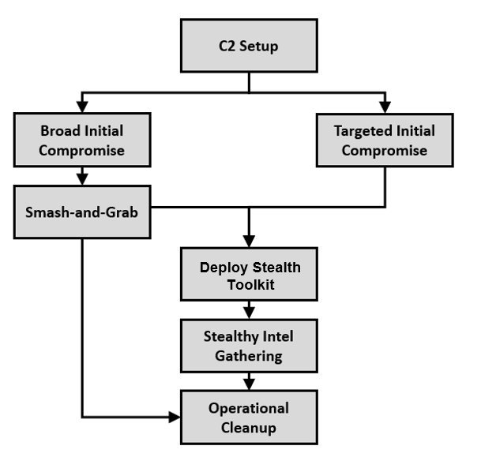

# Emulation Plan (ARCHIVED)

Please see the formal [APT29 emulation document](APT29_EmuPlan.pdf), which includes a break-down of the cited intelligence used for each step of this emulation.

The Evaluations emulation is split into two distinct scenarios (Days 1 and 2) to reflect these differing operational flows and toolkits used by APT29.

## Day 1

Based on `CosmicDuke` [ATT&CK S0050](https://attack.mitre.org/software/S0050/), `MiniDuke` [ATT&CK S0051](https://attack.mitre.org/software/S0051/), `SeaDuke/SeaDaddy` [ATT&CK S0053](https://attack.mitre.org/software/S0053/), `CozyDuke/CozyCar` [ATT&CK S0046](https://attack.mitre.org/software/S0046/), and `HAMMERTOSS` [ATT&CK S0037](https://attack.mitre.org/software/S0037/)

This scenario begins with a legitimate user clicking on a malicious payload delivered via a “spray and pray” broad spearphishing. campaign. The attacker immediately kicks off a “smash-and-grab”, rapid espionage mission, gathering and exfiltrating data. After initial exfiltration, the attacker realizes the value of victim and subsequently deploys a stealthier toolkit, changing TTPs​ and eventually moving laterally through the rest of the environment. The scenario ends with the execution of previously established persistence mechanisms are executed. 

This content to execute this scenario was tested and developed using [Pupy](https://github.com/n1nj4sec/pupy), [Meterpreter](https://github.com/rapid7/metasploit-framework), and other custom/modified scripts and payloads. Pupy and Meterpreter were chosen based on their available functionality and similarities to the adversary's malware within the context of this scenario, but alternative red team tooling could be used to accurately execute these and other APT29 behaviors.

## Day 2

Based on `PowerDuke` [ATT&CK S0139](https://attack.mitre.org/software/S0139/), `POSHSPY` [ATT&CK S0150](https://attack.mitre.org/software/S0150/), `CloudDuke` [ATT&CK S0054](https://attack.mitre.org/software/S0054/), and more recent (2016+) TTPs

This scenario begins with a legitimate user clicking on a malicious payload delivered via a targeted spearphishing​ campaign. The attacker employs a low and slow, methodical approach​ to owning the initial target, establishing persistence, gathering credential materials​, then finally enumerating and owning the entire domain​. Data exfiltration is dumped to a public cloud storage​. The scenario ends with a simulated time-lapse where previously established persistence mechanisms are executed. 

This content to execute this scenario was tested and developed using [PoshC2](https://github.com/nettitude/PoshC2) and other custom/modified scripts and payloads. PoshC2 was chosen based on its available functionality and similarities to the adversary's malware within the context of this scenario, but alternative red team tooling could be used to accurately execute these and other APT29 behaviors.

## Liability / Responsible Usage

This content is only to be used with appropriate prior, explicit authorization for the purposes of assessing security posture and/or research.

## Notice

Copyright 2020 The MITRE Corporation

Approved for Public Release; Distribution Unlimited. Case Number 19-03607-2.

Licensed under the Apache License, Version 2.0 (the "License");
you may not use this file except in compliance with the License.
You may obtain a copy of the License at

   http://www.apache.org/licenses/LICENSE-2.0

Unless required by applicable law or agreed to in writing, software
distributed under the License is distributed on an "AS IS" BASIS,
WITHOUT WARRANTIES OR CONDITIONS OF ANY KIND, either express or implied.
See the License for the specific language governing permissions and
limitations under the License.

This project makes use of ATT&CK®

[ATT&CK Terms of Use](https://attack.mitre.org/resources/terms-of-use/)