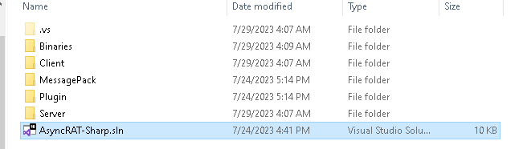

# AsyncRAT

## Overview

AsyncRAT is an open source Remote Administration tool maintained by [Nyan Cat](https://github.com/NYAN-x-CAT/AsyncRAT-C-Sharp) and leveraged by Blind Eagle in its campaigns<sup>[1](https://blogs.blackberry.com/en/2023/02/blind-eagle-apt-c-36-targets-colombia),[2](https://lab52.io/blog/apt-c-36-from-njrat-to-apt-c-36/)</sup>. For the purposes of this emulation a fork of AsyncRAT was made so that documentation could be added and relevent code functions could be highlighted with comments relating to their use and CTI. AsyncRAT has a client and server written in C# and hosts a suite of capabilities. Of particular note in Blind Eagle Campaigns is the inclusion of functions that are capable of stealing cookies from the browser, keyloggers, and remote desktop interaction<sup>[3](https://dciber.org/analisando-asyncrat-distribuido-na-colombia/),[4](https://dciber.org/apt-c-36-ataques-continuos-direcionados-a-instituicoes-e-corporacoes-do-governo-colombiano/),[5](https://dciber.org/analisando-asyncrat-distribuido-na-colombia/),[6](https://research.checkpoint.com/2023/blindeagle-targeting-ecuador-with-sharpened-tools/),[7](https://blog.scilabs.mx/en/campaign-attributed-to-apt-c-36-context-and-iocs/)</sup>.

AsyncRAT is made up of the following components:

| Component | Description |
| --------- | ----------- |
| Server    | AsyncRAT server executable written in .NET 4.6. GUI application that handles connections from agents and tasking |
| AsyncRAT Client | AsyncRAT payload delivered to victim machines. Provides built in functionality and plugin interface to extend functionality
| AsnycRAT Plugins | Code that enables extra features such as keylogging<sup>[8]</sup>, credential recovery<sup>[9]</sup>, and remote desktop<sup>[10]</sup> |

## Usage

See server and Client sections for specific usage instructions

## Troubleshooting

## Build

.NET 4.6 is required to buid the server. the download can be found on the Microsoft website. Once installed the computer will need to be restarted before the server can be built.

Two build options are presented. The CLI can be used with devenv.exe to build the `AsyncRAT-Sharp.sln` solution. Also instructions for the Visual Studio GUI are also included:


### CLI:

```PowerShell
PS C:\<path>\<to>\birdsofprey\Resources\AsyncRAT-C#> 'C:\Program Files | [x86]\Microsoft Visual Studio\<version>\<Professional|blank>\Common7\IDE\devenv.exe' AsyncRAT-Sharp.sln /Build "Release"
```

### GUI

1) Open Solution in Visual Studio - this option is presented upon Visual Studio opening

    

    

2) In the menu bar near the top of the window, change the dropdown from Debug to Release - this will build and remove any debugging assistance from the project:

    

3) In the menu bar at the top of the window, select Build -> Build Solution. The completed executables will be located in `birdsofprey\Resources\AsyncRAT-C#\Binaries\Release`

    

## References and CTI

1) https://blogs.blackberry.com/en/2023/02/blind-eagle-apt-c-36-targets-colombia

2) https://lab52.io/blog/apt-c-36-from-njrat-to-apt-c-36/

3) https://dciber.org/analisando-asyncrat-distribuido-na-colombia/

4) https://dciber.org/apt-c-36-ataques-continuos-direcionados-a-instituicoes-e-corporacoes-do-governo-colombiano/

5) https://dciber.org/analisando-asyncrat-distribuido-na-colombia/

6) https://research.checkpoint.com/2023/blindeagle-targeting-ecuador-with-sharpened-tools/

7) https://blog.scilabs.mx/en/campaign-attributed-to-apt-c-36-context-and-iocs/

[8]: Plugin/LimeLogger/LimeLogger/Packet.cs

[9]: Plugin/Recovery/Recovery/Packet.cs

[10]: Plugin/RemoteDesktop/RemoteDesktop/Packet.cs
