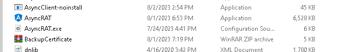
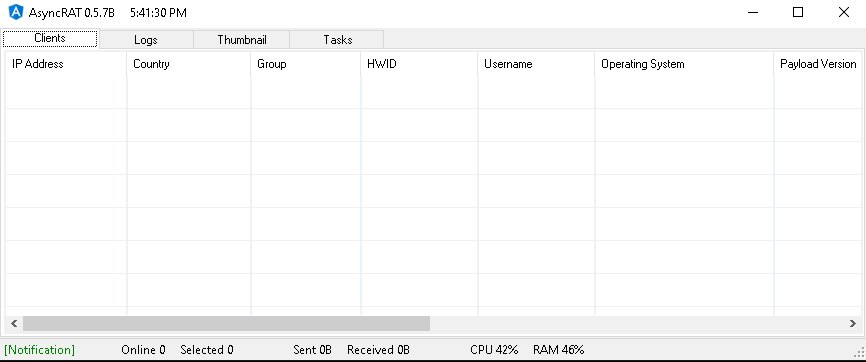
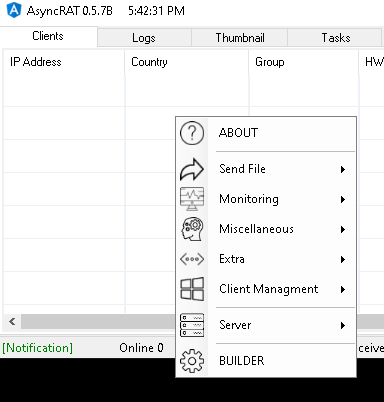

# AsyncRAT Server

## Overview

The AsyncRAT server is a Windows .NET GUI application that manages AsyncRAT clients by issuing tasks and receiving output[1](https://github.com/NYAN-x-CAT/AsyncRAT-C-Sharp).

## Usage

* After build double clicking the AsyncRAT icon located in `AsyncRAT-C#\Binaries\Release` will launch the server GUI:

    

* On first launch AsyncRAT server will create a certificate used for communication via SSL. The name can be changed or left at default:

    

* Once the certificate has been generated the next screen allows the user to select which TCP ports the server will listen on:

    

* Clicking Start then launches the server and the user is presented with the management GUI. The user has the option to view Clients, Logs, Thumbnails, and Tasks from the GUI:

    

* Right clicking within the GUI brings up the Context menu where clients can be built or tasked:

    

## Build

Build is addressed at the top level of the project.

## References

1) https://github.com/NYAN-x-CAT/AsyncRAT-C-Sharp