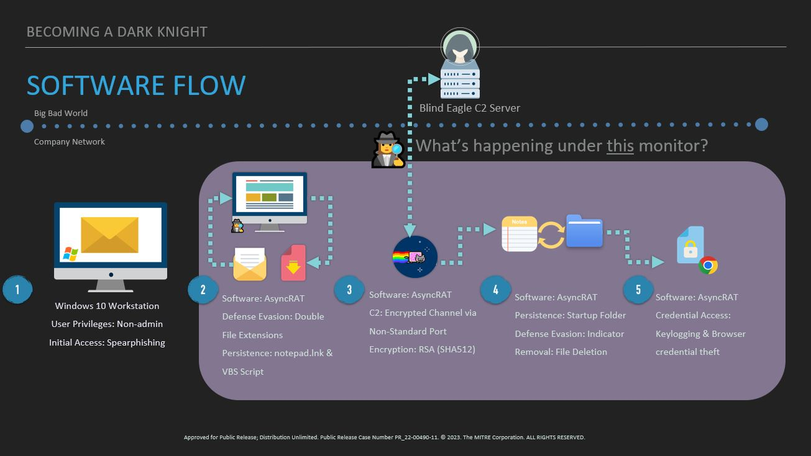

This emulation was created for the 2023 BlackHat presentation 🎩 , [Becoming a Dark Knight: Adversary Emulation Demonstration for ATT&CK Evaluations](https://www.blackhat.com/us-23/briefings/schedule/#becoming-a-dark-knight-adversary-emulation-demonstration-for-attck-evaluations-33209). This presentation focused how to combine CTI and red development team capabilities for adversary emulation.  

The ATT&CK Evaluation team created the below scenario leveraging techniques seen from Blind Eagle in the wild based on open-source reporting. We have adapted the scenario based on tools and resources available at the time. This emulation was researched, developed, and presented with one Windows SME Red Team developer, one CTI Analyst, and one Technical lead in 2 months while working on other work 50% of their time. Our goal was to provide a simpler emulation example when faced with limited resources. Therefore, this emulation is less complicated than other emulations represented in the [Adversary Emulation Library](https://github.com/center-for-threat-informed-defense/adversary_emulation_library).

This page contains a high-level overview of our Blind Eagle scenario and related diagram, as well as the full 5-step plan created by our CTI analyst.

# Emulation Scenario 📖

This scenario follows Blind Eagle's cyberattack against a Colombian target. Blind Eagle will gain initial access via user execution of a link in a file sent via spearphishing. Once execution is obtained and persistence installed, Blind Eagle downloads and executes the AsyncRAT for additional actions on objective. Characteristics of this campaign include social engineering, open-source modified RATs, exploitation of a single workstation, and theft of browser credentials.

# Scenario Steps👣

| Steps | User Story | Software | Reporting |
| :----: | ----- | :-----: | ------ |
| **Step 0 - Initial Compromise** | Blind Eagle gains an initial foothold into the victim’s system via spearphishing ([T1566.001](https://attack.mitre.org/techniques/T1566/001/)). The attackers send an email containing a password-protected PDF, and the password is provided in the email’s content. The sender address spoofs the Colombian National Directorate of Taxes and Customs (DIAN), a legitimate Colombian government agency.|Browser-based Outlook instance     Adobe Acrobat| [BlackBerry - Feb 2023](https://blogs.blackberry.com/en/2023/02/blind-eagle-apt-c-36-targets-colombia)     [Check Point Research - Jan 2023](https://research.checkpoint.com/2023/blindeagle-targeting-ecuador-with-sharpened-tools/)     [QiAnXin Threat Intelligence Center - Feb 2019](https://web.archive.org/web/20190625182633/https://ti.360.net/blog/articles/apt-c-36-continuous-attacks-targeting-colombian-government-institutions-and-corporations-en/)     [Lab 52 - 2020](https://lab52.io/blog/apt-c-36-new-anti-detection-tricks/)     [TrendMicro - Sept 2021](https://www.trendmicro.com/en_us/research/21/i/apt-c-36-updates-its-long-term-spam-campaign-against-south-ameri.html)     [SCILabs MX - June 2022](https://blog.scilabs.mx/malware-campaign-attributed-to-apt-c-36-context-and-iocs-update-june-2022/)  |
| **Step 1 - Execution** | The non-admin user will enter the password to open the PDF, which contains a fake notification from DIAN regarding outstanding tax payments owed by the user. The document prompts the user to click a link ([T1566.002](https://attack.mitre.org/techniques/T1566/002/), [T1204.001](https://attack.mitre.org/techniques/T1204/001/)). This link will download a second item, which is a password protected RAR archive - "factura-228447578537.pdf.uue" - that utilizes double file extensions (masquerades as a PDF but really is a UUE) ([T1036.007](https://attack.mitre.org/techniques/T1036/007/)). The site will download the AsyncRAT payload from a Discord CDN ([T1102](https://attack.mitre.org/techniques/T1102/)). The user will double click the file, which prompts the execution of VBS script ("factura-22844758537.pdf.vbs") via wscript.exe and trigger the persistence mechanism ([T1204.002](https://attack.mitre.org/techniques/T1204/002/), [T1059.005](https://attack.mitre.org/techniques/T1059/005/)).| AsyncRAT     PowerShell     Visual Basic     WinRAR | [BlackBerry - Feb 2023](https://blogs.blackberry.com/en/2023/02/blind-eagle-apt-c-36-targets-colombia)     [Check Point Research - Jan 2023](https://research.checkpoint.com/2023/blindeagle-targeting-ecuador-with-sharpened-tools/)     [Lab 52 - 2020](https://lab52.io/blog/apt-c-36-new-anti-detection-tricks/)     [TrendMicro - Sept 2021](https://www.trendmicro.com/en_us/research/21/i/apt-c-36-updates-its-long-term-spam-campaign-against-south-ameri.html)     [SCILabs MX - Jul 2022](https://blog.scilabs.mx/malware-campaign-attributed-to-apt-c-36-context-and-iocs-update-june-2022/)     [ThreatMon - Apr 2023](https://web.archive.org/web/20230421020841/https://threatmon.io/wp-content/uploads/2023/04/APT_Blind_Eagles_Malware_Arsenal_Technical_Analysis_of_the_New.pdf)     [Lab 52 - Mar 2023](https://lab52.io/blog/apt-c-36-from-njrat-to-apt-c-36/) |
| **Step 2 - Infection** | Once the user manually executes the VBScript, a series of automatic actions will occur. Specifically, the VBScript will use Powershell to download fiber.dll, which is encoded via Base64 ([T1059.001](https://attack.mitre.org/techniques/T1059/001/), [T1132.001](https://attack.mitre.org/techniques/T1132/001/)). The fiber.dll will run the VAI method with an obfuscated URL that resolves to a file named "asy.txt," which is the AsyncRAT obfuscated payload ([[T1132.001](https://attack.mitre.org/techniques/T1132/001/), [T1027](https://attack.mitre.org/techniques/T1027/)). Next, fiber.dll will download fsociety.dll (disguised under filename "Rump.xls"), which is again encoded via Base64 ([T1132.001](https://attack.mitre.org/techniques/T1132/001/)), [T1036.008](https://attack.mitre.org/techniques/T1036/008/)). Next, the adversary will use fiber.dll and PowerShell ([T1059.001](https://attack.mitre.org/techniques/T1059/001/)) to deobfuscate the URL that resolves to the .txt file, and then downloads and executes the decoded Fsociety.dll ([T1140](https://attack.mitre.org/techniques/T1140/)). AsyncRAT will masquerade as the legitimate RegSvcs.exe process via process hollowing ([T1055.012](https://attack.mitre.org/techniques/T1055/012/), [T1218.009](https://attack.mitre.org/techniques/T1218/009/)). | AsyncRAT     Powershell     Visual Basic     RegSvcs.exe     Fsociety.dll     fiber.dll |[BlackBerry - Feb 2023](https://blogs.blackberry.com/en/2023/02/blind-eagle-apt-c-36-targets-colombia)     [DCiber - Jun 2022](https://dciber.org/analisando-asyncrat-distribuido-na-colombia/)     [Lab 52 - Mar 2023](https://lab52.io/blog/apt-c-36-from-njrat-to-apt-c-36/)     [EcuCERT - 2022](https://www.ecucert.gob.ec/wp-content/uploads/2022/03/alerta-APTs-2022-03-23.pdf)     [GitHub - AsyncRAT](https://github.com/NYAN-x-CAT/AsyncRAT-C-Sharp)   |
| **Step 3 - Command and Control** | Once the AsyncRAT payload is decrypted ([T1132.001](https://attack.mitre.org/techniques/T1132/001/), [T1140](https://attack.mitre.org/techniques/T1140/)), it shows that the C2 infrastructure is hosted on a site using Duck DNS services and leverages communications over port 1523 ([T1568](https://attack.mitre.org/techniques/T1568/), [T1571](https://attack.mitre.org/techniques/T1571/)). The payload will communicate with the C2 via RSA (SHA512) ([T1573.002](https://attack.mitre.org/techniques/T1573/002/)). | AsyncRAT | [BlackBerry - Feb 2023](https://blogs.blackberry.com/en/2023/02/blind-eagle-apt-c-36-targets-colombia)     [Lab 52 - 2020](https://lab52.io/blog/apt-c-36-new-anti-detection-tricks/)     [SCILabs MX - Jul 2022](https://blog.scilabs.mx/malware-campaign-attributed-to-apt-c-36-context-and-iocs-update-june-2022/)     [Lab 52 - Mar 2023](https://lab52.io/blog/apt-c-36-from-njrat-to-apt-c-36/)     [GitHub - AsyncRAT](https://github.com/NYAN-x-CAT/AsyncRAT-C-Sharp) |
| **Step 4 - Establish Persistence & Privilege Escalation** | Next, Blind Eagle will look to establish persistence on the host device. Given that the user is non-admin, the attackers use fiber.dll to leverage Windows Script Host to copy the VBS loader to Windows Temp folder ([T1570](https://attack.mitre.org/techniques/T1570/)). The attackers also use fiber.dll to create a .lnk file in the user's startup folder ([T1547.001](https://attack.mitre.org/techniques/T1547/001/), [T1059.003](https://attack.mitre.org/techniques/T1059/003/)). | AsyncRAT | [BlackBerry - Feb 2023](https://blogs.blackberry.com/en/2023/02/blind-eagle-apt-c-36-targets-colombia)     [ThreatMon - Apr 2023](https://web.archive.org/web/20230421020841/https://threatmon.io/wp-content/uploads/2023/04/APT_Blind_Eagles_Malware_Arsenal_Technical_Analysis_of_the_New.pdf)      [DCiber - Jun 2022](https://dciber.org/analisando-asyncrat-distribuido-na-colombia/)     [SCILabs MX - Jul 2022](https://blog.scilabs.mx/malware-campaign-attributed-to-apt-c-36-context-and-iocs-update-june-2022/)     [GitHub - AsyncRAT](https://github.com/NYAN-x-CAT/AsyncRAT-C-Sharp)     [Secure Soft - Apr 2023](https://www.securesoftcorp.com/es/w/novedades/ss_alert292) |
| **Step 5 - Credential Access** | Blind Eagle will then utilize AsyncRAT to conduct keylogging and steal information from the victim’s web browser ([T1056.001](https://attack.mitre.org/techniques/T1056/001/)). Specifically, the malware will be used to steal browser credentials ([T1555.003](https://attack.mitre.org/techniques/T1555/003/)). Finally, the attackers will navigate to the victim's online banking portal and use the previously keylogged credentials to gain admin access to the site ([T1056.001](https://attack.mitre.org/techniques/T1056/001/)). | AsyncRAT     Edge browser | [GitHub - AsyncRAT](https://github.com/NYAN-x-CAT/AsyncRAT-C-Sharp)     [DCiber - Jun 2022](https://dciber.org/analisando-asyncrat-distribuido-na-colombia/)     [QiAnXin Threat Intelligence Center - Feb 2019](https://web.archive.org/web/20190625182633/https://ti.360.net/blog/articles/apt-c-36-continuous-attacks-targeting-colombian-government-institutions-and-corporations-en/)     [DCiber - Mar 2023](https://dciber.org/apt-c-36-ataques-continuos-direcionados-a-instituicoes-e-corporacoes-do-governo-colombiano/)     [Check Point Research - Jan 2023](https://research.checkpoint.com/2023/blindeagle-targeting-ecuador-with-sharpened-tools/)     [SCILabs MX - Jul 2022](https://blog.scilabs.mx/malware-campaign-attributed-to-apt-c-36-context-and-iocs-update-june-2022/)   
