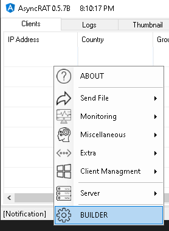
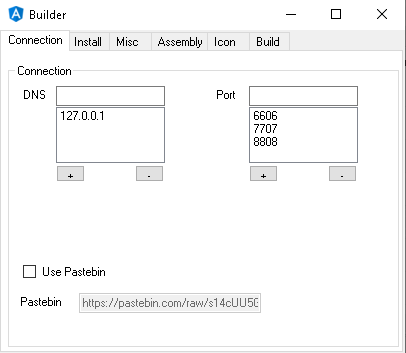
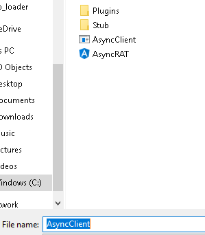

# AsyncRAT Client

## Overview

AsyncRATs client is written in C# and communicates with the C2 server over an encrypted TCP session. The server generates a certificate when first started and the client uses that certificate to validate that it is connected to the correct server. The client implements sevaral capabilities outlined below with CTI references:

| Capability | Description | CTI / References |
| --- | --- | --- |
| Anti-Analysis | Anti Analysis techniques to determine if the program is running in a sandbox or debugging environment | [2](#references-and-cti) |
| Persistence | Persistence via either Startup/Registry or Scheduled Tasks depending on the integrity of the AsyncRAT process | [1](#references-and-cti), [2](#references-and-cti) |
| Critical Process | If AsyncRAT detects it is running as Administrator it will also set itself as a critical process with `RtlSetProcessIsCritical` - which according to pinvoke.net is an undocumented DLL that can set a process to cause a Blue Screen of Death (BSOD) on kill | [3](#references-and-cti)

## Usage

* After starting the AsyncRAT server right click in the window -> select BUILDER from the menu.

    

* Set Connection and Install properties accordingly

    

    

* select the Build tab and click Build

    

* name the client file

    

Once the file is generated it will need to be encoded properly using `file-ops.py` as follows:

Windows:

```powershell
py.exe .\file-ops.py -r c:\path\to\birdsofprey\Resources\AsyncRAT-C#\Binaries\Release\<asyncRAT Client>.exe
```

Linux/Mac:

```bash
python3 .\file-ops.py -r path/to/birdsofprey/Resources/AsyncRAT-C#/Binaries/Release/<asyncRAT Client>.exe
```

This will save a file called `asy.txt` to the current working directory.

## Troubleshooting

Coming soon

## Build

The client portion is built with the project - and implants are created from the C2 GUI

## References and CTI

1) https://blogs.blackberry.com/en/2023/02/blind-eagle-apt-c-36-targets-colombia

2) https://dciber.org/analisando-asyncrat-distribuido-na-colombia/

3) http://www.pinvoke.net/default.aspx/ntdll/RtlSetProcessIsCritical.html?diff=y