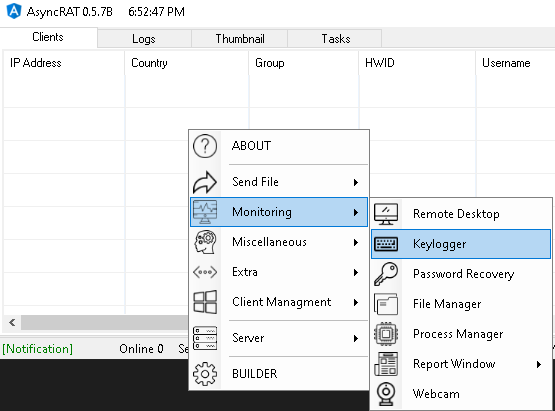

# AsyncRAT Plugins

## Overview

AsyncRAT implements plugins to expand capability. Plugins are built on the Server side and only sent to the client when they need to be executed. For the purposes of this emulation the following Plugins are leveraged:

| Plugin | Description | CTI/Reference |
| --- | --- | --- |
| LimeLogger | LimeLogger is a keylogging utility leveraged by AsyncRAT as a plugin | [1](https://dciber.org/apt-c-36-ataques-continuos-direcionados-a-instituicoes-e-corporacoes-do-governo-colombiano/) |
| Recovery | Recovery has functionality to steal cookies and passwords from the password managers of various browsers. As of writing Chromium based and FireFox browsers are supported. | [1](https://dciber.org/apt-c-36-ataques-continuos-direcionados-a-instituicoes-e-corporacoes-do-governo-colombiano/), [2](https://dciber.org/analisando-asyncrat-distribuido-na-colombia/) |

## Usage

Plugins are typically ran from the GUI menu. Both the Keylogger and Recovery can be found under Monitoring in the context menu by right clicking in the GUI:

Upon selection the plugin will be sent to the client (first time) or ran from the client (already used once) and output will show up under Logs

## CTI/References

1) https://dciber.org/apt-c-36-ataques-continuos-direcionados-a-instituicoes-e-corporacoes-do-governo-colombiano/

2) https://dciber.org/analisando-asyncrat-distribuido-na-colombia/