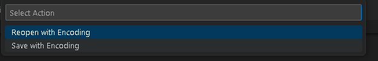

# VBS Loader

## Overview

Blind Eagle is known to use VBS loaders as a second stage or later loader of malware infection<sup>[1](https://lab52.io/blog/apt-c-36-from-njrat-to-apt-c-36/),[2](https://blogs.blackberry.com/en/2023/02/blind-eagle-apt-c-36-targets-colombia),[3](https://dciber.org/apt-c-36-ataques-continuos-direcionados-a-instituicoes-e-corporacoes-do-governo-colombiano/),[4](https://blog.scilabs.mx/en/campaign-attributed-to-apt-c-36-context-and-iocs/),[5](https://research.checkpoint.com/2023/blindeagle-targeting-ecuador-with-sharpened-tools/)</sup>. The loader for this scenario is based on a variant used in more recent campaigns. The VBS loader is hidden inside of a seemingly legitimate winRM vbs script. The purpose of this loader is to downlod and execute the second stage DLL, and is typically also targeted for persistence by the second stage DLL loader. 

## Usage

The loader should be populated with the correct URL for the final payload on line `344`. The `file-ops.py` script has a function to encode the URL properly.

Typically the vbs file will be named according to the current campaigns pretext and use a double extension such as pdf.vbs<sup>[2](https://blogs.blackberry.com/en/2023/02/blind-eagle-apt-c-36-targets-colombia)</sup>. In some instances the payload will also be compressed into a .uue file or another type of zip/compressed file<sup>[1](https://lab52.io/blog/apt-c-36-from-njrat-to-apt-c-36/),[2](https://blogs.blackberry.com/en/2023/02/blind-eagle-apt-c-36-targets-colombia)</sup>. Simply double clicking the file will set off execution.

To execute via CLI:

```powershell
wscript.exe .\eagle_loader.vbs
```

## Troubleshooting

the VB loader can have issues running the PowerShell script due to the Unicode characters. Ensuring that the VB loader is saved with UTF-16LE encoding will allow PowerShell to run and parse the Unicode URL on line 344 properly.

To save the file as UTF16-LE You can use Visual Studio Code - in the lower right corner of the window the encoding should be listed:


If VSCode shows a different value you can click the encoding and choose "Save With Encoding" from the action menu:



## Build

1) Run `file-ops.py` with the `-u` flag to generate a URL pointing to `asy.txt` `(asyncrat payload)` on your remote host. This will save a file called `url.txt` in the current folder

```powershell
py.exe .\file-ops.py -u http://<url>/<to>/asy.txt
```

2) Open `url.txt` in VSCode and copy string into line 344 between the single quotes just after `UUkXaLU = "e').G44☝░@4�tM44☝░@4�thod('VAI').Invok44☝░@4�($null, [obj44☝░@4�ct[]] ('`

## References and CTI

1) https://lab52.io/blog/apt-c-36-from-njrat-to-apt-c-36/

2) https://blogs.blackberry.com/en/2023/02/blind-eagle-apt-c-36-targets-colombia

3) https://dciber.org/apt-c-36-ataques-continuos-direcionados-a-instituicoes-e-corporacoes-do-governo-colombiano/

4) https://blog.scilabs.mx/en/campaign-attributed-to-apt-c-36-context-and-iocs/

5) https://research.checkpoint.com/2023/blindeagle-targeting-ecuador-with-sharpened-tools/
