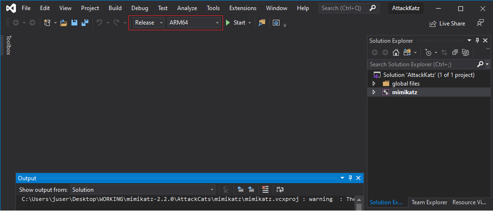

### AttackKatz

AttackKatz is a modified version of Mimikatz. For information on Mimikatz, please take a look at "HOWTO-Mimikatz.md".
Modifications include compiler settings and removing (commenting out or removing from the project) some modules not required for Round 3.

To build AttackKatz, perform the following:
0. Import the solution file into Visual Studio Community 2019.
* It may prompt you to install additional libraries via the Visual Studio installer (C++ MFC for latest vXXX build tools) . Complete this function.
1. Choose your perferred target build (ARM/x86/x64/DLL)

2. Click build solution.
3. If successful, a file called "mimikatz.exe" should be produced in the root of the project directory under the corresponding target folder.
  * Ex: An x64 build will be in the under x64 folder in the root project directory.

*Note, this utility was built on a Windows 10 1909 virual machine with 6GB of RAM and hard drive space of 60GB.*