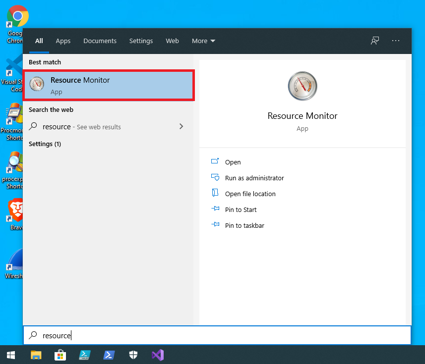
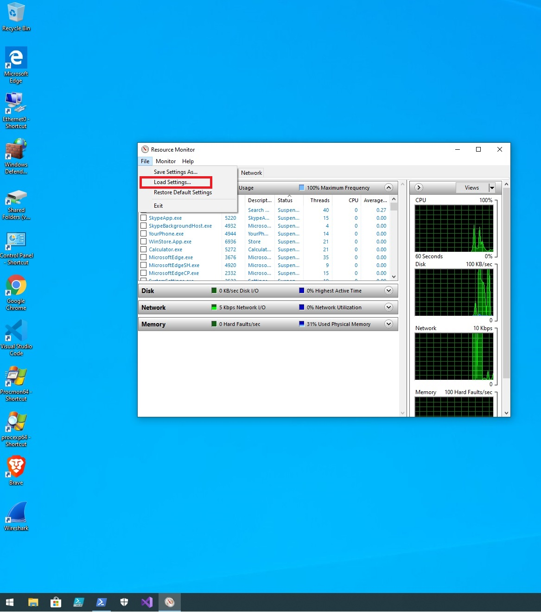
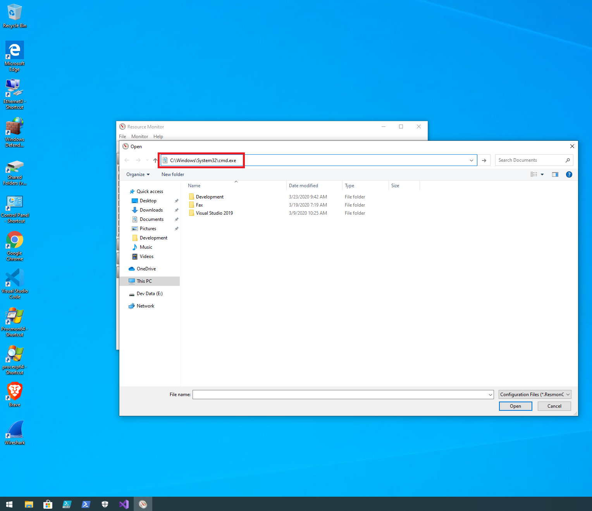
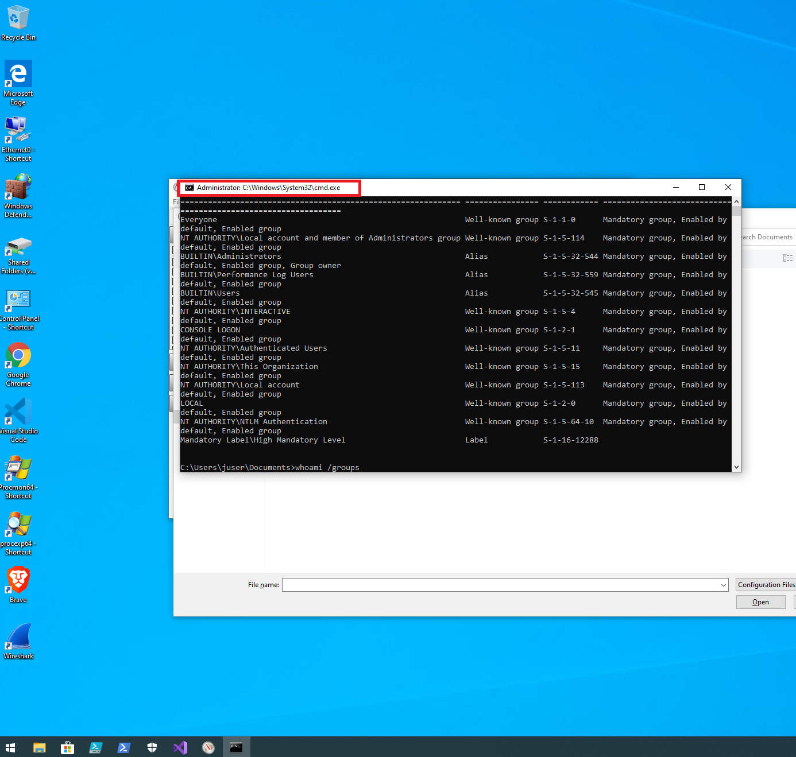

#### Interactive - UAC Bypass
##### About The Bypass
This UAC bypass relies on launching a native Windows process (performance
monitor) and leveraging it's default
integrity level of high to launch a command prompt. This avoids UAC prompts on
Windows 19.09.

