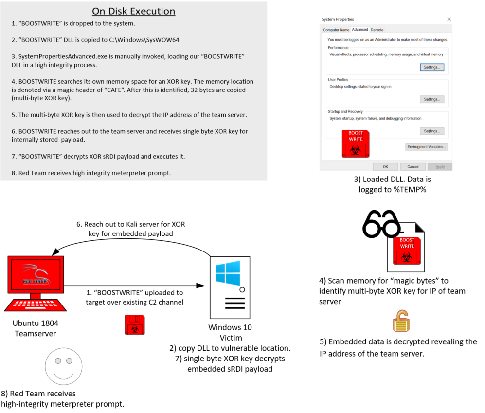

## What does it do?
BOOSTWRITE.dll is used in a DLL Hijacking technique to give the red team an elevated shell.
* [Attack Technique T1038](https://attack.mitre.org/techniques/T1038/)

## Why are we doing it?
BOOSTWRITE is a utility made by FIN7 that leverages a DLL Hijack routine within a propriteary piece of software (Aloha Command Center). 
BOOSTWRITE execution models techniques not representing in other aspects of this rounds emulation.  
These techniques includes [code signing](https://attack.mitre.org/techniques/T1116/) and [execution guardrails](https://attack.mitre.org/techniques/T1480/).

## How does it work?
For ATT&CK Evals, The utility vulnerable to DLL hijacking used is SystemPropertiesAdvanced.exe (located in C:\Windows\syswow64).
The execution flow is as follows:

0) BOOSTWRITE.dll is renamed to srrstr.dll and uploaded to C:\Windows\Syswow64 by a pre-existing meterpreter shell on the target machine.
    * This directory is typically write protected, but has been misconfigured on the target machine.

1) SystemPropertiesAdvanced.exe is then launched which does not prompt for UAC confirmation, but does run as a high integrity process.

2) SystemPropertiesAdvanced.exe loads srrstr.dll from the Syswow64 directory.
    * Our functionality resides within DLLMain, meaing upon the DLL being loaded our functionality begins executing.
    * During execution data is logged to a file within TEMP per-CTI.

3) After our DLL is loaded, it first performs a API call ReadProcessMemory to locate a string of bytes representing a multi-byte XOR encrypted C2 server IP address to reach out to for a XOR key.
    * This string of bytes has four "magic bytes" of CAFE preceeding it that we're matching on. After CAFE is identified the next 32 bytes represent an XOR encrypted IP address.
    * The 32 bytes are then XOR'd accordingly and the IP of 192.168.0.4 is revealed.

4) A HTTP GET request is made to the C2 server.
    * The response is an ascii "B" which in hex is 0x42. This is the single byte xor key used for embedded payload decryption.
    * The embedded payload is a MSFVenom generated DLL payload has been created to be position independt via the sRDI framework.
    * [sRDI](https://github.com/monoxgas/sRDI) is an external framework that takes a DLL and makes it position independent for reflective DLL injection.
    

5) After successfully receiving the single byte key, an embedded sRDI payload is decrypted.

6) After successful decryption of the sRDI payload, memory is virtually allocated, the payload buffer is written to memory and a void pointer to this buffer is executed.
    * At the end of this execution, the red team should receive a high integrity meterpreter shell.

