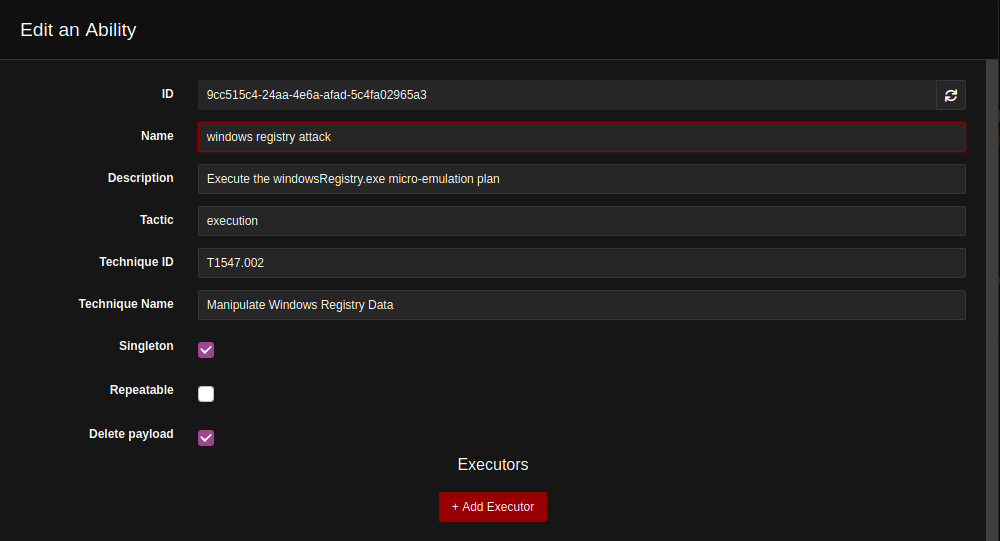

# Executing Micro Emulation Plans with CALDERA

Micro emulation plans are focused, packaged binaries which emulate real-world
tactics, techniques, and procedures (TTPs). They also provide the opportunity
for automation by importing them into your Breach and Attack Simulation tool.
This README will show you how to import a Micro Emulation Plan into CALDERA, but
you can follow a similar process for other products. You can refer to the
[CALDERA repo](https://github.com/mitre/caldera) for installation instructions.

CALDERA can execute these emulation plans against target hosts autonomously,
generating powerful insights on a network's security and reliance in the face of
these TTPs.  CALDERA enables autonomous adversary emulation through
**payloads**, **abilities**, **adversaries**, and **operations**, generating a
wealth of offensive and defense lessons learned.

## Adding a new micro emulation plan to CALDERA

This walk through uses the [Windows
Registry](../src/file_access)
micro emulation plan, but the required steps are mirrored for any other micro
emulation plan. In this case, the `windowsRegistry.exe` executable enables
creating, populating, and modifying data within the Registry of a target Windows
machine.

First, add `windowsRegistry.exe` to CALDERA's **payload** store by dragging and
dropping the file to the `caldera/plugins/stockpile/payloads/` directory.  You
can add the emulation plan executable before launching the CALDERA server or
while the server is already running.  If the file is added while the server is
running, it will take a few seconds to register.

Once the executable registers as a CALDERA **payload**, we can add it to a new
**ability**.  Abilities are powerful tools for automating attacks, and are
executed against target systems using dynamically-complied CALDERA agents.
Abilities also encode our understanding of the MITRE ATT&CK® Matrix in the
context of this attack using the **Tactic**, **Technique ID** and **Technique
Name** fields.

One should consider the target environment for the emulation plan of interest.
In this case, we target Windows hosts, and must use either the `cmd` or `psh`
executors to run the executable.  We want to execute the `windowsRegistry.exe`
executable against the target, but must first ensure that the executable is
present on the target.  We accomplish this by adding the executable in the
Abilities **payload** field, which tells the agent to pull the executable from
the CALDERA C2 server before executing the **command** associated with our
ability.

The **command** field describes what the agent will execute after pulling down
the payload from the CALDERA server.  In this case, the `windowsRegistry.exe`
emulation plan has three execution variants, which can be specified using a
flag. These are enumerated below:

1. API variant, which leverages various functions provided by the .NET
   Microsoft.Win32 Namespace
2. `Reg.exe` variant, which leverages various commands provided by the reg
   utility
3. `Powershell.exe` variant, which leverages various cmdlets provided by
   PowerShell

We specificy which variant to use by adding an argument to the command, e.g.
`windowsRegistry.exe 1`, `windowsRegistry.exe 2` or `windowsRegistry.exe 3`.  As
`1` is the default behavior we choose to set the command to
`windowsRegistry.exe`.

## Automating execution of the Micro Emulation Plan

Now that the Windows Registry micro emulation plan exists as an ability within
CALDERA, we can enable repeatable, fast, and autonomous execution of the
emulation plan using CALDERA's *adversary* and *operation* constructs.

Adversaries are collections of abilities, executed in sequential order by
default. In this case, we can create a new adversary called "Windows Registry
Micro Emulation Adversary". The adversary starts without any assigned abilities,
but abilities can be added using the "Add Ability" button. After adding our
"windows registry attack" ability to the adversary profile, we can see that:

1. It is the first and only ability executed by the adversary
2. It can only execute against Windows machines, as denoted by the "Executors"
   icon
3. The ability has a payload (in this case `windowsRegistry.exe`)

Once the windows registry attack ability has an associated adversary, we can
execute it autonomously against any Windows host where the CALDERA agent is
deployed.  The "Operations" Tab provides information on the executed command,
its status, and any recorded `stdout` or `stderr` if applicable.

We can create a new operation with the "Windows Registry Micro Emulation
Adversary" as our selected adversary, and run the operation autonomously.  Upon
creation, the operation will beacon to all agents deployed against Windows hosts
in the `red` agent group with the instructions encoded in the "windows registry
attack" ability.

---

**Watch [the demo
video](https://user-images.githubusercontent.com/27238806/174340808-f4316861-7fa9-4168-bea9-7d567afb66c5.mov)
to see an operation play out in CALDERA.**
