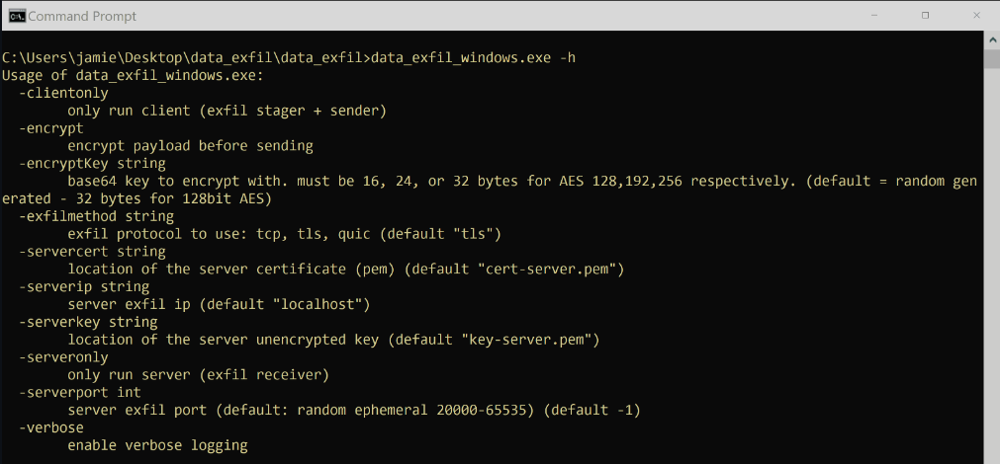
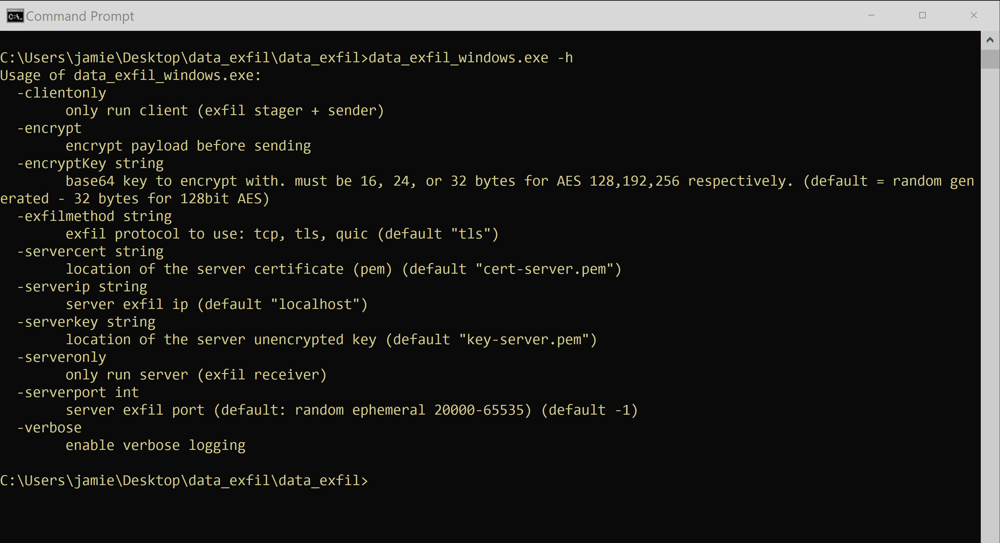

# Micro Emulation Plan: Data Exfiltration

This micro emulation plan targets malicious activity surrounding [TA0010 Exfiltration](https://attack.mitre.org/tactics/TA0010/). Data theft via exfiltration is very often part of, if not the primary objective, of an intrusion/campaign and is comprised of compound behaviors involving both exfiltration as well as [TA0009 Collection](https://attack.mitre.org/tactics/TA0009/) techniques.

**Table Of Contents:**

- [Description of Emulated Behaviors](#description-of-emulated-behaviors)
- [CTI / Background](#cti--background)
- [Execution Instructions / Resources](#execution-instructions--resources)
  - [Command Arguments](#command-arguments)
  - [Execution Demo](#execution-demo)
- [Defensive Lessons Learned](#defensive-lessons-learned)
  - [Detection](#detection)
  - [Mitigation](#mitigation)

## Description of Emulated Behaviors

**What are we doing?** This module provides an easy-to-execute tool that:

1. Creates dummy files
2. Enumerates the dummy files ([T1083 File and Directory Discovery](https://attack.mitre.org/techniques/T1083/))
3. Reads the dummy files ([T1005 Data from Local System](https://attack.mitre.org/techniques/T1005/)) then creates a local zip archive of the data ([T1560.002 Archive Collected Data: Archive via Library](https://attack.mitre.org/techniques/T1560/002/) + [T1074.001 Data Staged: Local Data Staging](https://attack.mitre.org/techniques/T1074/001/))
4. [Optional] encrypts the archive file ([T1027 Obfuscated Files or Information](https://attack.mitre.org/techniques/T1027/))
5. Exfiltrates the archive file to a dummy server ([T1048 Exfiltration Over Alternative Protocol](https://attack.mitre.org/techniques/T1048/)) over a specified IP:Port as well as protocol (TCP, TLS, QUIC)
6. Deletes the archive file ([T1070.004 Indicator Removal: File Deletion](https://attack.mitre.org/techniques/T1070/004/)) as well as the dummy files

## CTI / Background

**Why should you care?** Exfiltration of sensitive data is a very common goal for intrusion campaigns (and often included in tandem with other actions, such as [double extortion ransomware](https://www.trendmicro.com/vinfo/us/security/news/cybercrime-and-digital-threats/ransomware-double-extortion-and-beyond-revil-clop-and-conti)). This establishes data theft as a prioritized threat for organizations of all sizes, industries, and geographies.

Data theft most directly maps to techniques within [TA0010 Exfiltration](https://attack.mitre.org/tactics/TA0010/), but is often a compilation and conclusion to a series of related behaviors involving [TA0007 Discovery](https://attack.mitre.org/tactics/TA0007/), [TA0009 Collection](https://attack.mitre.org/tactics/TA0009/), [TA0011 Command and Control](https://attack.mitre.org/tactics/TA0011/), and even [TA0005 Defense Evasion](https://attack.mitre.org/tactics/TA0005/) techniques. 

## Execution Instructions / Resources

This cross-platform module (separate binaries for Windows and Linux) has been compiled into an easy-to-execute tool. The module is logically split as a client and server communication nodes, but can be fully executed on one host. If you wish to customize or build from source code, Windows/Linux binaries can be made using `make windows` and `make linux` respectively.

By default the `data_exfil_windows.exe` (or `data_exfil_linux`) tool coordinates execution and connection between the server and the client over localhost (though two instances of the tool can be separately executed to connect over a specific IP:Port socket).

### Command Arguments

Default parameters are set to enable simple execution requiring no user inputs (i.e. double click), but available command-line parameters can be found by running the tool with the `-h` option.

For TLS and QUIC protocols, a certificate + key is required (and also provided in the pre-compiled zip). `createcerts.sh` can be used to generate new certs as needed.

### Execution Demo

## Defensive Lessons Learned

### Detection

Detecting data theft in aggregate may be challenging, as many of the relevant actions are otherwise benign and potentially high volume. Decomposing the compound behavior into individual techniques may reveal actionable defensive opportunities, such as:

- Abnormal [file access patterns](https://github.com/center-for-threat-informed-defense/adversary_emulation_library/tree/master/micro_emulation_plans/src/file_access#detection), especially high volumes targeting potentially sensitive data
- Execution of processes (e.g., `WinRAR.exe`) as well as creation of files (e.g., `.zip`) associated with creating data archives
- Network connections to suspicious/known malicious destinations (including online data storage sites and services), especially if PCAP is available to show large or otherwise irregular patterns of data flow and/or protocol abuse
- A disproportionate amount of outbound data to external IPs

### Mitigation

Similarly, opportunities to prevent data theft must be balanced against the normal accepted activity of systems and users. However, data loss prevention (DLP) strategies may help identify and restrict operations involving sensitive data.

From a network level, network signatures targeting large or otherwise irregular volumes, known patterns of protocol abuse (e.g., DNS tunneling), as well as out-of-policy destinations (e.g., unknown or known malicious) may block potentially malicious data exfiltration.
