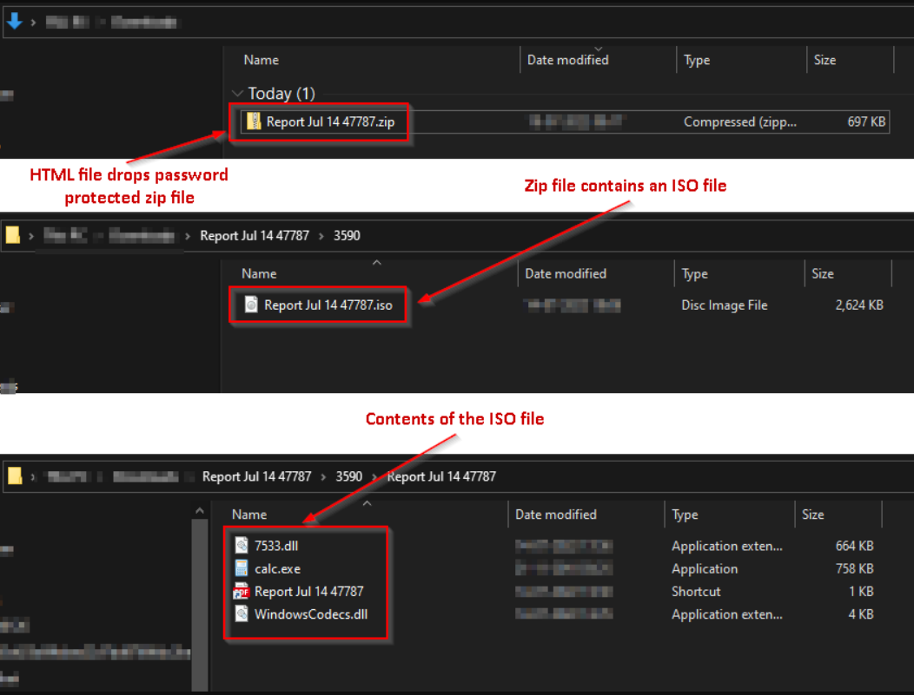
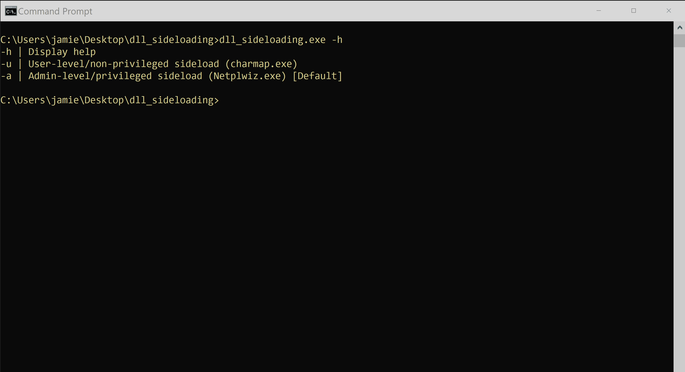

# Micro Emulation Plan: DLL Side-loading

This micro emulation plan targets malicious activity associated with [T1574.002 Hijack Execution Flow: DLL Side-Loading](https://attack.mitre.org/techniques/T1574/002/). DLL side-loading involves adversaries executing an otherwise legitimate/benign application in order to hijack the modules/libraries it loads to instead execute their malicious payload. This behavior is very often abused to execute malware within trusted, potentially privileged (i.e. [TA0004 Privilege Escalation](https://attack.mitre.org/tactics/TA0004/)) applications.

You can access the binary for this micro plan as part of the [latest release](https://github.com/center-for-threat-informed-defense/adversary_emulation_library/releases). 

**Table Of Contents:**

- [Micro Emulation Plan: DLL Side-loading](#micro-emulation-plan-dll-side-loading)
  - [Description of Emulated Behaviors](#description-of-emulated-behaviors)
  - [CTI / Background](#cti--background)
  - [Execution Instructions / Resources](#execution-instructions--resources)
    - [Execution Demo](#execution-demo)
  - [Defensive Lessons Learned](#defensive-lessons-learned)
    - [Detection](#detection)
    - [Mitigation](#mitigation)

## Description of Emulated Behaviors

**What are we doing?** This plan provides an easy-to-execute tool that invokes a vulnerable executable in order to side-load a payload. The payload then executes a series of typical Discovery commands (`dir`, `net share`, `whoami`).

The plan supports user (non-privileged) and administrator-level side-loading.

## CTI / Background

**Why should you care?**  DLL side-loading is part of a [broader set of DLL hijacking behaviors](https://www.wietzebeukema.nl/blog/hijacking-dlls-in-windows) often abused to execute malware within trusted, potentially privileged (i.e. [TA0004 Privilege Escalation](https://attack.mitre.org/tactics/TA0004/)) applications. A growing pattern of DLL side-loading abuse involves including both a malicious DLL as well as vulnerable application as [TA0001 Initial Access](https://attack.mitre.org/tactics/TA0001/) phishing payloads.

This type of infection chain concludes with invoking the vulnerable application (`calc.exe` in the example below) in order to load and execute the malicious payload (`WindowsCodecs.dll` in the example below) in memory.



*Image from [Qakbot Resurfaces with new Playbook - Threat Actors Leveraging DLL-SideLoading to Deliver Malware](https://blog.cyble.com/2022/07/21/qakbot-resurfaces-with-new-playbook/).*

Side-loading is abused by a [wide range of threat actors and malware](https://web.archive.org/web/20150915072551/https://www.fireeye.com/content/dam/fireeye-www/global/en/current-threats/pdfs/rpt-dll-sideloading.pdf), and is an increasingly relevant threat given the prevalence of vulnerable executables.

## Execution Instructions / Resources

This plan has been compiled into an easy-to-execute tool. The source code for this plan (as well as the DLL payload) is also provided if you wish to customize and rebuild.

The `dll_sideloading.exe` tool executes the complete emulation functionality. It accepts a single argument that selects the execution variant:
 - `-u` user-level side-loading using `charmap.exe`
 - `-a` admin-level side-loading using `Netplwiz.exe` [default if no argument is provided]
 
 `dll_sideloading.exe -h` will display a help menu. Execution of the plan will also create a `sideloaded.txt` file that confirms successful operation.

**Note:** These techniques were developed and tested using W10 Enterprise 21H2 (Ver: 19044.2364).

### Execution Demo



## Defensive Lessons Learned

### Detection

DLL side-loading activity can potentially be identified by analyzing [module load events](https://attack.mitre.org/datasources/DS0011/#Module%20Load) (e.g., [Sysmon EID 7](https://learn.microsoft.com/sysinternals/downloads/sysmon#event-id-7-image-loaded)). Side-loading patterns can be detected by comparing characteristics of the loaded DLLs (hash, location, etc.) to known/expected values. This can be done by:

- Baselining the DLLs loaded by specific processes to monitor for anomalies such as [module loads from non-default directories](https://github.com/SigmaHQ/sigma/blob/master/rules/windows/image_load/image_load_side_load_windows_defender.yml)
- Baselining the common locations of specific DLLs to monitor for [module load events originating from unexpected locations](https://github.com/SigmaHQ/sigma/blob/master/rules/windows/image_load/image_load_side_load_dbgcore_dll.yml)
- Baselining DLLs present on a system by default to monitor for [unexpected module loads, especially those known to be commonly abused for malicious side-loading](https://github.com/SigmaHQ/sigma/blob/master/rules/windows/image_load/image_load_side_load_non_existent_dlls.yml)
- Broadly monitoring [loads of known DLLs from non-standard locations (such as the \System32 folder)](https://github.com/SigmaHQ/sigma/blob/master/rules/windows/image_load/image_load_side_load_from_non_system_location.yml), as well as modules being loaded from commonly abused folders

```xml
<ImageLoad onmatch="include">
  <ImageLoaded name="technique_id=T1574.002,technique_name=DLL Side-Loading" condition="contains any">admin$;c$;\\;\appdata\;\temp\</ImageLoaded> <!-- loaded from network file share -->
  <ImageLoaded condition="begin with" name="technique_id=T1574.002,technique_name=DLL Side-Loading">c:\programdata\</ImageLoaded>
  <ImageLoaded condition="begin with" name="technique_id=T1574.002,technique_name=DLL Side-Loading">C:\Windows\Media\</ImageLoaded>
  <ImageLoaded condition="begin with" name="technique_id=T1574.002,technique_name=DLL Side-Loading">C:\Windows\addins\</ImageLoaded>
  <ImageLoaded condition="begin with" name="technique_id=T1574.002,technique_name=DLL Side-Loading">C:\Windows\system32\config\systemprofile\</ImageLoaded>
  <ImageLoaded condition="begin with" name="technique_id=T1574.002,technique_name=DLL Side-Loading">C:\Windows\Debug\</ImageLoaded>
  <ImageLoaded condition="begin with" name="technique_id=T1574.002,technique_name=DLL Side-Loading">C:\Windows\Temp</ImageLoaded>
  <ImageLoaded condition="begin with" name="technique_id=T1574.002,technique_name=DLL Side-Loading">C:\PerfLogs\</ImageLoaded>
  <ImageLoaded condition="begin with" name="technique_id=T1574.002,technique_name=DLL Side-Loading">C:\Windows\Help\</ImageLoaded>
  <ImageLoaded condition="begin with" name="technique_id=T1574.002,technique_name=DLL Side-Loading">C:\Intel\Logs\</ImageLoaded>
  <ImageLoaded condition="begin with" name="technique_id=T1574.002,technique_name=DLL Side-Loading">C:\Temp</ImageLoaded>
  <ImageLoaded condition="begin with" name="technique_id=T1574.002,technique_name=DLL Side-Loading">C:\Windows\repair\</ImageLoaded>
  <ImageLoaded condition="begin with" name="technique_id=T1574.002,technique_name=DLL Side-Loading">C:\Windows\security\</ImageLoaded>
  <ImageLoaded condition="begin with" name="technique_id=T1574.002,technique_name=DLL Side-Loading">C:\Windows\Fonts\</ImageLoaded>
  <ImageLoaded condition="contains" name="technique_id=T1574.002,technique_name=DLL Side-Loading">Downloads</ImageLoaded>
  <ImageLoaded condition="contains" name="technique_id=T1574.002,technique_name=DLL Side-Loading">Public</ImageLoaded>
  <ImageLoaded condition="contains" name="technique_id=T1574.002,technique_name=DLL Side-Loading">Documents</ImageLoaded>
  <ImageLoaded condition="contains" name="technique_id=T1574.002,technique_name=DLL Side-Loading">Music</ImageLoaded>
  <ImageLoaded condition="contains" name="technique_id=T1574.002,technique_name=DLL Side-Loading">Video</ImageLoaded>
  <ImageLoaded condition="begin with" name="technique_id=T1574.002,technique_name=DLL Side-Loading">file:</ImageLoaded>
  <ImageLoaded name="technique_id=T1574.002,technique_name=DLL Side-Loading" condition="contains">$Recycle.bin\</ImageLoaded>
  <ImageLoaded name="technique_id=T1574.002,technique_name=DLL Side-Loading" condition="contains">\Windows\IME\</ImageLoaded>
</ImageLoad>
```
*Excerpted from [github.com/olafhartong/sysmon-modular](https://github.com/olafhartong/sysmon-modular/blob/4153d4c9898ec43c86cc939d55aa45f3461ea955/7_image_load/include_suspicious_location.xml).*

Also consider analyzing other related events, such as the creation of DLL files in unexpected locations as well as the execution of abnormal applications (potentially being used to load malicious payloads).

### Mitigation

DLL side-loading may be challenging to prevent as it abuses legitimate system features, but consider keeping software up-to-date as a means to minimize the presence of side-loading vulnerabilities. System antivirus may also remediate malicious payloads before they are loaded.
