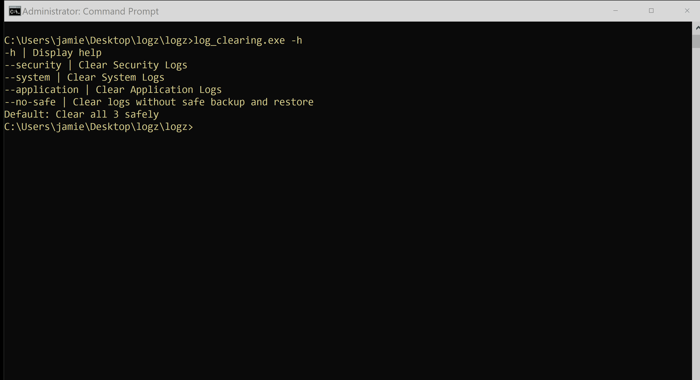
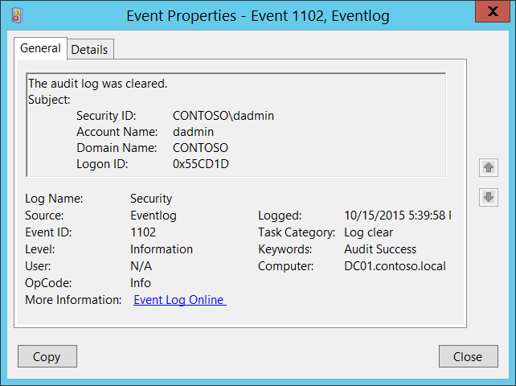

# Micro Emulation Plan: Clear Windows Event Logs

\*\***WARNING: THIS PLAN WILL DELETE YOUR WINDOWS EVENT LOGS AND CREATE A BACKUP COPY. USE CAUTION**\*\*

This micro emulation plan targets malicious activity associated with [T1070.001 Indicator Removal: Clear Windows Event Logs](https://attack.mitre.org/techniques/T1070/001/). Adversaries and malware often target clearing and/or disabling the native logging provided by Windows events in order to evade detections, while also inhibiting response and recovery from breaches.

**Table Of Contents:**

- [Description of Emulated Behaviors](#description-of-emulated-behaviors)
- [CTI / Background](#cti--background)
- [Execution Instructions / Resources](#execution-instructions--resources)
  - [Execution Demo](#execution-demo)
- [Defensive Lessons Learned](#defensive-lessons-learned)
  - [Detection](#detection)
  - [Mitigation](#mitigation)

## Description of Emulated Behaviors

**What are we doing?** This plan provides an easy-to-execute tool that:

1. Saves a copy of Windows event log(s) (`security`, `system`, and/or `application`)
2. Executes events that will generate relevant log entries (e.g., adding a user, starting then stopping a service)
3. Clears the relevant log(s)

Instruction for restoring saved logs will be displayed in an popup window.

## CTI / Background

**Why should you care?** A wide variety of adversaries and malware target clearing the event logging provided by Windows events. This is often combined with [T1562.002 Impair Defenses: Disable Windows Event Logging](https://attack.mitre.org/techniques/T1562/002/) as well as tampering with other security tools discovered in victim environments (e.g., [T1562.001 Impair Defenses: Disable or Modify Tools](https://attack.mitre.org/techniques/T1562/001/)).

Clearing event logs is especially prevalent given this telemetry is often enabled and generated natively by the OS, but is also commonly consumed by other defensive tools/sensors (e.g., EDR) as well as utilized by incident and forensic investigators.

## Execution Instructions / Resources

This plan has been compiled into an easy-to-execute executable. The source code for this plan is also provided if you wish to customize and rebuild.

The `log_clearing.exe` tool executes the complete emulation functionality. The tool accepts the following arguments on the command-line or can simply be executed with defaults via  double-click:

- `-h` displays the help menu
- `--application` targets the Application log, restarting the `tvnservice` service to generate relevant events
- `--system` targets the System log, starting then stopping the `WMPNetworkSvc` service to generate relevant events
- `--security` targets the Security log, adding then deleting a `secretadmin` privileged user to generate relevant events
- `--no-safe` executes the module without first backing up relevant log files

By default (no arguments) the tool targets all 3 logs.

**NOTE: The executable must be run as administrator!**

During execution, a popup window will be displayed with instruction to restore log entries from the generated backup files.

### Execution Demo

## Defensive Lessons Learned

### Detection

Monitor processes and executed commands for potential attempts to tamper with or clear logs, such as execution of the [`wevtutil`](https://learn.microsoft.com/windows-server/administration/windows-commands/wevtutil) utility. PowerShell also has a [`Clear-EventLog`](https://learn.microsoft.com/powershell/module/microsoft.powershell.management/clear-eventlog) cmdlet.

Windows will also generate an event ([`Event ID 1102: "The audit log was cleared`](https://learn.microsoft.com/windows/security/threat-protection/auditing/event-1102)) when the Security log is cleared.

*Image source: [Microsoft Security auditing](https://learn.microsoft.com/windows/security/threat-protection/auditing/event-1102)*

Baselining event log size/volume may also help highlight potential anomalies, such as the absence of events in logs.

### Mitigation

Consider [customizing security access rights to Windows events](https://learn.microsoft.com/troubleshoot/windows-server/group-policy/set-event-log-security-locally-or-via-group-policy) (especially on sensitive or otherwise high-risk servers). Specific permissions can be set to control users' ability to `read`, `write`, and `clear` event logs through local or Active Directory group policies.

Also consider utilizing Windows Event Forwarding ([WEF](https://learn.microsoft.com/windows/security/threat-protection/use-windows-event-forwarding-to-assist-in-intrusion-detection)) to collect events centrally off individual devices.
