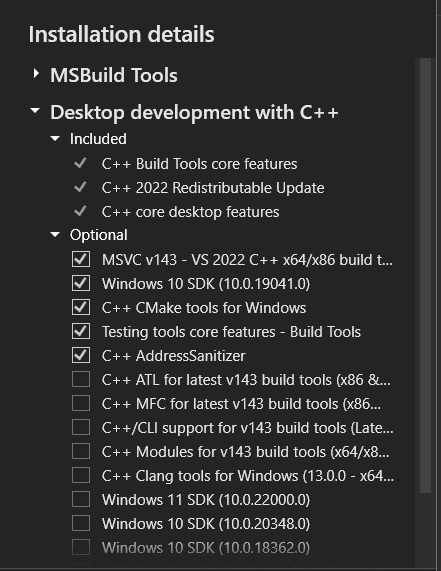

## Build Prerequisites

### Build Prerequisites - OS

This application was developed on Windows 10.

### Build Prerequisites - Software

#### Build Prerequisites - Software - GNU Win32 Make

The `make` tool is needed to use the Makefile make targets.

* GNU Make for Win32:
  * http://gnuwin32.sourceforge.net/packages/make.htm -> "Download" -> "Setup Program"
    * https://sourceforge.net/projects/gnuwin32/files/make/3.81/make-3.81.exe/download
    * 3.81 is the latest version as of July 2022.

The default installation directory is `C:\Program Files (x86)\GnuWin32`.

After the installation, add `C:\Program Files (x86)\GnuWin32\bin` to the `Path`
in the Windows system environment variables.

Finally, verify that `make` is available by executing `make --version`.
```
>make --version
GNU Make 3.81
Copyright (C) 2006  Free Software Foundation, Inc.
This is free software; see the source for copying conditions.
There is NO warranty; not even for MERCHANTABILITY or FITNESS FOR A
PARTICULAR PURPOSE.

This program built for i386-pc-mingw32
```

#### Build Prerequisites - Software - MSYS Winlibs

MSYS Winlibs is required for this build.

* MSys Winlibs for Windows x86_64 MSVCRT (11.3.0) or greater
  * https://winlibs.com/#download-release
  * Extract this to `C:\mingw64\`.
  * Add `C:\mingw64\bin` to the Windows `Path` in the system environment variables.

#### Build Prerequisites - Software - Build Tools for Visual Studio

The Windows 10 SDK is required for this build and is obtained as part of the
Build Tools for Visual Studio.

* Build Tools for Visual Studio 2022 17.1.6 or later
  - Provides the Windows 10 SDK.
  - Available from: https://visualstudio.microsoft.com/downloads/?q=build+tools

When you run the "Build Tools for Visual Studio" installer, review the
selections in the "Installation details" menu on the right side before starting
the installation.



**Make sure that the following options are selected. These were the defaults as of 17.1.6.**
* "Included" (these cannot be unselected):
  * C++ Build Tools core features
  * C++ 2022 Redistributable Update
  * C++ core desktop features
* "Optional" (at a minimum, "Windows 10 SDK" must be checked)
  * MSVC v143 - VS 2022 C++ x86/x86 build tools
  * Windows 10 SDK (10.0.19041.0)
  * C++ CMake Tools for Windows
  * Testing tools core features - Build Tools
  * C++ AddressSanitizer

## Customizing The Executables

The named_pipes micro emulation has three components: the server, the client, and the executor.

* Server - `namedpipes_server.cpp`: Creates the pipe and writes to it.
* Client - `namedpipes_client.cpp`: Reads from the pipe.
* Executor - `namedpipes_executor.cpp`: Launches the server and client executables in their own processes.

The operation of the three components can be modified by editing certain
variables in the source code files.

### Customizing The Executables - Pipe Names

In the current design of this module, the three components don't share the name
of the pipe between each other, so the same value(s) must be edited in the
server, client, and executor.

The list of hard-coded pipe names is defined in the `pipe_names` array in all three files:

```
const char *pipe_names[5] = {
    "\\\\.\\pipe\\MSSE-a09-server",
    "\\\\.\\pipe\\status_4f",
    "\\\\.\\pipe\\postex_ssh_ad90",
    "\\\\.\\pipe\\postex_b83a",
    "\\\\.\\pipe\\29fe3b7c1"
};
```

The `main()` of each file has a conditional block that sets the pipe name to use
based on what option is specified (1-5). The executor calls the client and server
with the same value that it is given as input.

To define a custom pipe name, replace the value at a specific index
in `pipe_names` with your pipe name in all three files.

For example, to replace option 1, replace the first value in `pipe_names`,
`\\\\.\\pipe\\MSSE-a09-server`, in all three files.

#### Customizing The Executables - Pipe Names - More than Five Pipe Names

If you are going to define more than five pipe names at a time, you must also
modify each file's block of conditional code that sets the pipe name based
on the value from `argv[1]`.

The current code allows values from 1 to 5 and prints an error message
if the value is not one of those values.

* You must add conditional branches to define your additional pipes
  as valid choices.
  * Example: A case that accepts "6" or "7".
* You must update the "Invalid pipe type number" error message.

The below excerpt is from `namedpipes_executor.cpp`.

```
        } else if (strcmp(argv[1], "1") == 0) {
            pipe_option = "1";
            std::printf("Pipe will be: %s\n", pipe_names[0]);
        } // ... options 2-4 skipped for space ...
        } else if (strcmp(argv[1], "5") == 0) {
            pipe_option = "5";
            std::printf("Pipe will be: %s\n", pipe_names[4]);
        } else {
            cout << "Invalid pipe type number: " << argv[1] \
                << " (must be 1-5).\n" << endl;
            cout << options << endl;
            return 1;
        }
```

To account for C/C++ 0-indexing, we pick the pipe name from
the option number minus one.

In `namedpipes_server.cpp` and `namedpipes_client.cpp`,
`pipe_option` is used to set the pipe name from `pipe_names`,
rather than the integer of an option value.

This excerpt is from `namedpipes_server.cpp`:

```
    if (argc == 2) {
        if (strcmp(argv[1], "1") == 0) {
            pipe_option = pipe_names[0];
        } // ... options 2-4 skipped for space ...
        } else if (strcmp(argv[1], "5") == 0) {
            pipe_option = pipe_names[4];
        } else {
            char errbuffer[46];
            int cx = snprintf(
                errbuffer, 45,
                "Invalid pipe type number: %s (must be 1-5).\n",
                argv[1]);
            WriteOutput(errbuffer);
            WriteOutput(options);
            return 1;
        }
```

### Customizing The Executables - Running Time

Each of the three components has a `Sleep(time in milliseconds);` call near the
end that pauses for a set amount of time to allow other processes time to
interact with them:

* `namedpipes_server.cpp` sleeps for 30 seconds (30000 ms) waiting for the
  client to connect. This also allows other tools to observe its named pipe
  before it closes.
* `namedpipes_client.cpp` sleeps for 20 seconds (20000 ms).
  This is also done to let other tools observe it, if applicable.
* `namedpipes_executor.cpp` sleeps for 35 seconds (35000 ms) so that it will
  run longer than the server and client processes that it starts, finishing last.

Follow these rules if you change these times:

* The executor must have the longest sleep time.
* The server's sleep time must be longer than the client's.

For consistency, you may also want to modify the hard-coded output strings just
before the `Sleep(35000)` in `namedpipes_executor.cpp`, which have the times
"20 seconds" and "30 seconds" hard-coded.

```
    std::printf("The client will read from the server, wait 20 seconds, and close its connection.\n");
    std::printf("The server will wait 30 seconds and close the pipe.\n");
```

## Building the Executables

As previously stated, this step requires you to have `make` installed and
available on the Windows `Path` in the system environment variables.

In a terminal, switch to the `named_pipes` directory where the `Makefile` is located,
and run `make build-all` to statically compile the executables:

```
make build-all
```

The executables are placed in `build/`.

## Creating a Zip Archive

This section assumes that:
* You have a `zip` command available in the shell. The commands in the
  `archive` make target use `zip`.
* You have already built the executables according to the previous steps.

If so, run `make archive`:

```
make archive
```

This will delete the old `named_pipes.zip` and produce a new `named_pipes.zip`.

The `named_pipes.zip` includes:

* `README.md`
* `BUILD.md`
* Supporting assets in `docs/`
* `build/namedpipes_client.exe`
* `build/namedpipes_executable.exe`
* `build/namedpipes_server.exe`

## Customizing the Executable Names

This section assumes that you can complete the steps to build executables
and create the zip archive.

The names of the processes for the server and client are based on their
filenames. You can change the names of the files by setting some variables
for the make targets `make build-all` and `make-archive`.

**If you customize the name variables for one `make` target, you must use the
same variable values in all `make` targets that you run after that which depend
on an output of that customized make target.**

The examples in the following subsections use these names:
* Server: variable `SERVER_EXE`: `myserver.exe`
* Client: variable `CLIENT_EXE`: `myclient.exe` 
* Executor: variable `EXECUTOR_EXE`: `myexec.exe`

### Customizing Individual Builds of the Executables

This example builds, in order, the server (with `build-server`), the client
(with `build-client`), and the executor (with `build-executor`) with custom
names for the executable that the make target generates.

```
make SERVER_EXE=myserver.exe build-server
make CLIENT_EXE=myclient.exe build-client
make EXECUTOR_EXE=myexec.exe build-executor
```

### Customizing "make build-all"

This example passes custom names for the server, client, and executor executables
to the `make build-all` make target.

```
make SERVER_EXE=myserver.exe CLIENT_EXE=myclient.exe EXECUTOR_EXE=myexec.exe build-all
```

### Customizing "make archive"

This example passes custom names for the server, client, and executor executables
to the `make archive` make target.

```
make SERVER_EXE=myserver.exe CLIENT_EXE=myclient.exe EXECUTOR_EXE=myexec.exe archive
```

### Using Custom Executable Names As the Application Parameters

**When you run the executor, you must specify the same custom values that
you used when you built the server and client executables, or the executor
will assume that those executables have the default names.**

```
./myexec.exe --pipe 3 --server myserver.exe --client myclient.exe
```
