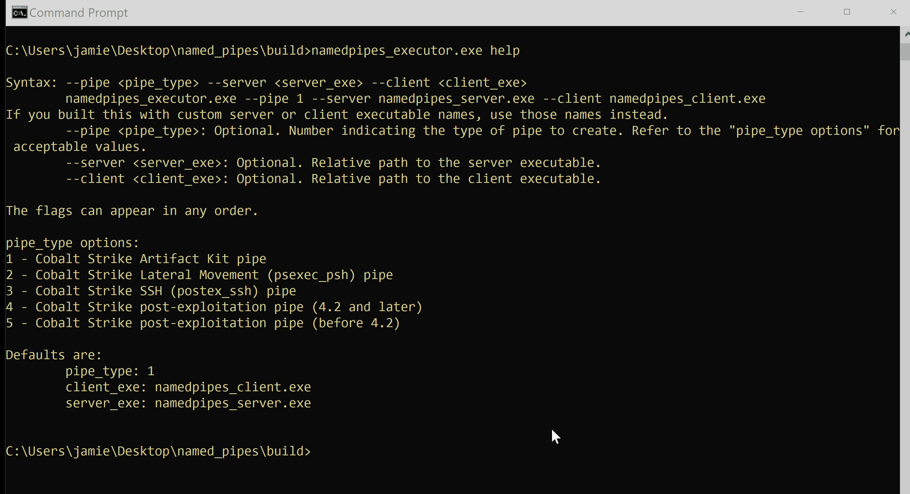

# Micro Emulation Plan: Named Pipes

This micro emulation plan targets the data source [DS0023 Named
Pipe](https://attack.mitre.org/datasources/DS0023). [Named
pipes](https://docs.microsoft.com/windows/win32/ipc/pipes?redirectedfrom=MSDN)
are shared memory used for inter-process communication (IPC). A pipe is
typically implemented as a special file that allows processes to exchange data,
though IPC traffic between hosts may be encapsulated in other protocols such as
SMB. Named pipes are commonly abused by malware (ex: [Cobalt
Strike](https://labs.f-secure.com/blog/detecting-cobalt-strike-default-modules-via-named-pipe-analysis/))
while injecting/retrieving payloads and commands.

**Table Of Contents:**

- [Description of Emulated Behaviors](#description-of-emulated-behaviors)
- [CTI / Background](#cti--background)
- [Execution Instructions / Resources](#execution-instructions--resources)
  - [Command Arguments](#command-arguments)
  - [Customizing the Executables](#customizing-the-executables)
  - [Execution Demo](#execution-demo)
- [Defensive Lessons Learned](#defensive-lessons-learned)
  - [Detection](#detection)
  - [Mitigation](#mitigation)

## Description of Emulated Behaviors

**What are we doing?** This module provides an easy-to-execute tool for creating
and sending data over a named pipe. The module is split into 3 parts:

1. A **server** that creates a named pipe using the Windows `CreateNamedPipe()`
   API, then writes a message to that pipe.
2. A **client** that connects to a named pipe using the Windows `CreateFile()`
   API, then reads and prints the message from the named pipe.
3. Both the client and server are executed by the **executor** program, which
   also provides the name of the pipe. Pipe names are chosen by the user based
   on hard-coded values based on [CTI-inspired
   templates](https://www.cobaltstrike.com/blog/learn-pipe-fitting-for-all-of-your-offense-projects/).

## CTI / Background

**Why should you care?** Named pipes are commonly abused by malware to transfer
malicious payloads and data between processes ([T1559 Inter-Process
Communication](https://attack.mitre.org/techniques/T1559)). Commonly known as a
["Fork-n-Run"
pattern](https://labs.f-secure.com/blog/detecting-cobalt-strike-default-modules-via-named-pipe-analysis/),
this design helps protect malware by using "sacrificial processes" that may not
reveal/highlight the main malware module. Malware such as Cobalt Strike Beacons
have utilized this approach while executing malicious components such as code
loaders/injector ([T1055 Process
Injection](https://attack.mitre.org/techniques/T1055)) and keyloggers.

Privilege escalation exploits ([T1068 Exploitation for Privilege
Escalation](https://attack.mitre.org/techniques/T1068)), such as [Cobalt
Strike](https://thedfirreport.com/2021/08/29/cobalt-strike-a-defenders-guide/)'s
& [Metasploit's
getsystem](https://docs.rapid7.com/metasploit/meterpreter-getsystem/), have also
abused [named pipe
impersonation](https://foxglovesecurity.com/2016/09/26/rotten-potato-privilege-escalation-from-service-accounts-to-system/)
to steal tokens ([T1134 Access Token
Manipulation](https://attack.mitre.org/techniques/T1134)). Named pipes may also
be created and abused as part of Lateral Movement ([T1134 Access Token
Manipulation](https://attack.mitre.org/techniques/T1134), [T1570 Lateral Tool
Transfer](https://attack.mitre.org/techniques/T1570)) or remote Discovery
([T1018 Remote System Discovery](https://attack.mitre.org/techniques/T1018))
behaviors.

## Execution Instructions / Resources

This module has been implemented into an easy-to-execute tool. You can download
the tool to get start quickly. If you wish to customize or build from source
code, please see [BUILD.md](BUILD.md).

The `namedpipes_executor.exe` tool coordinates the exection of the server and
the client. It starts a server subprocess to create the pipe and write to it.
Then it starts a client subprocess to read from the pipe. The
`namedpipes_executor.exe` tool expects `namedpipes_server.exe` and
`namedpipes_client.exe` to be in its current working directory.

### Command Arguments

The executor accepts three optional arguments: `--pipe`, `--server`, and
`--client`. Run the tool with just the argument `help` (with no other
parameters) to see a help message.

```
> ./namedpipes_executor.exe help

Syntax: --pipe <pipe_type> --server <server_exe> --client <client_exe>
        namedpipes_executor.exe --pipe 1 --server namedpipes_server.exe --client namedpipes_client.exe
If you built this with custom server or client executable names, use those names instead.
        --pipe <pipe_type>: Optional. Number indicating the type of pipe to create. Refer to the "pipe_type options" for acceptable values.
        --server <server_exe>: Optional. Relative path to the server executable.
        --client <client_exe>: Optional. Relative path to the client executable.

The flags can appear in any order.

pipe_type options:
1 - Cobalt Strike Artifact Kit pipe
2 - Cobalt Strike Lateral Movement (psexec_psh) pipe
3 - Cobalt Strike SSH (postex_ssh) pipe
4 - Cobalt Strike post-exploitation pipe (4.2 and later)
5 - Cobalt Strike post-exploitation pipe (before 4.2)

Defaults are:
        pipe_type: 1
        client_exe: namedpipes_client.exe
        server_exe: namedpipes_server.exe
```

The `--pipe` argument specifies one of the five pipe types to use (default: 1),
e.g.:

```
./namedpipes_executor.exe --pipe 2
```

The valid pipe types are:

1. `\\.\pipe\MSSE-a09-server`, inspired by the default Cobalt Strike Artifact
   Kit pipe (`MSSE-###-server`)
2. `\\.\pipe\status_4f`, inspired by the default Cobalt Strike Lateral Movement
   pipe (`status_##` created by `psexec_psh`)
3. `\\.\pipe\postex_ssh_ad90`, inspired by the default Cobalt Strike SSH pipe
   (`postex_ssh_####` created by `postex_ssh`)
4. `\\.\pipe\postex_b83a`, inspired by the default Cobalt Strike v4.2+
   post-exploitation pipe (`postex_####`)
5. `\\.\pipe\29fe3b7c1`, inspired by the default Cobalt Strike pre-v.4.2 pipe
   (7-10 digit hexadecimal value)

The `--server` argument sets the name of the server executable to invoke
(default: `namedpipes_server.exe`):

```
./namedpipes_executor.exe --server myserver.exe
```

You only need to set this flag if you have customized the server executable
name. See ["Customizing the Executable
Names"](BUILD.md#customizing-the-executable-names) for more information.

The `--client` argument sets the name of the server executable to invoke
(default: `namedpipes_client.exe`):

```
./namedpipes_executor.exe --client myclient.exe
```

You only need to set this flag if you have customized the client executable name.
See ["Customizing the Executable Names"](BUILD.md#customizing-the-executable-names) for more information.

### Customizing the Executables

These hard-coded values can be tailored by modifying the relevant strings in the
source code and rebuilding the project. See [Customizing the
Executables](BUILD.md#Customizing-The-Executables) for more details.

### Execution Demo



## Defensive Lessons Learned

### Detection

Sysmon generates [event IDs 17 and
18](https://docs.microsoft.com/en-us/sysinternals/downloads/sysmon#event-id-17-pipeevent-pipe-created)
when named pipes are created or connected to. These, and similar events, can be
used to baseline known name pipe patterns (i.e. [pipe names and associated
client/server
processes](https://github.com/olafhartong/sysmon-modular/tree/master/17_18_pipe_event))
as well as create analytics to match on [known malicious pipe name
patterns](https://github.com/SigmaHQ/sigma/tree/master/rules/windows/pipe_created).

```yaml
detection:
   selection_MSSE:
      PipeName|contains|all:
         - '\MSSE-'
         - '-server'
   selection_postex:
      PipeName|startswith: '\postex_'
   selection_postex_ssh:
      PipeName|startswith: '\postex_ssh_'
   selection_status:
      PipeName|startswith: '\status_'
   selection_msagent:
      PipeName|startswith: '\msagent_'
   condition: 1 of selection*
```
*Code excerpted from [github.com/SigmaHQ/sigma](https://github.com/SigmaHQ/sigma/blob/7fb8272f948cc0b528fe7bd36df36449f74b2266/rules/windows/pipe_created/pipe_created_mal_cobaltstrike.yml*

Monitoring and/or alerting based solely on pipe names (which may be manipulated
by adversaries) may introduce false positives and false negatives (though lists
of default values commonly abused by malware are available). Other behaviors
such as execution of PowerShell commands (`\PSHost`) or [LDAP queries using
tools such as
SharpHound.exe](https://blog.menasec.net/2019/02/threat-hunting-7-detecting.html)
may also utilize [well-known name
pipes](https://thedfirreport.com/2021/08/29/cobalt-strike-a-defenders-guide/).
You can also use [PowerShell to
query](https://svch0st.medium.com/guide-to-named-pipes-and-hunting-for-cobalt-strike-pipes-dc46b2c5f575)
for all currently open pipes (ex: `Get-ChildItem \\.\pipe\`)

[Anonymous (unnamed)
pipes](https://labs.f-secure.com/blog/detecting-cobalt-strike-default-modules-via-named-pipe-analysis/)
can also be created and used in the same way as named pipes. These may still
trigger the same detection events (ex: Sysmon EID 17) but may be more difficult
to create automatic alerts for since the name value will be `Null`. For this
reason, it may be advantageous to baseline an environment (ex: which processes
commonly create/connect to anonymous pipes?) to provide better context during
triage/deeper analysis of potentially malicious telemetry.

Abuse of pipes could be a fruitful threat hunting activity. For example, [the
following Splunk
query](https://labs.f-secure.com/blog/detecting-cobalt-strike-default-modules-via-named-pipe-analysis/)
can be used to search for relatively uncommon/rare processes creating an
anonymous pipe:

```
index="YOUR_INDEX" source="XmlWinEventLog:Microsoft-Windows-Sysmon/Operational" EventCode=17 PipeName="&lt;Anonymous Pipe&gt;"| rare limit=20 Image
```

You can also monitor usage of named pipes via other methods such as [hooking API
functions associated with named
pipes](https://bmcder.com/blog/cobalt-strike-dfir-listening-to-the-pipes), those
this approach may be difficult to scale and distinguish from benign system
activity.

### Mitigation

Usage of named pipes may be difficult if not impossible to mitigate since they
have many legitimate uses. Efforts can be rather focused on
filtering/blocking/identifying patterns of abuse at both a host and network
layer. For the latter, network segmentation can be used to minimize the
potential impact of remote named pipe abuse.
