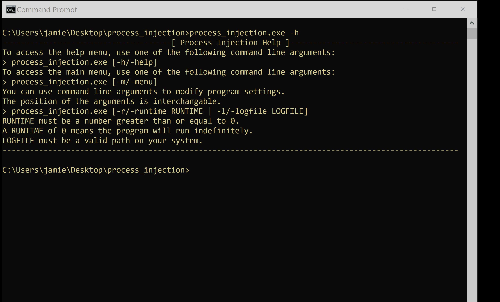

# Micro Emulation Plan: Process Injection

This micro emulation plan targets compound behaviors related to [T1055 Process
Injection](https://attack.mitre.org/techniques/T1055). [Process
injection](https://www.elastic.co/blog/ten-process-injection-techniques-technical-survey-common-and-trending-process)
is commonly abused by malware to run code in another process, often to evade
defenses (i.e. execution from an otherwise benign process) as well as
potentially to elevate privileges (i.e. inheriting unique privileges from the
target process). There are many variations of process injection, mostly used to
migrate between processes or to [execute specific modules in a sacrificial
process](https://labs.f-secure.com/blog/detecting-cobalt-strike-default-modules-via-named-pipe-analysis/).
This emulation focuses on the latter varaint.

You can access the binary for this micro plan as part of the [latest release](https://github.com/center-for-threat-informed-defense/adversary_emulation_library/releases). 

**Table Of Contents:**

- [Micro Emulation Plan: Process Injection](#micro-emulation-plan-process-injection)
  - [Description of Emulated Behaviors](#description-of-emulated-behaviors)
  - [Cyber Threat Intel / Background](#cyber-threat-intel--background)
  - [Execution Instructions / Resources](#execution-instructions--resources)
    - [Execution Demo](#execution-demo)
  - [Defensive Lessons Learned](#defensive-lessons-learned)
    - [Detection](#detection)
    - [Mitigation](#mitigation)

## Description of Emulated Behaviors

**What are we doing?** This module provides an easy-to-execute tool that:

1. Creates a suspended, sacrificial process (`svchost.exe`, `notepad.exe`, or
   `powershell.exe`) using `CreateProcess()`.
2. Injects the sacrificial process with malicious shellcode to execute a command
   (from a predefined list of local discovery commands) using
   `WriteProcessMemory()`.
3. Executes the command code using `CreateRemoteThread()`.
4. Repeats `1-3` until the program is stopped.
5. Cleans up by ending all created processes still running.

The local discovery commands used in step 2 are used to emulate an adversary enumerating a system after initial compromise. These commands are:

- `whoami /groups`
- `netstat -ano`
- `qwinsta`
- `tasklist`

## Cyber Threat Intel / Background

**Why should you care?** [T1055 Process
Injection](https://attack.mitre.org/techniques/T1055) is [very commonly abused
by
malware](https://redcanary.com/threat-detection-report/techniques/process-injection/)
to evade defenses, specifically to execute malicious code within an otherwise
benign process. There are [numerous variations of process
injection](https://www.ired.team/offensive-security/code-injection-process-injection)
that all [typically follow the same
pattern](https://www.microsoft.com/security/blog/2022/06/30/using-process-creation-properties-to-catch-evasion-techniques/)
of accessing a target process, writing malicious code into its memory space, and
then triggering execution of the code (typically via a thread within the victim
process).

Adversaries may utilize this approach to evade defensive analysis (e.g. moving
away from initial access artifacts) or to inherit specific permissions from a
victim process (e.g. changing users). Similar to the [Named Pipes micro
emulation](../named_pipes/), malware have also used process injection as part of
a ["fork-n-run"
pattern](https://labs.withsecure.com/blog/detecting-cobalt-strike-default-modules-via-named-pipe-analysis/)
to execute modules using "sacrificial processes" that may not reveal/highlight
the running malware process or write malicious payloads to disk.

Process injection may also be abused as part of other behaviors that involve
stealing data form process memory such as dumping LSASS credentials ([T1003.001
LSASS Memory](https://attack.mitre.org/techniques/T1003/001)).

## Execution Instructions / Resources

This module has been compiled into an easy to execute/integrate executable. If
you wish to customize or build from source code, please see the [building
document](BUILD.md). You can also download the pre-compiled module.

The `process_injection.exe` tool executes the complete emulation functionality.
The tool accepts the following arguments or on the command or alternatively can
be configured using the builtin menu:

- `-r / -runtime:` the number of seconds for the module to run
- `-l / -logfile:` the location for the module's log file

### Execution Demo



## Defensive Lessons Learned

### Detection

Sysmon generates [event ID
10](https://docs.microsoft.com/en-us/sysinternals/downloads/sysmon#event-id-10-processaccess)
when a process opens another process as well as [event ID
8](https://docs.microsoft.com/en-us/sysinternals/downloads/sysmon#event-id-8-createremotethread)
when a process creates a thread in another process, though this data [may incur
a lot of
noise](https://redcanary.com/threat-detection-report/techniques/process-injection/).
Consider monitoring for abnormal process activity (e.g. making network
connections or performing other unusual actions, especially compared to the
process's command line) that may be an indicator that a process is executing
malicious code.

Processes that are injecting into others may [load
DLLs/modules](https://github.com/olafhartong/sysmon-modular/blob/2bfcf938e7049d5939ff297d0d8039dc3d16244c/7_image_load/include_dotnet_load.xml),
exhibit specific [process access
characteristics](https://github.com/olafhartong/sysmon-modular/blob/f25467ca9400ff557934c46c90f19f48398323d8/10_process_access/include_process_suspend_resume.xml),
as well as [call
functions](https://github.com/olafhartong/sysmon-modular/blob/60b0883b019707bba9903c8c5a67f64713dcab5c/8_create_remote_thread/include_all.xml)
(ex: `CreateRemoteThread()`) that can be detected. [Comparing process
memory](https://www.microsoft.com/security/blog/2022/06/30/using-process-creation-properties-to-catch-evasion-techniques/)
to the [images backed by files on
disk](https://twitter.com/SecurePeacock/status/1486054048390332423/photo/1) may
also highlight malicious tampering via injection.

Consider baselining environments to understand benign process injection activity
that may help highlight malicious abuse. For example, processes such as
`powershell.exe` may be identified as [unlikely to be associated with detecting
false positive inter-process
activity](https://redcanary.com/threat-detection-report/techniques/process-injection/).

>**PowerShell injecting into… anything**
>
>There’s some exceptions here—surely varying from one environment to the
>next—but, generally speaking, you’ll want to be wary of process access activity
>where PowerShell is accessing any other processes.
>
>```
>process == powershell.exe
>&&
>handle_granted_to [any other process]
>```

*Excerpted from [Red Canary's Process Injection
report](https://redcanary.com/threat-detection-report/techniques/process-injection/).*

### Mitigation

Usage of process injection may be difficult if not impossible to mitigate since
the signals are also associated with benign behavior. Efforts can be focused on
blocking known, detectable patterns of abuse.
