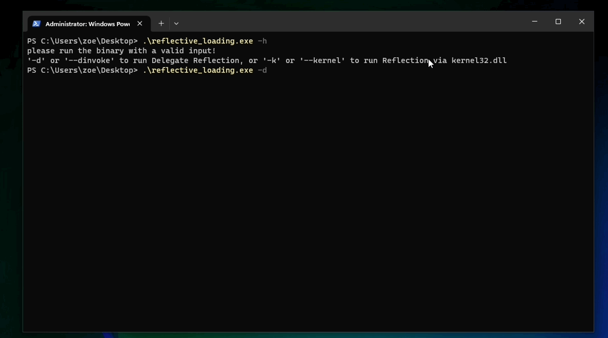
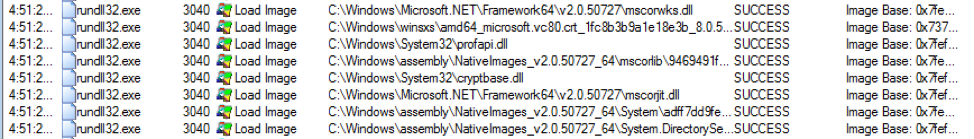

# Micro Emulation Plan: Reflective Code Loading

This micro emulation plan targets compound behaviors related to [T1620 Reflective Code Loading](https://attack.mitre.org/techniques/T1620/). [Malware commonly abuses reflective loading](https://thewover.github.io/Introducing-Donut/) to execute malicious code within an otherwise seemingly benign host process. There are many variations of reflectively loading code (this emulation focuses on a few very common variants) that highlight potentially broader defensive lessons learned.

**Table Of Contents:**

- [Description of Emulated Behaviors](#description-of-emulated-behaviors)
- [CTI / Background](#cti--background)
- [Execution Instructions / Resources](#execution-instructions--resources)
  - [Execution Demo](#execution-demo)
- [Defensive Lessons Learned](#defensive-lessons-learned)
  - [Detection](#detection)
  - [Mitigation](#mitigation)

## Description of Emulated Behaviors

**What are we doing?** This module provides easy-to-execute code that reflectively loads a shellcode payload (using either Windows API or .NET functions) into the running host process. The shellcode executes a series of local discovery commands via PowerShell:

- `whoami /groups`
- `qwinsta`
- `tasklist`
- `Get-WmiObject Win32_product`
- `netstat -ano`

## CTI / Background

**Why should you care?** [T1620 Reflective Code Loading](https://attack.mitre.org/techniques/T1620/) is very commonly abused by malware to evade defenses, specifically to execute malicious code within an otherwise benign process. Other techniques, such as [T1055 Process Injection](https://attack.mitre.org/techniques/T1055/) and [T1574 Hijack Execution Flow](https://attack.mitre.org/techniques/T1574/), achieve a similar effect but create external detectable artifacts. Adversaries and malware authors may instead opt to use reflective code loading techniques to attempt to contain generated artifacts within the memory of their host process.

Organic system features, such as the [Windows .NET Common Language Runtime (CLR)](https://learn.microsoft.com/dotnet/standard/clr), may be loaded into a process to run arbitrary code from private process memory. Malware, such as [Cobalt Strike's `execute-assembly` function in Beacon](https://www.mandiant.com/resources/blog/bring-your-own-land-novel-red-teaming-technique), abuse this functionality to execute malicious code in-memory without writing payloads to disk.

## Execution Instructions / Resources

This module has been compiled into an easy to execute/integrate executable. Source code is available if you wish to customize and/or rebuild the tool (e.g., changing the shellcode payload). You can also download the pre-compiled module.

The `reflective_loading.exe` tool executes the complete emulation functionality. The tool accepts the following arguments on the command-line, or can be executed with defaults via a double-click:

- `-d` or `--dinvoke`: execute using [MemoryMappedFile](https://learn.microsoft.com/dotnet/api/system.io.memorymappedfiles.memorymappedfile) & [Marshal](https://learn.microsoft.com/dotnet/api/system.runtime.interopservices.marshal) .NET functions (`DEFAULT`)
- `-k` or `--kernel`: execute using `VirtualAlloc()` and `CreateThread()`
- `-h` or `--help`: display the help menu

### Execution Demo

## Defensive Lessons Learned

### Detection

A lot of the related detection telemetry may be low-level since reflective code loading happens within a malicious host process. [Monitoring module loads](https://www.mdsec.co.uk/2020/06/detecting-and-advancing-in-memory-net-tradecraft/) (especially related to .NET and other execution runtimes) into abnormal processes (such as unmanaged, not .NET-based programs) may highlight attempts to execute functions associated with modifying process memory.

*Image source: [Bring Your Own Land (BYOL) – A Novel Red Teaming Technique](https://www.mandiant.com/resources/blog/bring-your-own-land-novel-red-teaming-technique)*

Monitoring API calls of functions commonly abused for reflective code loading could highlight malicious activity, but may also be prone to high noise and false positive rates if not correlated with other signals.

### Mitigation

Usage of reflective code loading may be difficult if not impossible to mitigate since the signals are low-level and potentially also associated with legitimate system activity. Efforts can be focused on blocking known, detectable patterns of abuse.
