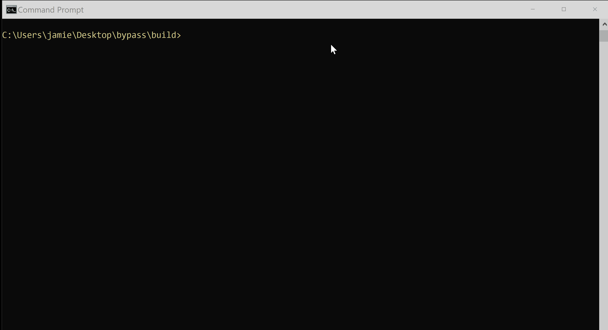

# Micro Emulation Plan: User Execution

This micro emulation plan targets malicious activity associated with [T1204 User
Execution](https://attack.mitre.org/techniques/T1204). User execution is
commonly abused by adversaries as a means of executing malicious payloads. This
behavior specifically highlights execution invoked by the victim in the form of
clicking or otherwise invoking malicious code from phishing or other delivery
campaigns.

**Table Of Contents:**

- [Description of Emulated Behaviors](#description-of-emulated-behaviors)
- [CTI / Background](#cti--background)
- [Execution Instructions / Resources](#execution-instructions--resources)
  - [Execution Demo](#execution-demo)
- [Defensive Lessons Learned](#defensive-lessons-learned)
  - [Detection](#detection)
  - [Mitigation](#mitigation)

## Description of Emulated Behaviors

**What are we doing?** This module provide an easy-to-execute tool for invoking
various types of payloads that emulate the mechanics of a user executing an
adversary's malicious payload. These modules support 3 variants that each:

1. Plant the malicious payload on disk
2. Invoke command execution through the payload file(s)

## CTI / Background

**Why should you care?** [T1204 User
Execution](https://attack.mitre.org/techniques/T1204) is commonly abused as a
follow-up to Initial Access via [T1566
Phishing](https://attack.mitre.org/techniques/T1566) where adversaries rely on
users to execute delivered payloads. These payloads are typically file formats
that facilitate the execution of commands and lead to follow-on activities by
downloading and staging additional payloads onto the victim host.

## Execution Instructions / Resources

This repository includes modules that execute multiple variants of user execution:

* Office documents containing macros: [README_macros.md](macros/README_macros.md)
* Shortcut (LNK) files containing PowerShell commands:
  [README_shortcut.md](shortcut/README_shortcut.md)
* Container (ISO) files containing commands in a batch script:
  [README_iso_bypass.md](iso_bypass/README_iso_bypass.md)
* OneNote file containing malicious batch script: [README_dotone.md](dot_one/README_dot_one.md)

### Execution Demo



## Defensive Lessons Learned

### Detection

Malicious user execution can be difficult to distinguish from benign user/system
activity, though payloads executed through user click interactions typically can
be identified by monitoring child processes of `explorer.exe`.

```xml
<Sysmon schemaversion="4.30">
  <EventFiltering>
    <RuleGroup name="" groupRelation="or">
      <ProcessCreate onmatch="include">
        <ParentCommandLine name="technique_id=T1204,technique_name=User Execution" condition="is">C:\Windows\explorer.exe</ParentCommandLine>
        <ParentImage name="technique_id=T1204,technique_name=User Execution" condition="is">C:\Windows\explorer.exe</ParentImage>
      </ProcessCreate>
    </RuleGroup>
  </EventFiltering>
</Sysmon>
```
*Excerpted from
[github.com/olafhartong/sysmon-modular](https://github.com/olafhartong/sysmon-modular/blob/14f9b5a9ca8580d4a6b0b4ca0ea100e8fdc6fdda/1_process_creation/include_explorer.xml).*

User execution targeting Microsoft Office files may also be detected via
[modules loads associated with script/command
execution](https://github.com/SigmaHQ/sigma/blob/7fb8272f948cc0b528fe7bd36df36449f74b2266/rules/windows/image_load/image_load_susp_winword_vbadll_load.yml).
Detection efforts may also focus on identifying abnormal process behavior that
may be a side-effect of malicious user execution, such as [Office applications
spawning command
interpreters](https://github.com/SigmaHQ/sigma/blob/becf3baeb4f6313bf267f7e8d6e9808fc0fc059c/rules/windows/process_creation/proc_creation_win_office_shell.yml),
[creating additional files commonly abused as malicious
payloads](https://github.com/SigmaHQ/sigma/blob/82a875385a97c4bb7464750fca885b9257fff35a/rules-unsupported/file_event_executable_and_script_creation_by_office_using_file_ext.yml),
or generating network traffic.

### Mitigation

User execution may be difficult if not impossible to mitigate given that user
execution is strongly associated with benign behavior. Efforts can be rather
focused on blocking known, detectable patterns of abuse such as filtering email
and other delivery of specific file types, blocking [execution of risky Office
macros](https://techcommunity.microsoft.com/t5/microsoft-365-blog/helping-users-stay-safe-blocking-internet-macros-by-default-in/ba-p/3071805),
as well as [disabling the functionality to mount ISO image
files](https://docs.microsoft.com/answers/questions/414032/removing-mount-iso-image-functionality-by-gpo.html).
