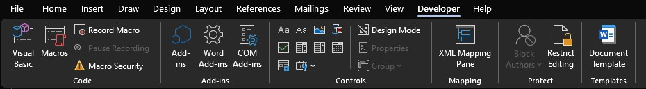
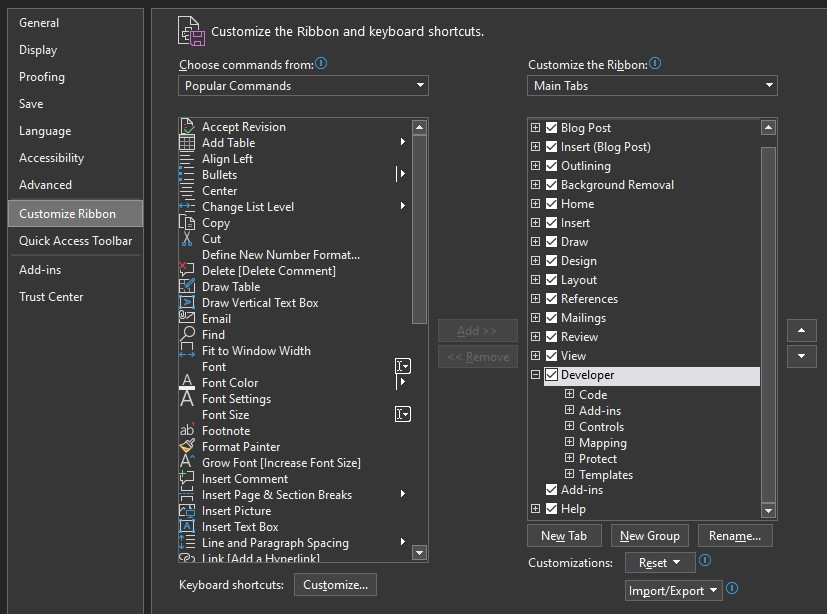
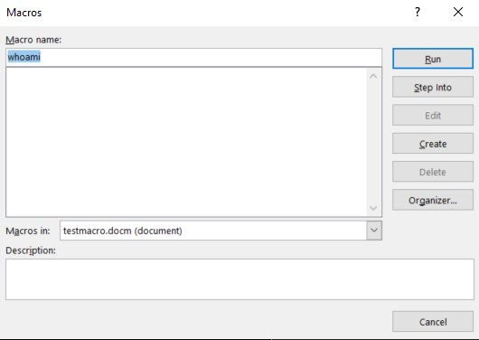
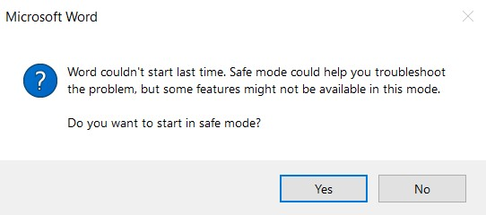
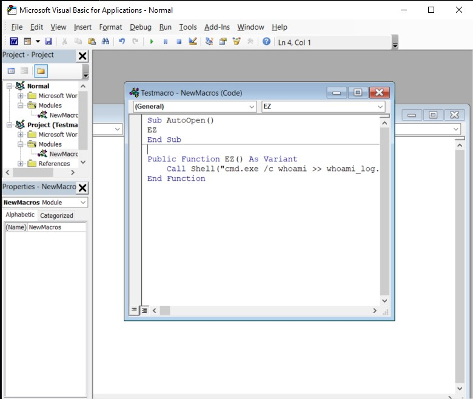
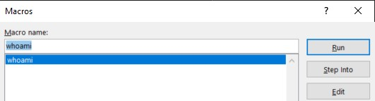

# Create and Edit Macro Documents

## Introduction

This article describes the process for creating and editing macros in a Microsoft Word document.

You should also follow the steps in [Enable Macros in Microsoft Office](enable_macros.md)
to allow macros to run in Office documents.

A discussion of Visual Basic itself is beyond the scope of this guide.

## Instructions

### Creating a New Document

Open a new Word document. In the Save menu, save it as a `Word Macro-Enabled Document (*.docm)`.

### Adding the Developer Tab to the Ribbon

Macro controls are in the "Developer" tab, which may not be enabled by default.

If you don't see the "Developer" tab, follow the below steps to enable it.

1. Open "File," then click through to "Options" → "Customize Ribbon."
2. Find the "Customize the Ribbon" list on the right-hand side, make sure
   "Main Tabs" is selected in the dropdown menu, and check "Developer" to
   enable it.
3. Click "OK" to save changes and exit.

### Defining a New Macro

In the "Developer" tab, click "Macros" to launch a popup menu.

1. Type a name for the macro in "Macro name."
   * Word will overwrite this with the name of the macro in the code.
     The example will be renamed `AutoOpen` after it is saved.
2. **IMPORTANT:** Change the "Macros in:" dropdown menu from the
   default "All active templates and documents" to
   "`<Name of document>`(document)," where `<Name of document>` is instead
   the name of the document that is open now.
   * **If you don't change this setting, your macro will be added to every
     Word document.**
   * **An `AutoOpen()` macro executes automatically when any document is opened.**
   * **If that AutoOpen macro did something that is flagged by your endpoint
     security, then every Word document will be flagged by your endpoint security!**
     * If the endpoint security causes Word to crash when it is launched, then
       Word will prompt you to open it in Safe Mode after a few crashes.
       * **Safe Mode doesn't load macros, so you can't fix this there.**
       * 
     * You must delete the document that you created when you defined the macro,
       then open a new Word Document (without Safe Mode), open the Macros menu,
       and delete the saved macro.
3. Click "Create" to launch the "Microsoft Visual Basic for Applications" IDE.
   * The code shown here is based on the [whoami example](../payload_code/whoami.md).

4. Use the green ▶ to run the code.
   * **WARNING: Depending on your system, this may trigger endpoint security.**
5. Alternatively, use "Debug" → "Step Into" to cause the ▶ button
   to step through the code, one line at a time.
6. Save with the save icon 💾 when done.
7. Exit the IDE by closing its window.

### Simple Macros

A full discussion of Visual Basic is beyond the scope of this guide.

The `Call Shell()` function will execute shell commands. For
enumeration commands like `whoami`, you should invoke these
in a specific shell, such as `cmd.exe` or `powershell.exe`.

For an example of this, see [the whoami example](../payload_code/whoami.md).

#### Differences from Standalone Visual Basic Code

This is not a comprehensive list.

* The `Imports` directive isn't valid here. The macro will only
  have access to whatever is provided by the Word context.
* `Shell()` must be preceded by the `Call` keyword.
  You cannot assign its return value to a variable.
  * Example: `Call Shell("cmd.exe /c whoami >> mylog.txt", 4)`
* The function `Threading.Thread.Sleep()` does not work.

### Editing a Saved Macro

If you need to edit the macro, select it in the Macros menu's list and click "Edit."

## References

* Microsoft: [Create or run a macro](https://support.microsoft.com/en-us/office/create-or-run-a-macro-c6b99036-905c-49a6-818a-dfb98b7c3c9c)
* Microsoft: [Find help on using the Microsoft Visual Basic Editor](https://support.microsoft.com/en-us/office/find-help-on-using-the-visual-basic-editor-61404b99-84af-4aa3-b1ca-465bc4f45432)
* Dan Gookin, Dummies.com: [How to Write Message Pop-Ups Macros in Word 2016](https://www.dummies.com/article/technology/software/microsoft-products/word/write-message-pop-ups-macros-word-2016-229114/)