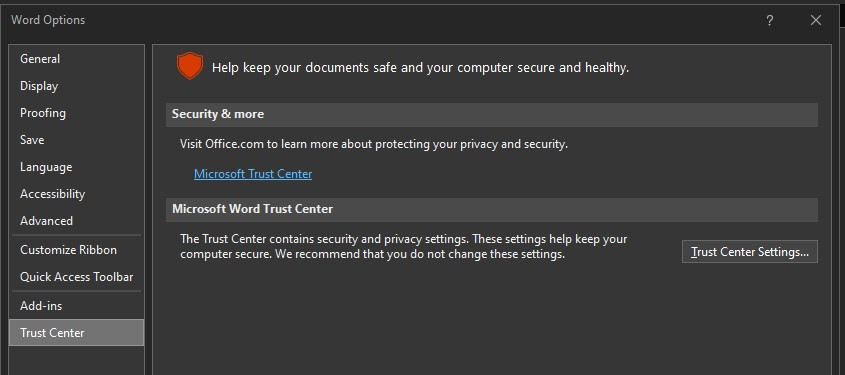
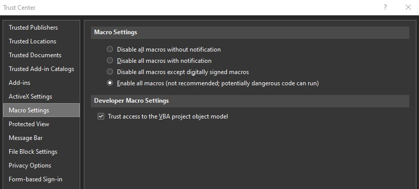

# Enable Macros in Microsoft Office

## Introduction

This walks users through [Microsoft's steps to enable Office macros](https://support.microsoft.com/en-us/office/macros-in-office-files-12b036fd-d140-4e74-b45e-16fed1a7e5c6?ui=en-us&rs=en-us&ad=us).

**This article intentionally configures insecure settings.**

This guide disables security settings in Office 365 that prevent the execution
of certain kinds of Office macro code.

It does not control other settings, such as Windows settings outside of Office,
or third-party endpoint security / antivirus applications.

If you are doing this on a non-disposable VM (however you define this), these
settings should be reverted to your organization's defaults after you are finished.

## Instructions

1. Open a Microsoft Office application, such as Microsoft Word.
2. Go to "File" -> "Options," then in the left sidebar, click "Trust Center."
3. In "Trust Center," go to "Trust Center Settings."

4. In "Trust Center Settings," click "Macro Settings."
5. Under "Macro Settings" -> "Macro Settings," select "Enable all macros."
6. Under "Macro Settings" -> "Developer Settings," check the box for "Trust access to the VBA Object Model."

7. Click "OK" to apply both changes and exit the Trust Center settings menu.
8. Click "OK" to exit the Options menu.

## References

* Microsoft: [Macros in Office Files](https://support.microsoft.com/en-us/office/macros-in-office-files-12b036fd-d140-4e74-b45e-16fed1a7e5c6?ui=en-us&rs=en-us&ad=us)