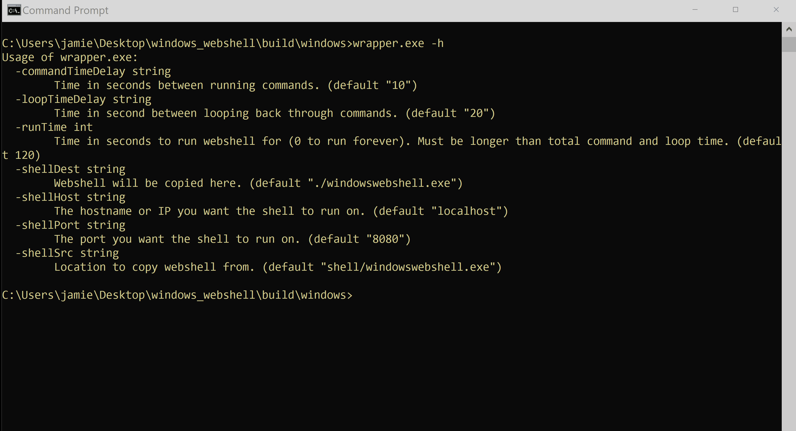

# Micro Emulation Plan: Web Shells

This micro emulation plan targets malicious activity surrounding [T1505.003 Web
Shell](https://attack.mitre.org/techniques/T1505/003). [Web
shells](https://www.cisa.gov/uscert/ncas/alerts/TA15-314A) are malware placed on
compromised web (or other network-accessible) servers, often used as a
persistent backdoor into a network. Once planted, adversaries may execute
arbitrary commands/functions on the victim server through a HTTP(S)
communication channel with the web shell. Various threat actors have abused web
shells targeting both Windows and Linux infrastructure.

**Table Of Contents:**

- [Description of Emulated Behaviors](#description-of-emulated-behaviors)
- [Cyber Threat Intel / Background](#cyber-threat-intel--background)
- [Execution Instructions / Resources](#execution-instructions--resources)
  - [Execution Demo](#execution-demo)
- [Defensive Lessons Learned](#defensive-lessons-learned)
  - [Detection](#detection)
  - [Mitigation](#mitigation)

## Description of Emulated Behaviors

**What are we doing?** This module provides an easy-to-execute tool for
installing, connecting to, and running commands through various web shells. The
emulation plans supports several variants of web shells that each:

1. Plant a malicious file in a web directory
2. Connect to the web shell over a user-defined network socket
3. Execute a series of user-defined (default is local discovery) shell commands
   using the web server

## Cyber Threat Intel / Background

**Why you should care?** [Web
shells](https://media.defense.gov/2020/Jun/09/2002313081/-1/-1/0/CSI-DETECT-AND-PREVENT-WEB-SHELL-MALWARE-20200422.PDF)
are a constant threat to organizations, as this type of malware has been
frequently deployed [across many different types of
intrusions](https://www.mandiant.com/resources/state-of-the-hack/the-wonderful-world-of-web-shells).
After identifying exploitatble vulnerabilities or configurations (i.e.
[T1190 Exploit Public-Facing Application](https://attack.mitre.org/techniques/T1190) via procedures such as
cross-site scripting, SQL injection, and remote/local file inclusion
vulnerabilities), threat actors often deploy web shells onto compromised
[Internet-facing or internal infrastructure to enable remote execution of
commands](https://www.cisa.gov/uscert/ncas/alerts/TA15-314A). Adversaries can
then use these web shells as a persistent backdoor into the network, as well as
a pivot to upload additional malware as well as locate and harvest data from
other internal hosts.

Web shells are typically small scripts and have been utilized by a wide range of threats, notably:

- [S0020 China Chopper](https://attack.mitre.org/software/S0020) utilized by
  Chinese and Iranian actors
- [S0073 ASPXSpy](https://attack.mitre.org/software/S0073) utilized by Chinese
  and Iranian actors
- Various implementations by Russian state actors, include [G0007
  APT28](https://attack.mitre.org/groups/G0007), [G0016
  APT29](https://attack.mitre.org/groups/G0016), [G0035
  Dragonfly](https://attack.mitre.org/groups/G0035), [G0034 Sandworm
  Team](https://attack.mitre.org/groups/G0034), and [G0088
  TEMP.Veles](https://attack.mitre.org/groups/G0088).

## Execution Instructions / Resources

This repository includes two web shells with separate instructions. These
instructions assume that you received the executables in a zip archive.

* A Windows web shell: [README_windows_webshell.md](README_windows_webshell.md)
* A PHP web shell for a Linux web server:
  [README_linux_php_webshell.md](README_linux_php_webshell.md)

### Execution Demo

## Defensive Lessons Learned

### Detection

Monitor and audit [changes to files within exposed web
directories](https://github.com/SigmaHQ/sigma/blob/d459483ef6bb889fb8da1baa17a713a4f1aa8897/rules/windows/file_event/file_event_win_webshell_creation_detect.yml)
(including file modification timestamps), especially those that do no align with
expected changes from administrator activity. [Baselining these directories and
files](https://media.defense.gov/2020/Jun/09/2002313081/-1/-1/0/CSI-DETECT-AND-PREVENT-WEB-SHELL-MALWARE-20200422.PDF)
may help change tracking and management. Monitor processes [spawning from web
directories](https://github.com/SigmaHQ/sigma/blob/58f1d6fa2c679198f2932e3c361d5fa827effa95/rules/linux/process_creation/proc_creation_lnx_webshell_detection.yml)
and web server users/accounts, especially [processes potentially associated with
malicious adversary
commands](https://github.com/SigmaHQ/sigma/blob/ed5963493c04698bcb0c4a02bf54b39aeeaba4e7/rules/windows/process_creation/proc_creation_win_webshell_spawn.yml)
and/or rarely launched by web services.

*Image source: [NSA Cybersecurity
Information: Detect and Prevent Web Shell
Malware](https://media.defense.gov/2020/Jun/09/2002313081/-1/-1/0/CSI-DETECT-AND-PREVENT-WEB-SHELL-MALWARE-20200422.PDF)*

[Also consider monitoring third-party application
logs](https://github.com/nsacyber/Mitigating-Web-Shells) for signs of abuse,
such as uncommon/unexpected events such as user logins/activity. Application
logs as well as network traffic and [web access
monitoring](https://github.com/ThreatHuntingProject/ThreatHunting/blob/master/hunts/webshells.md)
may reveal anomalous patterns of activity highlighting adversaries abusing a web
shell on a server.

*Image source: [NSA Cybersecurity
Information: Detect and Prevent Web Shell
Malware](https://media.defense.gov/2020/Jun/09/2002313081/-1/-1/0/CSI-DETECT-AND-PREVENT-WEB-SHELL-MALWARE-20200422.PDF)*

### Mitigation

Considering removing/disabling file directories and other resources that are
network-exposed and could be abused to host a web shell. [Implement
least-privilege polices to web server
users/services](https://media.defense.gov/2020/Jun/09/2002313081/-1/-1/0/CSI-DETECT-AND-PREVENT-WEB-SHELL-MALWARE-20200422.PDF)
as well as network segmentation of Internet-facing infrastructure to limit scope
of abuse.

Once deployed, ensure only required changes to web directory content are allowed
(e.g. by file as well as limited by user account). Also consider disabling
dangerous web functions (such as PHP's `eval()` and `system()`) that are
[commonly abused by web
shells](https://itsyndicate.org/blog/disabling-dangerous-php-functions/).
