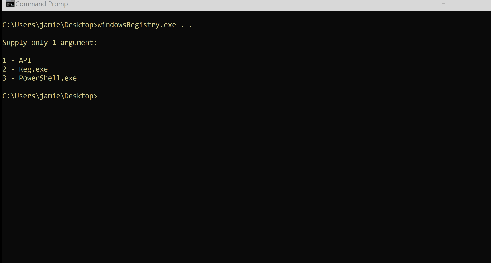
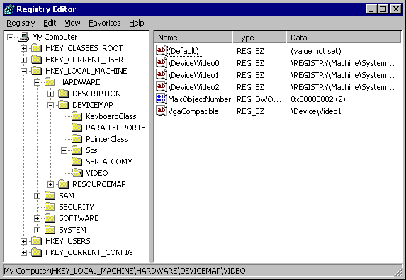

# Micro Emulation Plan: Windows Registry

This micro emulation plan targets the data source [DS0024 Windows
Registry](https://attack.mitre.org/datasources/DS0024). The
[Registry](https://docs.microsoft.com/windows/win32/sysinfo/structure-of-the-registry)
is a hierarchical database used by Windows to store critical data for the OS as
well as applications/services. The Registry is organized in a tree structure,
where nodes are keys made up of subkeys with corresponding data entries called
values. Abuse of the Registry spans numerous diverse adversary behaviors,
including tampering with system settings to enable Persistence or Privilege
Escalation as well as hiding payloads or other operational information.

You can access the binary for this micro plan as part of the [latest release](https://github.com/center-for-threat-informed-defense/adversary_emulation_library/releases). 

**Table Of Contents:**

- [Micro Emulation Plan: Windows Registry](#micro-emulation-plan-windows-registry)
  - [Description of Emulated Behaviors](#description-of-emulated-behaviors)
  - [Cyber Threat Intel / Background](#cyber-threat-intel--background)
  - [Execution Instructions / Resources](#execution-instructions--resources)
    - [Execution Demo](#execution-demo)
  - [Defensive Lessons Learned](#defensive-lessons-learned)
    - [Detection](#detection)
    - [Mitigation](#mitigation)

## Description of Emulated Behaviors

**What are we doing?** This module provides an easy-to-execute tool for creating, populating, and modifying data in the registry. The module supports 3 variants for performing Registry actions:

1. API variant: leverages various functions provided by the [.NET
   `Microsoft.Win32`
   Namespace](https://docs.microsoft.com/dotnet/api/microsoft.win32)
2. Reg.exe variant: leverges various commands provided by the [reg
   utility](https://docs.microsoft.com/windows-server/administration/windows-commands/reg)
3. Powershell.exe variant: leverages various [cmdlets provided by
   PowerShell](https://docs.microsoft.com/powershell/scripting/samples/working-with-registry-keys)

All three variants follow the same execution flow:

1. Create a new local Registry key (`HKEY_CURRENT_USER\CTID`)
2. Populate a new subkey (`CTID` subkey with a value derived from `{username_timestamp}`)
3. Update the subkey value (Base64 encoded representation of same `{username_timestamp}` value)
4. Delete the key and subkey

## Cyber Threat Intel / Background

**Why should you care?** The data in the Registry controls many OS and
application settings and is thus associated with a broad range of adversary
behaviors. Most commonly, adversaries manipulate Registry data in order to
enable Persistent and/or Privileged access to victim systems (e.g. [T1547.001
Registry Run Keys / Startup
Folder](https://attack.mitre.org/techniques/T1547/001)).

Adversaries may also use the Registry to store and/or conceal operational data
such as malware configurations/payloads or collected data prior to exfiltration
([T1074.001 Local Data Staging](https://attack.mitre.org/techniques/T1074/001)).
Adversaries have also used evasion tricks, such as encoding/encryption
obfuscation ([T1027 Obfuscated Files or
Information](https://attack.mitre.org/techniques/T1027)) and naming intended to
blend into the victim environment ([T1036.005 Match Legitimate Name or
Location](https://attack.mitre.org/techniques/T1036/005)) to conceal these
changes.

Along with the settings for applications and services, the registry also stores
sensitive information such as credentials stored by the OS (e.g. [T1003.002
Security Account Manager](https://attack.mitre.org/techniques/T1003/002)) or
user applications ([T1552.002 Credentials in
Registry](https://attack.mitre.org/techniques/T1552/002)).

The following image highlights ATT&CK v11 techniques that can potentially be
detected by monitoring changes to registry data.


## Execution Instructions / Resources

This module has been compiled into an easy-to-execute tool. The [source
code](windowsRegistry.cs) for this module is also provided if you wish to
customize and rebuild. The `windowsRegistry.exe` tool executes the complete
emulation functionality. It accepts a single argument that selects the execution
variant (see above).

### Execution Demo



## Defensive Lessons Learned

### Detection

Sysmon generates [event IDs
12-14](https://docs.microsoft.com/sysinternals/downloads/sysmon#event-id-12-registryevent-object-create-and-delete)
when Registry objects are created/deleted or a value is set and/or renamed.
These, and similar events, can be used to both baseline typical registry
operations (i.e. [those associated with known
software](https://github.com/olafhartong/sysmon-modular/tree/master/12_13_14_registry_event))
as well a create analytic logic to match on [potentially malicious
operations](https://github.com/SigmaHQ/sigma/tree/master/rules/windows/registry).

```xml
<RuleGroup name="" groupRelation="or">
  <RegistryEvent onmatch="include">
    <TargetObject name="technique_id=T1548.002,technique_name=Bypass User Access Control" condition="contains">\mscfile\shell\open\command</TargetObject>
    <TargetObject name="technique_id=T1548.002,technique_name=Bypass User Access Control" condition="contains">ms-settings\shell\open\command</TargetObject>
    <TargetObject name="technique_id=T1548.002,technique_name=Bypass User Access Control" condition="contains">Classes\exefile\shell\runas\command\isolatedCommand</TargetObject>        <!-- Credit cyb3rop -->
  </RegistryEvent>
</RuleGroup>
```
*Excerpted from [github.com/olafhartong/sysmon-modular](https://github.com/olafhartong/sysmon-modular/blob/f25467ca9400ff557934c46c90f19f48398323d8/12_13_14_registry_event/include_bypass_uac.xml).*

You can use the [Windows Registry
Editor](https://support.microsoft.com/en-us/windows/how-to-open-registry-editor-in-windows-10-deab38e6-91d6-e0aa-4b7c-8878d9e07b11)
(`regedit.exe`) as well as command-line utilities (such as `reg.exe` and
`PowerShell`) to browse the Registry. Monitoring usage of these utilities may
also highlight malicious activity/abuse.



Monitoring and/or alerting on all Registry operations may introduce false
positives and alert fatigue. For this reason, it may be advantageous to baseline
an environment (e.g. which Registry subkeys/values exist, and what processes
typically create/modify these values?) to provide better context during
triage/deeper analysis of potentially malicious telemetry. Analytics can however
be used to monitor changes to [commonly abused
subkeys](https://www.cyborgsecurity.com/cyborg-labs/hunting-for-persistence-registry-run-keys-startup-folder/),
as well as those identified by your organization as being higher-priority.

### Mitigation

[M1024 Restrict Registry
Permissions](https://attack.mitre.org/mitigations/M1024) can be used to protect
specific Registry keys from being modified by unauthorized users. The Registry
also [maintains permission
settings](https://docs.microsoft.com/archive/msdn-magazine/2008/november/access-control-understanding-windows-file-and-registry-permissions)
that can be maintained at on object-level.
