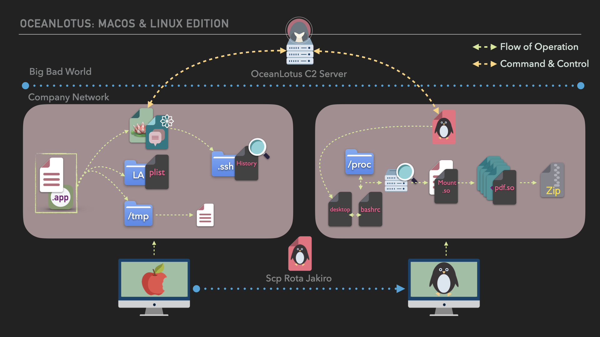

# OceanLotus Operations Flow

| Step | CTI Operations Flow | Cited Intelligence |
| ------- | ----------- | ----------- | 
|0| Assuming OceanLotus used a watering hole attack ([T1189](https://attack.mitre.org/techniques/T1189/)), Hope Potter, downloadeds a macOS application disguised Word document ([T1566](https://attack.mitre.org/techniques/T1566/)). This document, conkylan.app, now resides in the `/Downloads` folder on Hope Potter's macOS Catalina Host. | OceanLotus has compromised websites tied to Vietnamese individuals, bordering countries’ state owned or affiliated organizations, and organizations that are critical of the Vietnamese Government. The compromised websites are leveraged to execute targeted malicious JavaScript code (Framework B) which is then later used to distribute malware.1
|1| Thinking it's a normal Word document, the user, Hope Potter (hpotter), double-clicks the conkylan.app ([T1204.002](https://attack.mitre.org/techniques/T1204/002/))(note: We were not able to disguise the app as a Word document using a homoglyph file extension due to OS updates 🙌 🍎). The Word document is actually an Application bundle ([T1036](https://attack.mitre.org/techniques/T1036/007/)), the first stage payload, which executes the second stage payload([T1027.009](https://attack.mitre.org/techniques/T1027/009/)), deploys a decoy Word document, and connects to the C2 server. Using the script, OceanLotus also installs persistence via Launch Agent ([T1543.001](https://attack.mitre.org/techniques/T1543/001/)) and removes file information used by security tools ([T1070](https://attack.mitre.org/techniques/T1070/)). | Apps via doco
Modify permissions of file
Unpack another payload
Persistence
Separation of comms verses implant
Automating initial discovery of macOS information
|2| OceanLotus conducts local system discovery ([T1082](https://attack.mitre.org/techniques/T1082/))on the macOS host. OceanLotus reviews the contents of the `.ssh` folder. Seeing there is an SSH key, the `known_hosts` and `history` files are exfiled to the C2 server for analysis ([T1041](https://attack.mitre.org/techniques/T1041/)). The history file reveals Hope Potter sends files to the file server using SCP ([T1018](https://attack.mitre.org/techniques/T1018/)). | Directory discovery
Service discovery on local host
Downloading or reviewing config files. 
|3| OceanLotus downloads Rota Jakiro to the macOS host in the `/Users/hpotter/Library/WebKit` folder (the execution folder for OSX.OceanLotus) as `osx.download` ([T1105](https://attack.mitre.org/techniques/T1105/)). OSX.OceanLotus then uses SCP to transfer Rota Jakiro to the `\tmp` folder of the Linux host ([T1021](https://attack.mitre.org/techniques/T1021/)). Using SSH ([T1021.004](https://attack.mitre.org/techniques/T1021/004/)), OSX.OceanLotus changes Rota Jakiro to an executable and executes Rota Jakiro on the Linux host ([T1059.004](https://attack.mitre.org/techniques/T1059/004/)). | Downloading their tools into the env. 
Using scripting interpreters to execute binaries 
Moving binaries between platforms
Using native remote services on local machines
|4| For initial collection, Rota Jakiro executes and collects the results from the `uname` syscall ([T1082](https://attack.mitre.org/techniques/T1082/)). Rota Jakiro sends the following information regarding the Linux host to the C2 server: Host name, Architecture, & Kernel version. Rota Jakiro then downloads and executes a shared object (mount.so file) performing discovery for mounted drives connected to the Linux host ([T1135](https://attack.mitre.org/techniques/T1135/)). The resulting information is saved to the `mount.txt` file. Rota Jakiro then uploads this file to the C2 server for offline analysis ([T1041](https://attack.mitre.org/techniques/T1041/)). | Collection with uname 
 
Collection for mounted drives or mapped drives
|5| OceanLotus downloads and executes a shared object on the Linux host (pdf.so).([T1119](https://attack.mitre.org/techniques/T1119/)) The shared object performs the following actions: 
1. Creates a hidden directory named `tmp.rota` folder ([T1564.001](https://attack.mitre.org/techniques/T1564/001/)). 
2. Starting from the $HOME folder using the `find` command, copy files with a `.pdf` extension into the `tmp.rota` folder ([T1083](https://attack.mitre.org/techniques/T1083/)) ([T1074.001](https://attack.mitre.org/techniques/T1074/001/)). 
3. All files are then compressed into a single file named `rota.tar.gz` ([T1560](https://attack.mitre.org/techniques/T1560/)). 

After the shared object is executed, Rota Jakiro confirms the target file was created. | CTI reporting states Rota Jakiro uses shared objects for code execution. NOTE: There is no public CTI reporting documenting exactly what these shared objects are executing. Therefore, the following code execution is based off general behaviors derived from CTI reporting targeting linux hosts. 
|6| OceanLotus tasks Rota Jakiro to upload the `/tmp/rota.tar.gz` file to the C2 server completeing the objective.([T1041](https://attack.mitre.org/techniques/T1041/)) | methods of exfil via C2 server

# References
[1] [OceanLotus Blossoms: Mass Digital Surveillance and Attacks Targeting ASEAN, Asian Nations, the Media, Human Rights Groups, and Civil Society](https://www.volexity.com/blog/2017/11/06/oceanlotus-blossoms-mass-digital-surveillance-and-exploitation-of-asean-nations-the-media-human-rights-and-civil-society/)  
[2] [OceanLotus: Extending Cyber Espionage Operations Through Fake Websites](https://www.volexity.com/blog/2020/11/06/oceanlotus-extending-cyber-espionage-operations-through-fake-websites/)  
[3] [The New and Improved macOS Backdoor from OceanLotus](https://unit42.paloaltonetworks.com/unit42-new-improved-macos-backdoor-oceanlotus/)  
[4] [APT32 Multi-stage macOS Trojan Innovates on Crimeware Scripting Technique](https://www.sentinelone.com/labs/apt32-multi-stage-macos-trojan-innovates-on-crimeware-scripting-technique/)  
[5] [New MacOS Backdoor Connected to OceanLotus Surfaces](https://www.trendmicro.com/en_us/research/20/k/new-macos-backdoor-connected-to-oceanlotus-surfaces.html)  
[6] [OceanLotus: macOS malware update](https://www.welivesecurity.com/2019/04/09/oceanlotus-macos-malware-update/)  
[7] [New MacOS Backdoor Linked to OceanLotus Found](https://www.trendmicro.com/en_us/research/18/d/new-macos-backdoor-linked-to-oceanlotus-found.html)  
[8] [Operation Cobalt Kitty: Attackers’ Arsenal](https://www.cybereason.com/hubfs/Cybereason%20Labs%20Analysis%20Operation%20Cobalt%20Kitty-Part2.pdf)  
[9] [RotaJakiro: A long live secret backdoor with 0 VT detection](https://blog.netlab.360.com/stealth_rotajakiro_backdoor_en/)  
[10] [Operation Cobalt Kitty: A large-scale APT in Asia carried out by the OceanLotus Group](https://www.cybereason.com/blog/operation-cobalt-kitty-apt)  
[11] [Operation Cobalt Kitty: Attack Lifecycle](https://www.cybereason.com/hubfs/Cybereason%20Labs%20Analysis%20Operation%20Cobalt%20Kitty-Part1.pdf)  
[12] [Cyber Espionage is Alive and Well: APT32 and the Threat to Global Corporations](https://www.mandiant.com/resources/blog/cyber-espionage-apt32)  
[13] [OceanLotus: New watering hole attack in Southeast Asia](https://www.welivesecurity.com/2018/11/20/oceanlotus-new-watering-hole-attack-southeast-asia/)  
[14] [The New and Improved macOS Backdoor from OceanLotus](https://unit42.paloaltonetworks.com/unit42-new-improved-macos-backdoor-oceanlotus/)  
[15] [RotaJakiro, the Linux version of the OceanLotus](https://blog.netlab.360.com/rotajakiro_linux_version_of_oceanlotus/)  
[16] [OceanLotus APT Hits Human Rights Orgs in Vietnam, China, Cambodia](https://www.digitalguardian.com/blog/oceanlotus-apt-hits-human-rights-orgs-vietnam-china-cambodia)  
