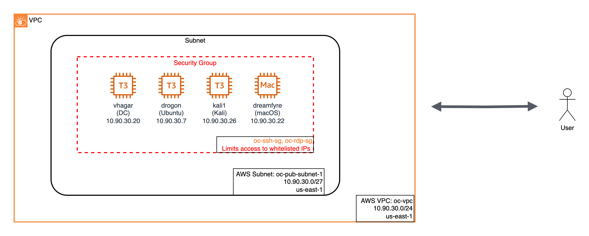

# OceanLotus Infrastructure Overview

- [OceanLotus Infrastructure Overview](#oceanlotus-infrastructure-overview)
  - [Setup](#setup)
    - [Prerequisites](#prerequisites)
    - [Create SSH Key Pair](#create-ssh-key-pair)
    - [Get your Public IP](#get-your-public-ip)
  - [Terraform](#terraform)
  - [Ansible](#ansible)
    - [Install Ansible dependencies](#install-ansible-dependencies)
      - [Retrieve the Windows Password](#retrieve-the-windows-password)
      - [Update the Ansible Inventory](#update-the-ansible-inventory)
      - [Deploy Ansible Configuration](#deploy-ansible-configuration)
  - [Post Configuration](#post-configuration)
    - [Mac Host](#mac-host)
    - [Setup Adversary Payloads](#setup-adversary-payloads)
      - [Move Unzipped Binaries into Payloads](#move-unzipped-binaries-into-payloads)
      - [Staging the Application Bundle on Victim](#staging-the-application-bundle-on-victim)
  - [Teardown](#teardown)
  - [How To Connect Using VNC to Mac](#how-to-connect-using-vnc-to-mac)
  - [Follow On Work](#follow-on-work)
  - [References](#references)

## Setup

### Prerequisites

* Running on a system with the following tools pre-installed:

  * Existing AWS Account with permissions to perform required actions (create/manage resources including EC2 instances, VPCs, Internet Gateways, Security Groups, and related resources)

  * Tools

    * `ssh-keygen`,
    * `bash` shell,
    * [Terraform](https://developer.hashicorp.com/terraform/downloads),
    * [Ansible](https://docs.ansible.com/)
    * [AWS CLI](https://aws.amazon.com/cli/) installed

  * Install

    * On Mac with [Homebrew](https://brew.sh/) installed

      * Example:

        ```shell
        brew tap hashicorp/tap
        brew install hashicorp/tap/terraform
        brew install ansible
        ```

    * On Linux, see [Terraform](https://developer.hashicorp.com/terraform/downloads) and [Ansible](https://docs.ansible.com/ansible/latest/installation_guide/installation_distros.html) documentation

### Create SSH Key Pair

Run the `run_first.sh` script in this directory first. The script will generate a separate SSH key pair, that will be used for OceanLotus infrastructure.

`./run_first.sh`

After the script completes, you will have a new SSH private and public key pair, named `oceanlotus` and `oceanlotus.pub`, respectively.

### Get your Public IP

You will need to know your public IP address for the next steps. You can get it by searching Google for "what is my ip", or running `curl ifconfig.me` from the command line on a system with curl installed. For the rest of this document, your public IP will be referred to as `PUBLIC_IP`, replace the variable `PUBLIC_IP` with your actual public IP address, in CIDR notation. For example, append `/32` to specify a single IP (e.g. `4.3.2.1/32`.)

## Terraform

Terraform is used to initialize the AWS infrastructure.



**NOTE**: You may be prompted to accept the Terms and subscribe for the Kali image in the Marketplace. If prompted, follow the URL provided in the terminal and click the Subscribe button. Once the process completes, re-run the Terraform plan and apply commands below.

1. Create a Terraform settings file from the included template. 
   1. `cp -a oceanlotus.auto.tfvars.example oceanlotus.auto.tfvars`
   2. Open the `oceanlotus.auto.tfvars` in an editor
   3. Set the values for all the variables listed, and uncomment each line by removing the `#` at the beginning of the line.
      1. For AWS Profile, set to the profile name used by your AWS CLI.
      2. For the unique prefix, generate a random string sequence.
         1. The unique prefix should consist of lowercase letters and numbers only.
      3. For the IP whitelist, list each public IP address (identified in the earlier setup section) that will be accessing the OceanLotus resources.
2. Time to run Terraform.
   1. Initialize your Terraform environment.
      1. `terraform init`
   2. Validate your Terraform configuration.
      1. `terraform validate`
   3. Plan your deployment with Terraform.
      1. `terraform plan --out=tfplan`
   4. Execute the Terraform plan created in the previous step.
      1. `terraform apply tfplan`
      2. NOTE: This step may take a few minutes to properly provision all AWS resources. This is normal.
   5. View the Terraform output to get a list of public IP addresses for each resource, as well as the default password for the Windows server.
      1. `terraform output` (if you get a "No outputs found" message, run `terraform refresh`)
   6. You are done, celebrate!

## Ansible

The Windows and Ubuntu hosts are configured with Ansible. The AWS Mac instance must be configured manually. The steps for configuring the AWS Mac instance are listed in the next section. 

**IMPORTANT**: All Ansible commands assume you are in the `Resources/setup/ansible` directory. Please change to the `Resources/setup/ansible` directory if necessary.

**IMPORTANT**: If you are running Ansible on a Mac, and encounter an error `ERROR! A worker was found in a dead state` when running Ansible, run `export OBJC_DISABLE_INITIALIZE_FORK_SAFETY=YES` from the command line prior to running any Ansible commands to workaround the bug. This is a known [upstream Ansible issue](https://github.com/ansible/ansible/issues/49207).

### Install Ansible dependencies

First, install the Ansible playbook requirements by running the following command:

`ansible-galaxy install -r requirements.yml`

#### Retrieve the Windows Password

AWS generates a random password on creation of a Windows instance.

1. To retrieve the password, view the output of `terraform output` from the previous step.
2. Open the `ansible/inventory` text file in an editor
3. From the output from Terraform, paste the value for Windows_Admin_Password into the `ansible_password` section for the `vhagar` host. Replace the text `REPLACE_ME_WITH_Windows_Admin_Password` with your actual password output by Terraform earlier.

#### Update the Ansible Inventory

Update the IP addresses listed in the `inventory` file with the IPs output by `terraform output`.

For `vhagar`, `dreamfyre`, and `drogon`, update the value of `ansible_host` with the IP address output by `terraform output`.

#### Deploy Ansible Configuration

1. First, generate the Windows AD domain.
   1. `ansible-playbook -i inventory playbooks/windows.yml`
   2. Once the playbook completes successfully, move to next step.
2. Provision the remaining hosts.
   1. `ansible-playbook -i inventory playbooks/all_the_rest.yml`
   2. Once the playbook completes successfully, manually perform a couple setup steps on the Mac host.

## Post Configuration

### Mac Host

Replace `MAC-IP` with the public IP of your Mac instance below.

1. SSH to Mac Host

   1. From your local machine: `ssh -i ./oceanlotus ec2-user@MAC-IP`

2. Set password for default ec2-user

   1. From the AWS Mac Instance: `sudo passwd ec2-user`
      1. **NOTE**: The emulation plan assumes you set the password to `apples`.

3. Create SSH Tunnel

   1. From your local machine: `ssh -L  5900:localhost:5900 -i ./oceanlotus ec2-user@MAC-IP`


6. You will now be able to connect to the Mac host.

### Setup Adversary Payloads

The following steps details how to manually setup the adversary payloads and
relevant implant components.

#### Move Unzipped Binaries into Payloads

A zip of the scenario binaries have been included [here](../Binaries/binaries.zip).
The binaries.zip can be unzipped to the expected directory location using the
following command and password `malware`:

```sh
# from the ocean-lotus directory
unzip Resources/Binaries/binaries.zip -d Resources/payloads
```

#### Staging the Application Bundle on Victim

If the OSX.OceanLotus Application Bundle has not been staged on the target
Mac host yet, use the following commands to do so:

1. Copy the Application Bundle from Kali Linux machine to the Mac host:

      ```sh
      # from the ocean-lotus directory
      cd Resources/payloads/oceanlotus/
      scp -r -i /home/kali/.ssh/id_rsa_ocean conkylan.app ec2-user@10.90.30.22:/tmp/
      ```

1. SSH from the Kali Linux machine to the Mac host, entering the password when
prompted:

    ```sh
    ssh -i /home/kali/.ssh/id_rsa_ocean ec2-user@10.90.30.22
    ```

1. Using the SSH session, modify the file permissions of the Application Bundle
to be owned by `hpotter`, then copy the Application Bundle to
`/Users/hpotter/Downloads`:

    ```sh
    cd /tmp
    sudo chown -R hpotter /tmp/conkylan.app
    sudo cp -r /tmp/conkylan.app /Users/hpotter/Downloads
    ```

1. The Application Bundle should now be available in the Downloads folder of
`hpotter` and ready for scenario execution

## Teardown

Once done with emulation, you can destroy the resources you deployed in AWS to limit billing.
To permanently destroy the OceanLotus AWS resources, run the following command from the `terraform/` directory.

```shell
# cd Resources/setup/terraform
terraform destroy
```

**NOTE**: Once you confirm the `destroy` operation, any resources managed by Terraform will be deleted.

## How To Connect Using VNC to Mac

VNC Connection to Mac

**NOTE**: Anytime you connect to the AWS Mac instance over VNC will require you to setup an SSH tunnel first.

1. Establish SSH tunnel.

    ```sh
    ssh -L  5900:localhost:5900 -i ./oceanlotus ec2-user@MAC-IP
    ```

2. From Mac, run `open vnc://localhost:5900`. On other platforms, use a VNC client to connect to `localhost:5900`.

## Follow On Work

Some items for future work are listed below:

* Dynamically generating the Ansible inventory

## References

* [Quick Reference](REFERENCE.md)
* [Terraform README](./terraform/scenario/README.md)
