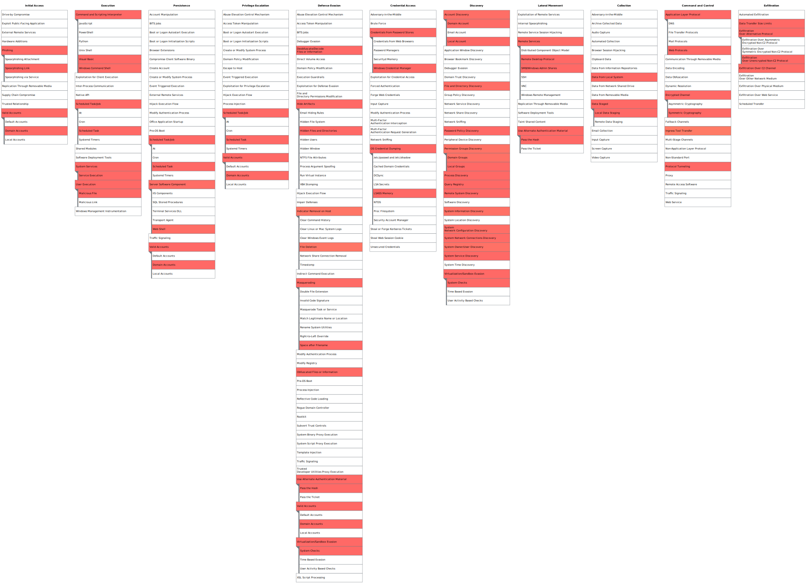

# OilRig Intelligence Summary
## ATT&CK Group ID: [G0049](https://attack.mitre.org/groups/G0049/)

**Objectives:** [OilRig](https://attack.mitre.org/groups/G0049/) is a cyber threat actor whose collection objectives align with the strategic interests of Iran. [1](https://cyware.com/blog/apt34-the-helix-kitten-cybercriminal-group-loves-to-meow-middle-eastern-and-international-organizations-48ae) [2](https://unit42.paloaltonetworks.com/threat-brief-iranian-linked-cyber-operations/) The group is believed to have been operating since at least 2014 and is reportedly maintaining operational successes as of 2022. [3](https://www.fortinet.com/blog/threat-research/please-confirm-you-received-our-apt)  OilRig's objectives have been focused on reconnaissance activity and exfiltration of information that could be used to inform strategic decision making. [4](https://www.mandiant.com/resources/blog/targeted-attack-in-middle-east-by-apt34)

**Target Industries:** OilRig operations have been directed against financial, government, energy, chemical, telecommunications, and other sectors. Geographically, OilRig has targeted the Middle East, East Africa, Europe and the United States. A leak of OilRig’s tools and victim data in 2019 [5](https://www.zdnet.com/article/source-code-of-iranian-cyber-espionage-tools-leaked-on-telegram/)  revealed a more comprehensive list of targets, including Albania, Bahrain, Cambodia, China, Egypt, Israel, Jordan Kazakhstan, Kuwait, Lebanon, Macau, Mexico, Myanmar, Nigeria, Oman, Palestine, Qatar, Samoa, Saudi Arabia, South Korea, Taiwan Thailand, Tunisia, Turkey, UAE, and Zimbabwe. [1](https://cyware.com/blog/apt34-the-helix-kitten-cybercriminal-group-loves-to-meow-middle-eastern-and-international-organizations-48ae) [6](https://www.welivesecurity.com/wp-content/uploads/2022/02/eset_threat_report_t32021.pdf)

**Operations:**  OilRig’s tradecraft is notable for their commitment to stealth and persistence in the pursuit of their mission objective. OilRig has demonstrated adeptness in a broad range of attack vectors and a willingness to deviate from their existing arsenal to use novel techniques to accomplish their objectives. OilRig predominantly leverages social engineering as an initial attack vector but has also exploited patched vulnerabilities. Following the 2019 leak of OilRig’s tools  and victim data, the group actively evolved their payload arsenal and retooling to avoid detection, creating multiple different malware variants with the same purpose as always: to gain an initial foothold on targeted devices. [7](https://www.intezer.com/blog/malware-analysis/new-iranian-campaign-tailored-to-us-companies-uses-updated-toolset/) [8](https://research.checkpoint.com/2021/irans-apt34-returns-with-an-updated-arsenal/)

OilRig is reported to have attained initial access via phishing ([T1566.001](https://attack.mitre.org/techniques/T1566/001/),[T1566.002](https://attack.mitre.org/techniques/T1566/002/), [T1566.003](https://attack.mitre.org/techniques/T1566/003/)), and credential abuse ([T1078](https://attack.mitre.org/techniques/T1078/)). [8](https://research.checkpoint.com/2021/irans-apt34-returns-with-an-updated-arsenal/) [9](https://www.malwarebytes.com/blog/threat-intelligence/2022/05/apt34-targets-jordan-government-using-new-saitama-backdoor) After achieving an initial foothold, OilRig actors are reported to use credential dumping tools, such as Mimikatz, to gather legitimate account credentials ([T1003.001](https://attack.mitre.org/techniques/T1003/001/)) then move laterally to other systems on the network. OilRig is also known for installing webshells to transfer tools ([T1105](https://attack.mitre.org/techniques/T1105/)) and maintain persistent access to the network. [10](https://unit42.paloaltonetworks.com/behind-the-scenes-with-oilrig/)

Associated Groups: COBALT GYPSY, IRN2, APT34, Helix Kitten

## Technique Scope

## Group Overview Report References
Source ID | Report Links
|:---:|:---|
|1|https://cyware.com/blog/apt34-the-helix-kitten-cybercriminal-group-loves-to-meow-middle-eastern-and-international-organizations-48ae|
|2|https://unit42.paloaltonetworks.com/threat-brief-iranian-linked-cyber-operations/|
|3|https://www.fortinet.com/blog/threat-research/please-confirm-you-received-our-apt|
|4|https://www.mandiant.com/resources/blog/targeted-attack-in-middle-east-by-apt34|
|5|https://www.zdnet.com/article/source-code-of-iranian-cyber-espionage-tools-leaked-on-telegram/|
|6|https://www.welivesecurity.com/wp-content/uploads/2022/02/eset_threat_report_t32021.pdf|
|7| https://www.intezer.com/blog/malware-analysis/new-iranian-campaign-tailored-to-us-companies-uses-updated-toolset/|
|8| https://research.checkpoint.com/2021/irans-apt34-returns-with-an-updated-arsenal/|
|9|https://www.malwarebytes.com/blog/threat-intelligence/2022/05/apt34-targets-jordan-government-using-new-saitama-backdoor|
|10|https://unit42.paloaltonetworks.com/behind-the-scenes-with-oilrig/|

## Connect with us 🗨️
We 💖 feedback! Let us know how using ATT&CK Evaluation results has helped you and what we can do better.

Email: evals@mitre-engenuity.org
Twitter: https://twitter.com/MITREengenuity
LinkedIn: https://www.linkedin.com/company/mitre-engenuity/
