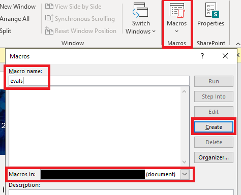
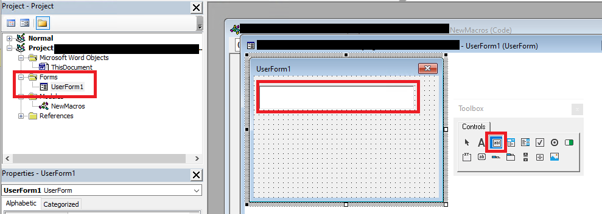
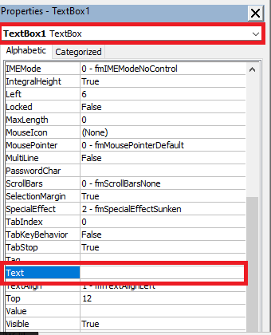

# SideTwist Dropper

Included document "GGMS Overview.doc" is SAFE.

## How It Works

The target downloads the malicious office document, enables macros, and closes
the document. In that span of time, the document performs the following:

The `Document_Open()` subroutine occurs where the macro
1. Collects the `computername` and `username` environment variables
2. Performs a sandbox detection check using `Application.MouseAvailable`
	- If this fails, a popup saying "Microsoft Visual C++ Redistributable Error: 0x801."
	 This is a dummy error to inform the oeprator that something went wrong.
3. Creates a directory named `SystemFailureReporter` under the current user's 
`AppData\Local` directory and drops the SideTwist payload (named `b.doc`) and 
`update.xml` into this directory.
	- Note: The SideTwist payload is embedded within the document under `UserForm1.TextBox1.Text`
	 as base64-encoded data. Information on how to replace this payload with your own
	 is covered in the "Weaponization" section.
 
The `Document_Close()` subroutine occurs when the user closes the document, where it

4. Performs another sandbox detection check using `Application.MouseAvailable`
	- If this fails, another dummy error pops up saying "Microsoft Visual C++
	 Redistributable Error: 0x802."
5. Renames `b.doc` from Step 4 to `SystemFailureReporter.exe`
6. Creates the `SystemFailureReporter` schtask, which is set to execute every
5 minutes forever.

*Note: OilRig has been known to perform DNS-based infection updates during initial access 
\[[1](https://research.checkpoint.com/2021/irans-apt34-returns-with-an-updated-arsenal/)\].
This functionality was omitted from our emulated payload due to time and resource restrictions.*

## Operator Notes
* The `SystemFailureReporter` schtask and EXE are created when the document is 
closed. If you're not seeing the artifacts or callbacks you expect from the 
maldoc, close it first and wait 5 minutes for the first scheduled execution to occur.

* When opening the maldoc, you may notice an unusually long time before you see
the actual contents of the document. This is okay, as the maldoc is decoding and
writing the SideTwist payload to disk.

* If you're searching for artifacts under the current user's `AppData\Local`
directory from CMD or PowerShell, be mindful of differences in how environment 
variables are called between CMD and PowerShell:
    - CMD: `dir %LOCALAPPDATA%`
    - PowerShell: `ls $env:LocalAppData`

* If you encounter "file/directory not found" errors while opening or closing the 
maldoc, check first to see if any artifacts already exist on the target (i.e. the 
`AppData\Local\SystemFailureReporter` directory and the "SystemFailureReporter" 
schtask). It's plausible that the document was already detonated on that host.

## Weaponization
The malicious VBA payload can be configured to use a custom schtask payload 
and schtask execution frequency.

To arm a document with an EXE of your choosing:
1. Open the .doc file you want to infect and go to "View > Macros". Give the 
macro an arbitrary name (we won't be using it), select `[Name of .doc] 
(document) from the dropdown menu, and hit "Create".

    

2. From the "Microsoft Visual Basic for Applications" IDE, select "Insert > UserForm".
Within the new Toolbox window, select "TextBox" and draw an arbitrarily-sized box
inside UserForm1.

    

3. Under the "Properties" panel, select "TextBox1 TextBox" from the dropdown menu and 
find the "Text" property. Base64-encode your desired payload and paste the encoded 
payload within this property value. *Newline characters and spaces will break the 
payload - Make sure neither are present before proceeding to the next step.*
    - On Linux: `base64 path/to/payload.exe`
    - On WIndows (PowerShell): `.\encode-file.ps1 -payload .\path\to\payload.exe` 

    

4. From the "Project" panel, double-click on the "ThisDocument" object under the 
"Microsoft Word Objects" folder. Copy and paste the entirety of the `payload.vbs` 
into this new window.
    - To modify the frequency of the schtask: Go to the `Document_Close()`
    subroutine and modify the integer value within the `SchTask` call to
    one of your choosing.

    *Note: the frequency here is specified in minutes.*

5. Save and close the document. Your document is armed and ready for prime-time!

6. Add it to a compressed archive, ensuring it's password-protected to 
avoid detection from static signatures. This emulation plan leverages a 
password-protected ZIP archive, but you can choose whatever format best 
meets your emulation requirements.

6. Upload the encrypted archive to a web server you control.

## Testing and Pre-Flight Checks
0. Start the control server on `192.168.0.4`, ensuring the SideTwist profile
under `config/handler_config.yml` is set to "Enabled".

    ```sudo ./controlServer```

1. Log in to a range Windows 10 machine and ensure Defender real-time protection 
is set to `Disabled`. When in doubt, run the 
[set-defender.ps1 script](https://raw.githubusercontent.com/center-for-threat-informed-defense/adversary_emulation_library/master/fin7/Resources/setup/set-defender.ps1)
from prior ATT&CK Evaluations or manually disable this feature from the security
dashboard.

3. Before closing the document, check to ensure all artifacts were dropped to disk
under the current user's `AppData\Local` directory.
    - `SystemFailureReporter\b.doc`
    - `SystemFailureReporter\update.xml`

4. Close the document and run the following from a PowerShell or CMD prompt to
validate the schtask was created.

    ```schtasks /query /TN SystemFailureReporter /V /FO LIST```

5. With the control server open and running, run the following to manually run 
the SystemFailureReporter schtask. You should receive a new session:

    ```schtasks /run /TN SystemFailureReporter```

## Cleanup
1. Remove the schtask for the target host:

    `schtasks /delete /tn "SystemFailureReporter"`
2. Remove the `%LOCALAPPDATA%\SystemFailureReporter\` directory and its contents.

## Scenario Deployment
The armed document has been zipped in a password protected archive 
`Marketing_Materials.zip` using the password `!M@rk3ting!` and will be hosted on
the C2 server for download. An email will be sent from shirinfarhad[.]com
containing the link and password to the zip file for the user to open as part of
OilRig gaining initial access.

## Cited Intelligence
- https://research.checkpoint.com/2021/irans-apt34-returns-with-an-updated-arsenal/
- https://hybrid-analysis.com/sample/13c27e5049a7fc5a36416f2c1ae49c12438d45ce50a82a96d3f792bfdacf3dcd?environmentId=100


