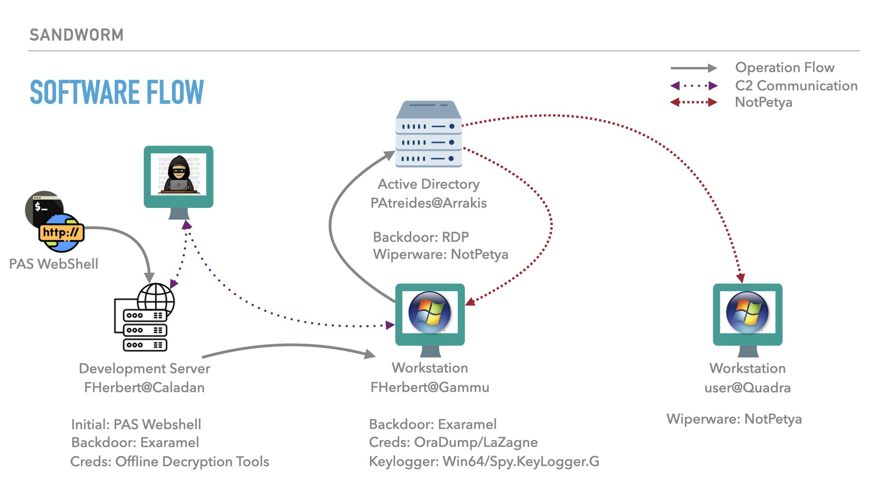
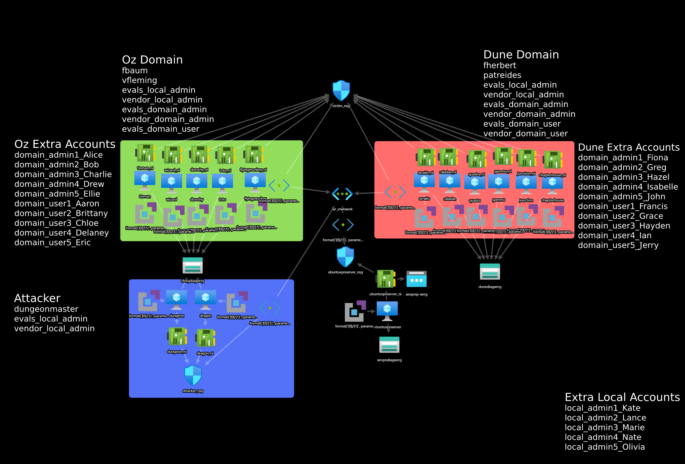

Based on open-source intelligence, the ATT&CK ® Evaluations team created the below scenario leveraging techniques seen from Sandworm in the wild. We have adapted the scenario based on tools and resources available at the time. Below is a diagram, [scenario overview](#emulation-scenario), [step-by-step breakdown](#scenario-steps), and an [infrastructure diagram](#infrastructure-diagram). 

# Emulation Scenario
📖 
In our scenario, a group of developers from the Holtzman organization decided to use an open-source tool called Weirdingway to monitor their development pipeline by pass budget constraints. Years pass and the Weirdingway software became baked into the developer’s environment. Some time later, Sandworm identified a vulnerability in a specific version of the Weirdingway project that exposes a webpage to the open internet. Sandworm began searching for this exposed webpage and identified the Holtzman organization as running the Weirdingway software with the vulnerable version. 

Exploiting the vulnerability (due to enviornment limitiations we use SSH and deploy the P.A.S. Webshell emulation), Sandworm establishes persistence with a P.A.S. webshell v3.1.4. After conducting initial discovery, Sandworm downloads the Linux/Exaramel software, modifies the permissions, and executes gaining C2 communications. Exaramel installs two persistence mechanisms (cron & systemd) then exfiltrates the /etc/shadow, bash history, and SSH keys. Performing offline password cracking, Sandworm obtains credentials for Frank Herbert on the Gammu host. 

Sandworm uploads Exaramel to the Gammu host using smbclient with valid credentials collected from the offline password cracking on the previous host, Caladan. Using a bind shell with psexec, persistence is established via registry keys and credential collection tools. The legitimate user Frank Herbert, fherbert, logs in to their computer via RDP and goes about their workday. Sandworm collects Frank’s credentials with keylogging deployed as a part of their OraDump Credential Collection toolkit. Sandworm conducts local host and network discovery, specifically looking for open RDP sessions. 

Using credentials from an active RDP session on Gammu, Sandworm RDPs into the Arrakis host as Paul Atreides, patreides. After additional discovery, the Arrakis host is determined the ideal location to deploy NotPetya. NotPetya is uploaded to the Active Directory and executed. NotPetya creates a scheduled task, searches for connected devices, dumps credentials, copies itself to discovered hosts, and executes itself. While moving laterally, NotPetya searches for files with specific file extensions, encrypts the files, clears windows event logs and executes the scheduled task to reboot. 

# Scenario Steps 
👣 
Steps start at 11 to follow emulation procedures 
| Steps | User Story | Software | Report Links |
| :-----------: | ----------- | ----------- | ----------- |
| Not in Play  Step 00 | Sandworm identifies a vulnerability in an open source tool, Weirdingway. When deployed with the default configurations, a webpage is exposed to the open internet.  **Analyst Comment:** _Due to environment limitations for using exploits, operators use SSH to access the host and deploy the PAS webshell_ | Exploit| https://www.cert.ssi.gouv.fr/uploads/CERTFR-2021-CTI-005.pdf |
| Step 11 | Sandworm logs into the Caladan host via SSH and deploys a PHP webshell as persistence.​ | P.A.S. webshell | https://www.us-cert.gov/ics/alerts/IR-ALERT-H-16-056-01   https://www.cert.ssi.gouv.fr/uploads/CERTFR-2021-CTI-005.pdf |
|Step 12|Sandworm enumerates information about the compromised system by issuing shell commands through the PHP webshell.​ Executed commands include whoami, uname, ls, etc. | P.A.S. webshell | https://www.justice.gov/opa/press-release/file/1328521/download  https://www.welivesecurity.com/2017/07/04/analysis-of-telebots-cunning-backdoor/ | 
| Step 13 | Sandworm downloads the Linux\Exaramel ELF executable via the webshell, modifies the file permissions, then executes Linux\Exaramel. Linux\Exaramel establishes connection to the C2. | P.A.S. webshell  Linux\Exaramel | https://www.justice.gov/opa/press-release/file/1328521/download |
| Step 14 | Exaramel installs two persistence mechanisms (cron & systemd) then exfiltrates the /etc/shadow, bash history, and SSH keys. Performing offline password cracking, Sandworm obtains credentials for Frank Herbert on the Gammu host. | Linux\Exaramel | https://www.welivesecurity.com/2018/10/11/new-telebots-backdoor-linking-industroyer-notpetya/  https://www.cert.ssi.gouv.fr/uploads/CERTFR-2021-CTI-005.pdf | 
| Step 15 | Using Frank Herbert's credentials, obtained from the previous step, Sandworm uploads Windows/Exaramel to the Gammu host using the smbclient. Persistence is established using registry keys and Windows/Exaramel is executed upon Frank’s login to the Gammu host. | Windows/Exaramel  PsExec | https://blog.talosintelligence.com/2017/06/worldwide-ransomware-variant.html   https://securelist.com/be2-custom-plugins-router-abuse-and-target-profiles/67353/ https://blog.talosintelligence.com/2018/02/olympic-destroyer.html https://www.welivesecurity.com/2017/07/04/analysis-of-telebots-cunning-backdoor/|
|Step 16|Sandworm conducts local host and network discovery, specifically looking for open RDP sessions. |Windows/Exaramel|https://www.justice.gov/opa/press-release/file/1328521/download https://www.welivesecurity.com/2016/12/13/rise-telebots-analyzing-disruptive-killdisk-attacks/ https://www.welivesecurity.com/2017/07/04/analysis-of-telebots-cunning-backdoor/|
|Step 17|Sandworm downloads two files associated with credential harvesting tools to the Gammu host. Once executed, Sandworm obtains domain admin credentials from an active RDP session. Sandworm then enumerates all domain hosts using dsquery.|oradump/LaZagne variant (CredRaptor & Plainpwd) Win64.Spy.KeyLogger.G| https://www.welivesecurity.com/2016/12/13/rise-telebots-analyzing-disruptive-killdisk-attacks/  https://www.welivesecurity.com/2017/06/30/telebots-back-supply-chain-attacks-against-ukraine/|
|Step 18|Using credentials from the active RDP session on Gammu, Sandworm RDPs into the Arrakis host as Paul Atreides, patreides. Sandworm uploads NotPetya to Arrakis over a network share tunneled through the RDP connection.|RDP NotPetya|https://www.justice.gov/opa/press-release/file/1328521/download https://www.welivesecurity.com/2016/12/13/rise-telebots-analyzing-disruptive-killdisk-attacks/ https://www.welivesecurity.com/2018/10/11/new-telebots-backdoor-linking-industroyer-notpetya/|
|Step 19|After additional discovery, the Arrakis host is determined the ideal location to deploy NotPetya. When executed, NotPetya creates a scheduled task, searches for connected devices, dumps credentials, copies itself to discovered hosts, and executes itself on the new host. Simultaiously, NotPetya searches for files with specific file extensions, encrypts the files, drops a ransom note, clears Window's event logs and executes the scheduled task to reboot. | NotPetya| https://blog.talosintelligence.com/2017/06/worldwide-ransomware-variant.html https://www.us-cert.gov/ncas/alerts/TA17-181A https://www.justice.gov/opa/press-release/file/1328521/download|

# Infrastructure Diagram

