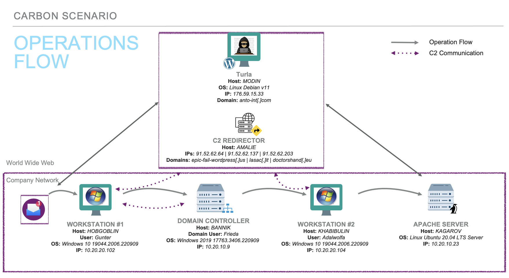
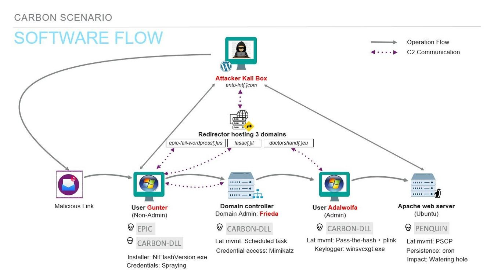
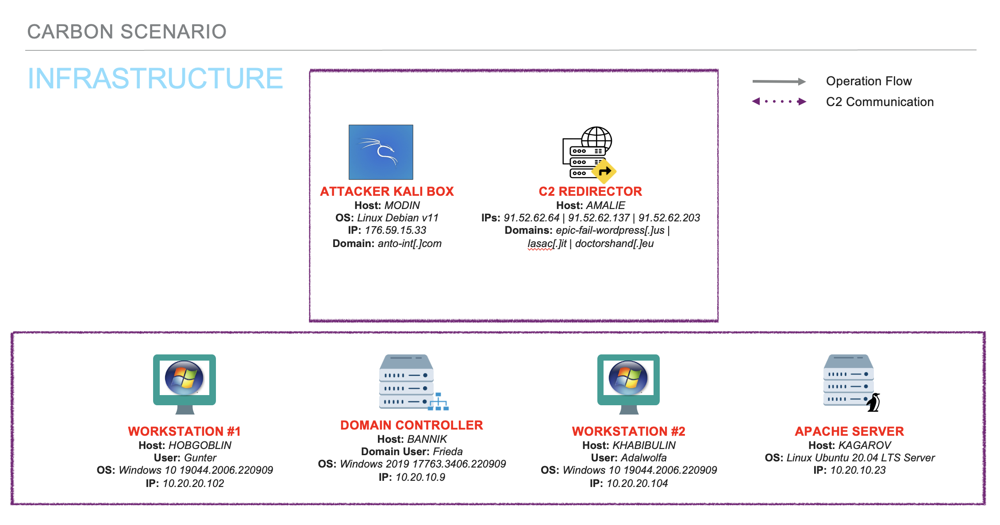

Based on open-source intelligence, the ATT&CK ® Evaluations team created the below scenario leveraging techniques seen from Turla in the wild. We have adapted the scenario based on tools and resources available at the time. Below is a [scenario overview](#carbon-emulation-scenario-📖), [step-by-step breakdown](#scenario-steps👣), and an [infrastructure diagram](#infrastructure-diagram).   

# Carbon Emulation Scenario 📖 
This scenario follows Turla’s multi-phase approach to implant a watering hole as a way to compromise more victims of interest. Turla gains initial access through a spearphishing email, a fake software installer is downloaded onto the victim machine and execution of the EPIC payload takes place. Once persistence and C2 communications are established, a domain controller is discovered, and CARBON-DLL is ingress into victim network. Further lateral movement takes the attackers to a Linux Apache server, PENGUIN is copied to the server and used to install a watering hole.

 **Phase 1:** The scenario begins when the user Gunter visiting a typosquat domain via a spearphishing email. When the link is opened, a fake software installer is downloaded on Gunter’s Windows host machine. Gunter clicks “Install,” executing the malicious EPIC payload. EPIC establishes persistence and connects to a C2 server via a proxy web server using HTTP requests. The attacker’s enumeration on Gunter’s device, discovers a domain controller on the network and the domain admin Frieda.

 **Phase 2:** To maintain persistence, the attackers will deploy CARBON-DLL and prepare to laterally move onto the domain controller. The use of password spraying helps to obtain Frieda’s domain admin credentials. Frieda’s credentials are then used to mount the DC’s hard drive, move a copy of CARBON-DLL to this drive, and execute the malware on the DC via remote scheduled task. A Linux Apache Server and the server’s admin Adalwolfa is discovered during enumeration. CARBON-DLL downloads Mimikatz and dumps Adalwolfa’s stored NTLM hash. Mimikatz and Adalwolfa’s NTLM hash are used to perform a pass-the-hash (PtH) attack allowing the attackers to authenticate into Adalwolfa’s device and copy CARBON-DLL to the workstation via PsExec. 

 **Phase 3:** On Adalwolfa’s workstation, a custom keylogger is dropped and captures plaintext SSH credentials. CARBON-DLL downloads the PENQUIN malware to Adalwolfa’s workstation, the SSH credentials allows the attackers to copy PENQUIN to the Apache server and execute the malware via plink. PENQUIN is utilized to install a watering hole causing users browsing a legitimate HTML site to be redirected to the malicious, attacker-controlled site.
   

# Scenario Steps👣
 | 
Steps & Techniques
  | 
User Story
 | 
Commands
 | 
Analyst Notes
| Software | 
Reporting
 |
 | :------------- | :------------- | :-------------: | ------------- |------------- |------------- |
| **Step 1**   **Initial Compromise**  [T1566.002](https://attack.mitre.org/techniques/T1566/002/): Phishing: Spearphishing Link  [T1204.002](https://attack.mitre.org/techniques/T1204/002/): User Execution: Malicious File  [T1036.004](https://attack.mitre.org/techniques/T1036/004/): Masquerading: Masquerade Task or Service  [T1574.007](https://attack.mitre.org/techniques/T1574/007/): Hijack Execution Flow: Path Interception by Path Environment Variable  [T1547.004](https://attack.mitre.org/techniques/T1547/004/): Boot Logon Autostart Execution: Winlogon Helper DLL | User Gunter (non-admin) receives a spearphishing email from noreply@sktlocal[.]it with a malicious link, http://www.anto-int.com.  Believing the link to be a valid NATO-related site, Gunter clicks the link and is tricked into installing what appears to be a legitimate software installer. The malicious installer (`NtFlashVersion.exe`) drops EPIC onto Gunter’s Windows workstation.| |CTI deviation: we simplified the delivery of EPIC for feasibility purposes. According to CTI, Turla previously delivered EPIC using Adobe exploits (CVE-2013-3346 & CVE-2013-5065) or watering hole attacks.|EPIC| https://securelist.com/the-epic-turla-operation/65545/  https://community.broadcom.com/symantecenterprise/communities/community-home/librarydocuments/viewdocument?DocumentKey=4501a782-fd84-4f44-a231-ee2a3e838c39&CommunityKey=1ecf5f55-9545-44d6-b0f4-4e4a7f5f5e68&tab=librarydocuments 
**Step 2**   **Establish Initial Access**  [T1027](https://attack.mitre.org/techniques/T1027/): Files or Information  [T1055.007](https://attack.mitre.org/techniques/T1055/001/): Injection: Dynamic-link Library Injection  [T1057](https://attack.mitre.org/techniques/T1057/): Discovery  [T1059.003](https://attack.mitre.org/techniques/T1059/003/): and Scripting Interpreter: Windows Command Shell  [T1087.001](https://attack.mitre.org/techniques/T1087/001/): Account Discovery: Local Account  [T1012](https://attack.mitre.org/techniques/T1012/): Query Registry [T1082](https://attack.mitre.org/techniques/T1082/): Information Discovery  [T1124](https://attack.mitre.org/techniques/T1124/): System Time Discovery  [T1057](https://attack.mitre.org/techniques/T1057/): Process Discovery  [T1135](https://attack.mitre.org/techniques/T1135/): Network Share Discovery  [T1049](https://attack.mitre.org/techniques/T1049/): System Network Connections Discovery  [T1069.001](https://attack.mitre.org/techniques/T1069/001/): Permission Groups Discovery: Local Groups  [T1033](https://attack.mitre.org/techniques/T1033/): System Owner/User Discovery  [T1083](https://attack.mitre.org/techniques/T1083/): File and Directory Discovery  [T1560.002](https://attack.mitre.org/techniques/T1560/002/): Archive Collected Data: Archive via Library  [T1132.001](https://attack.mitre.org/techniques/T1132/001/): Data Encoding: Standard Encoding  [T1071.001](https://attack.mitre.org/techniques/T1071/001/): Application Layer Protocol: Web Protocols  [T1090.002](https://attack.mitre.org/techniques/T1090/002/): Proxy: External Proxy | EPIC will then be injected via DLL onto Gunter’s workstation. The implant will perform initial discovery commands, enumerating information about the user, host device, network, system, registry, directory, and running processes. EPIC will send this data to the C2 via a proxy web server using HTTP requests. This web server, which was initially used to download the Adobe Flash installer, hosts a fake WordPress-related domain. |EPIC will terminate itself upon discovering any of the following processes: _`tcpdump.exe`_ _`windump.exe`_ _`ethereal.exe`_ _`wireshark.exe`_ _`ettercap.exe`_ _`snoop.exe`_  _`dsniff.exe`_ | **WordPress domain**: CTI shows Turla has utilized compromised legitimate WordPress sites and WordPress-focused URLs for C2 purposes (e.g., _newsforum.servehttp[.]com/wordpress/wp-includes/css/img/upload.php_)| EPIC| https://securelist.com/the-epic-turla-operation/65545/  https://go.recordedfuture.com/hubfs/reports/cta-2020-0312.pdf https://media.kasperskycontenthub.com/wp-content/uploads/sites/43/2018/03/08080105/KL_Epic_Turla_Technical_Appendix_20140806.pdf|
**Step 3**   **Discovery & Privilege Escalation**   [T1033](https://attack.mitre.org/techniques/T1033/): System Owner/User Discovery  [T1007](https://attack.mitre.org/techniques/T1007/): System Service Discovery  [T1124](https://attack.mitre.org/techniques/T1124/): System Time Discovery  [T1049](https://attack.mitre.org/techniques/T1049/): System Network Connections Discovery  [T1135](https://attack.mitre.org/techniques/T1135/): Network Share Discovery  [T1016](https://attack.mitre.org/techniques/T1016/): System Network Configuration Discovery  [T1069.001](https://attack.mitre.org/techniques/T1069/001/): Permission Groups Discovery: Local Groups  [T1069.002](https://attack.mitre.org/techniques/T1069/002/): Permission Groups Discovery: Domain Groups  [T1012](https://attack.mitre.org/techniques/T1012/): Query Registry   [T1059.001](https://attack.mitre.org/techniques/T1059/001/): Command and Scripting Interpreter: PowerShell   [T1574.011](https://attack.mitre.org/techniques/T1574/011/): Hijack Execution Flow: Services Registry Permissions Weakness|Once C2 communications have been established between EPIC and the C2 via the proxy web server, the attackers will collect information about the host device, including:  -Local/privileged groups  -System services  -System/Process discovery   At this point, the adversary will discover 2 crucial aspects on the network:  -Domain controller  -Domain admin accounts, including user Frieda    In order to escalate privileges, EPIC restarts itself as local system admin on Gunter’s workstation.|EPIC discovery commands:  `arp -a`   `net use`   `ipconfig/all`   `net localgroup administrators`   `net group "Doman Admins" /domain`   `net group "Domain Computers" /domain`   `net group "Domain Controllers" /domain`   `tasklist /svc`   `reg query`| | EPIC | https://securelist.com/the-epic-turla-operation/65545/ https://go.recordedfuture.com/hubfs/reports/cta-2020-0312.pdf https://media.kasperskycontenthub.com/wp-content/uploads/sites/43/2018/03/08080105/KL_Epic_Turla_Technical_Appendix_20140806.pdf https://www.ncsc.admin.ch/ncsc/en/home/dokumentation/berichte/fachberichte/technical-report_apt_case_ruag.html https://recon.cx/2018/brussels/resources/slides/RECON-BRX-2018-Visiting-The-Snake-Nest.pdf|
**Step 4**   **Persistence**  [T1105](https://attack.mitre.org/techniques/T1105/): Ingress Tool Transfer  [T1543.003](https://attack.mitre.org/techniques/T1543/003/): Create or Modify System Process: Windows Service  [T1112](https://attack.mitre.org/techniques/T1112/): Modify Registry  [T1569.002](https://attack.mitre.org/techniques/T1569/002/): System Services: Service Execution  [T1036.004](https://attack.mitre.org/techniques/T1036/004/): Masquerade Task or Service  [T1055.007](https://attack.mitre.org/techniques/T1055/001/): Injection: Dynamic-link Library Injection  [T1033](https://attack.mitre.org/techniques/T1033/): System Owner/User Discovery  [T1049](https://attack.mitre.org/techniques/T1049/): System Network Connections Discovery  [T1071.001](https://attack.mitre.org/techniques/T1071/001/): Application Layer Protocol: Web Protocols  [T1573.002](https://attack.mitre.org/techniques/T1573/002/): Encrypted Channel: Asymmetric Cryptography  [T1573.001](https://attack.mitre.org/techniques/T1573/001/): Encrypted Channel: Symmetric Cryptography  [T1132.001](https://attack.mitre.org/techniques/T1132/001/): Data Encoding: Standard Encoding  [T1074.001](https://attack.mitre.org/techniques/T1074/001/): Data Staged: Local Data Staging| Next, the attackers will deploy CARBON-DLL as a second-stage malware onto Gunter’s workstation in order to maintain persistence. CARBON-DLL, a variant of CARBON relying on DLLs and asymmetric encryption, will establish C2 communications via a redirector using HTTP requests. Once this communication channel is created, the malware will run a few discovery commands on Gunter’s device and drop several files to disk.  CARBON-DLL has the following components and functions:  _Installer_ - create subdirectories for staging, create services, and executes loader   _Loader_ - written to a registry key path, runs under svchost and executes orchestrator   _Orchestrator_ - injects communications library DLL into processes via HTTP |CARBON:   `ipconfig -all`     `netstat -r`    `netstat -an`    `nbtstat -n`    `nbtstat -s`    `net share`    `net file`  `net session`  `net use`  `net group`  `net view`  `net config`  `system info`  `net time \\127.0.0.1`| C2 Comms Details:  _Internal_: P2P, use of named pipes, worker drones received tasks via named pipes   _External_: use of HTTP requests, communication drones contacted C2s directly| CARBON-DLL |  https://securelist.com/the-epic-turla-operation/65545/ https://www.ncsc.admin.ch/ncsc/en/home/dokumentation/berichte/fachberichte/technical-report_apt_case_ruag.html https://www.welivesecurity.com/2017/03/30/carbon-paper-peering-turlas-second-stage-backdoor/ https://www.accenture.com/us-en/blogs/cyber-defense/turla-belugasturgeon-compromises-government-entity https://www.gdatasoftware.com/blog/2015/01/23926-analysis-of-project-cobra |
**Step 5**  **Lateral Movement to Domain Controller**  [T1105](https://attack.mitre.org/techniques/T1105/): Ingress Tool Transfer  [T1059.003](https://attack.mitre.org/techniques/T1059/003/): Command and Scripting Interpreter: Windows Command Shell  [T1110.003](https://attack.mitre.org/techniques/T1110/003/): Brute Force: Password Spraying  [T1021.002](https://attack.mitre.org/techniques/T1021/002/): Remote Services: SMB/Windows Admin Shares  [T1070.004](https://attack.mitre.org/techniques/T1070/004/): Indicator Removal on Host: File Deletion  [T1570](https://attack.mitre.org/techniques/T1570/): Lateral Tool Transfer  [T1053.005](https://attack.mitre.org/techniques/T1053/005/): Scheduled Task/Job: Scheduled Task  [T1071](https://attack.mitre.org/techniques/T1071/): Application Layer Protocol  [T1069.002](https://attack.mitre.org/techniques/T1069/002/): Permission Groups Discovery: Domain Groups  [T1018](https://attack.mitre.org/techniques/T1018/): Remote System Discovery |Using the enumerated usernames, the adversary conducts password spraying. This process retrieves Frieda’s admin credentials to the local domain controller.  To laterally move onto the DC, the attackers will use Frieda’s stolen password to mount the DC’s C:\ drive, and downloads and moves a second copy of the CARBON-DLL installer to this drive. The implant will be executed via remote scheduled task and then establish communications with the C2 server by leveraging P2P with the first CARBON-DLL implant Gunter’s device out to the redirector.  While performing discovery on the DC, the adversary discovers the following network devices:  1. Remote Apache web server  2. Windows workstation for user Adalwolfa (admin on Apache server) |`net use`   EPIC has moved through the victim’s network using pre-defined passwords:  `net use \\NET-DC-01\C$ "P@ssw0rd" /user:MOFA\Administrator` | _Password spraying_: CTI shows that EPIC has been used to conduct password spraying (see Report 1 for details)| CARBON-DLL | https://securelist.com/the-epic-turla-operation/65545/ https://www.ncsc.admin.ch/ncsc/en/home/dokumentation/berichte/fachberichte/technical-report_apt_case_ruag.html https://www.welivesecurity.com/2017/03/30/carbon-paper-peering-turlas-second-stage-backdoor/ https://www.accenture.com/us-en/blogs/cyber-defense/turla-belugasturgeon-compromises-government-entity https://www.gdatasoftware.com/blog/2015/01/23926-analysis-of-project-cobra|
**Step 6**   **Preparation for Lateral Movement onto Second Host**  [T1105](https://attack.mitre.org/techniques/T1105/): Ingress Tool Transfer  [T1003.004](https://attack.mitre.org/techniques/T1003/004/):  Credential Dumping: LSA Secrets  [T1550.002](https://attack.mitre.org/techniques/T1550/002/):  Alternate Authentication Material: Pass the Hash|Next, the attackers download Mimikatz (`mmgaproxy.exe`) to the DC and the attackers retrieve NTLM hash for admin user Adalwolfa. | | | CARBON-DLL   Mimikatz| https://www.ncsc.admin.ch/ncsc/en/home/dokumentation/berichte/fachberichte/technical-report_apt_case_ruag.html (pp. 21) https://symantec-enterprise-blogs.security.com/blogs/threat-intelligence/waterbug-espionage-governments |
**Step 7**   **Lateral Movement to Second Workstation**  [T1105](https://attack.mitre.org/techniques/T1105/): Tool Transfer  [T1550.002](https://attack.mitre.org/techniques/T1550/002/): Use Alternate Authentication Material: Pass the Hash  [T1070.004](https://attack.mitre.org/techniques/T1070/004/): Indicator Removal on Host: File Deletion | After obtaining the NTLM hash for user Adalwolfa, the attackers will move laterally to this user’s workstation. In order to do this, the threat actor will leverage the CARBON-DLL implant on the domain controller to download PsExec and another copy of the CARBON-DLL installer. To perform the lateral movement, CARBON-DLL performs a pass-the-hash (PtH) attack to move the installer onto Adalwolfa’s device. Finally, the attackers use PsExec to execute CARBON-DLL remotely on Adalwolfa’s Windows workstation. | | | Mimikatz  PsExec |   https://www.ncsc.admin.ch/ncsc/en/home/dokumentation/berichte/fachberichte/technical-report_apt_case_ruag.html (pp. 21)   https://symantec-enterprise-blogs.security.com/blogs/threat-intelligence/waterbug-espionage-governments   https://www.welivesecurity.com/2019/05/29/turla-powershell-usage/ |
**Step 8**   **Credential Access on Admin Host**   [T1105https://attack.mitre.org/techniques/T1105/ Ingress Tool Transfer  [T1056.001](https://attack.mitre.org/techniques/T1056/001/): Input Capture: Keylogging  [T1059.001](https://attack.mitre.org/techniques/T1059/001/): Command and Scripting Interpreter: PowerShell  [T1021.004](https://attack.mitre.org/techniques/T1021/004/): Remote Services: SSH  [T1489](https://attack.mitre.org/techniques/T1489/): Service Stop  [T1041](https://attack.mitre.org/techniques/T1041/): Exfiltration over C2 Channel  [T1070.004](https://attack.mitre.org/techniques/T1070/004/): Indicator Removal on Host: File Deletion |Once the adversary has moved onto Adalwolfa’s computer, CARBON-DLL downloads a custom keylogger (`winsvcxgt.exe`). This tool allows the adversary to retrieve Adalwolfa’s plaintext SSH credentials during the user’s Chrome browser session.|CARBON-DLL  Keylogger: _winsvcxgt.exe_ | | |  https://securelist.com/the-epic-turla-operation/65545/ https://www.ncsc.admin.ch/ncsc/en/home/dokumentation/berichte/fachberichte/technical-report_apt_case_ruag.html  https://blog.talosintelligence.com/2021/09/tinyturla.html |
**Step 9**   **Lateral Movement to Linux Server**  [T1105](https://attack.mitre.org/techniques/T1105/): Ingress Tool Transfer  [T1021.004](https://attack.mitre.org/techniques/T1021/004/): Remote Services: SSH  [T1053.003](https://attack.mitre.org/techniques/T1053/003/): Scheduled Task/Job: Cron [T1078.002](https://attack.mitre.org/techniques/T1078/): Valid Accounts: Domain Accounts  [T1070.004](https://attack.mitre.org/techniques/T1070/004/): Indicator Removal on Host: File Deletion  [T1027](https://attack.mitre.org/techniques/T1027/): Obfuscated Files or Information  [T1222.002](https://attack.mitre.org/techniques/T1222/002/): File and Directory Permissions Modification: Linux and Mac File and Directory Permissions Modification  [T1036.005](https://attack.mitre.org/techniques/T1036/005/): Masquerading: Match Legitimate Name or Location  [T1543](https://attack.mitre.org/techniques/T1543/): Create or Modify System Process  [T1205](https://attack.mitre.org/techniques/T1205/): Traffic Signaling  [T1040](https://attack.mitre.org/techniques/T1040/): Network Sniffing | To begin the lateral movement onto the targeted Linux Apache server, CARBON-DLL downloads PENQUIN to Adalwolfa’s workstation. Using the stolen credentials previously retrieve by the keylogger, the attackers copy PENQUIN to the Apache server. PENQUIN will mimic the legitimate Linux cron utility and modify the service. Finally, plink will be downloaded and copied to execute PENQUIN on the Apache server.| | **CTI deviation**: SSH was not utilized in Turla’s PENQUINx64 campaign, but has been used in other Turla attacks   **PENQUINx64 variant**:   - Written in C/C++   - 64-bit architectures   - Defense evasion: embeds legitimate Linux binary to mimic cron    **Old versions of PENQUIN**:  - ELF 32-bit LSB exe   - Intel 80386 version 1 (SYSV)   - GNU/Linux 2.2.5 (stripped)   - Does not require admin/root privileges to run   - Requires 2 parameters: ID & existing network interface name   Essentially, there are commands that are integrated into PENQUINx64’s code. Each command code corresponds to a specific function which the malware then executes. A full list of these functions is listed on page 13 of the Leonardo Spa report.| PENQUINx64   plink| https://securelist.com/the-epic-turla-operation/65545/ https://blog.talosintelligence.com/2021/09/tinyturla.html https://www.leonardo.com/documents/15646808/16757471/Malware+Technical+Insight+_Turla+%E2%80%9CPenquin_x64%E2%80%9D.pdf/524e39d0-029f-1a99-08d5-c013be1b8717?t=1590739252338 https://securelist.com/the-penquin-turla-2/67962/
**Step 10**    **Installation of Watering Hole**   [T1205](https://attack.mitre.org/techniques/T1205/): Traffic Signaling  [T1132.001](https://attack.mitre.org/techniques/T1132/001/): Data Encoding: Standard Encoding  [T1059.004](https://attack.mitre.org/techniques/T1059/004/): Command and Scripting Interpreter: Unix Shell  [T1033](https://attack.mitre.org/techniques/T1033/): System Owner/User Discovery  [T1083](https://attack.mitre.org/techniques/T1083/): File and Directory Discovery  [T1189](https://attack.mitre.org/techniques/T1189/): Drive-by Compromise |In order to maintain a foothold on the Apache web server, the adversary will utilize PENQUIN to install a watering hole. Specifically, the attackers send a magic packet to the Apache server, which is read by PENQUIN. This causes the creation of a reverse shell, which will perform discovery commands. Then, the attackers append additional script tags to a webpage previously accessed by Adalwolfa on the Apache server. This will allow users browsing the legitimate site http://kagarov/index[.]html to be redirected to the malicious, attacker-controlled site `anto-int[.]com`.| |**About PENQUINx64:** the malware can also download remote files in chunks (1024 bytes each) to a local vile via the “do_vsdownload” function. This particular method will not work for the scenario since all “do_vs” functions are executed on remote IPs distinct from the C2 (a.k.a. a third peer).    **CTI deviation:** Based on available reporting, PENQUINx64 has not been used in watering hole attacks. However, Turla has used other tools/payloads to launch watering hole attacks to fingerprint victims for initial access purposes. This scenario uses the installation of watering holes to transition into the SNAKE scenario (second scenario).    **Watering hole details:**     1. User visits the compromised webpage hosting malicious Javascript.    2. On the user’s first visit, the browser adds and evercookie which has an MD5 value provided by the web server. The evercookie will keep track of which users have already visited the site.    3. On a user’s second visit, the stored MD5 value is used to identify the victim and the attackers will collect OS info which is sent to the C2 through POST requests.|PENQUINx64|https://securelist.com/the-epic-turla-operation/65545/ https://www.leonardo.com/documents/15646808/16757471/Malware+Technical+Insight+_Turla+%E2%80%9CPenquin_x64%E2%80%9D.pdf/524e39d0-029f-1a99-08d5-c013be1b8717?t=1590739252338   https://securelist.com/the-penquin-turla-2/67962/   https://lab52.io/blog/looking-for-penquins-in-the-wild/   https://www.welivesecurity.com/2020/03/12/tracking-turla-new-backdoor-armenian-watering-holes/   https://github.com/samyk/evercookie|

# Infrastructure Diagram

