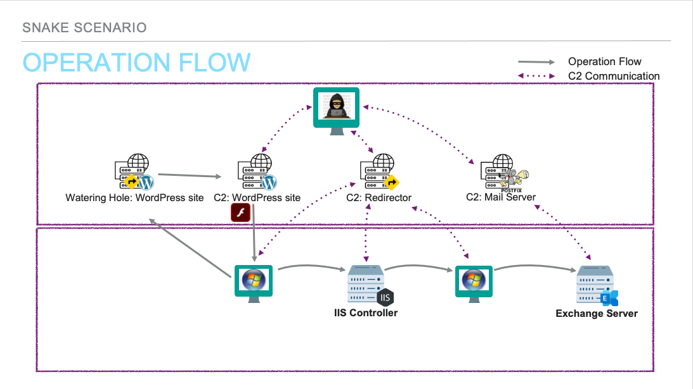
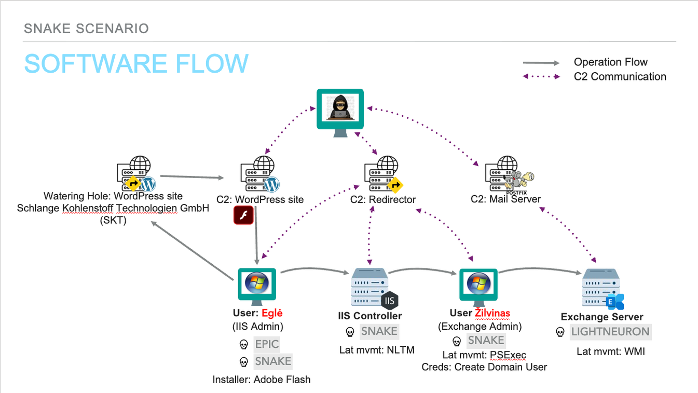
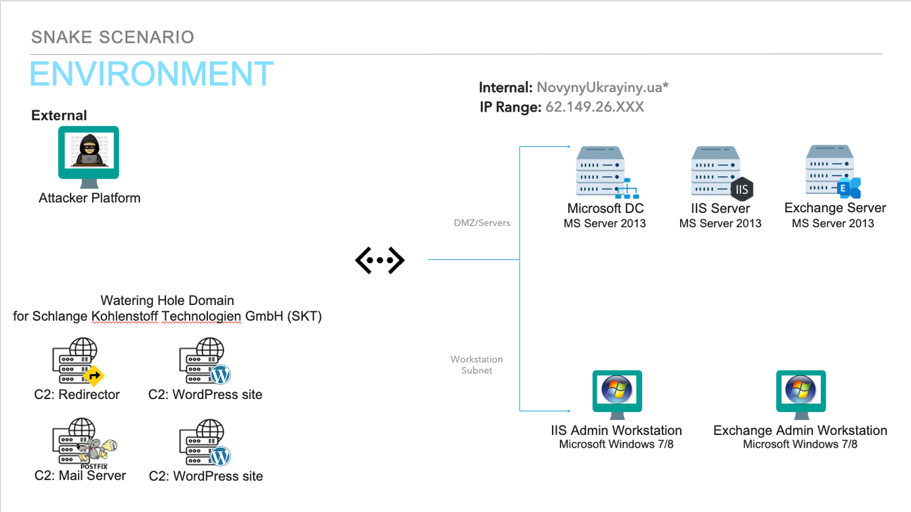

Based on open-source intelligence, the ATT&CK ® Evaluations team created the below scenario leveraging techniques seen from Turla in the wild. We have adapted the scenario based on tools and resources available at the time. Below is a [scenario overview](#snake-emulation-scenario-📖), [step-by-step breakdown](#scenario-steps👣), and an [infrastructure diagram](#infrastructure-diagram).   

# Snake Emulation Scenario 📖 
This scenario is a continuation of Turla’s multi-phase operation, as part of an ongoing intelligence collection campaign. The attackers establish a typo-squatting website to target entities with a high value of information. Turla targets the victim with a drive-by compromise, through user interaction Adobe Flash installer bundled with EPIC, is installed on the victim’s Windows workstation. EPIC communicates to the C2 server via proxy web server with HTTPS requests, persists via process injection, and performs enumeration on the victim’s workstation. SNAKE is then deployed to maintain foothold, elevate privileges and communicates to the C2 via HTTP/SMTP/DNS.

Next, the attackers move laterally onto a Microsoft IIS server, install SNAKE, and create an admin account. They then proceed to move laterally onto an Exchange workstation, and install SNAKE. Finally, the attackers move laterally onto an Exchange Server and install LIGHTNERON. LIGHTNERON enables email collection, and staging for exfiltrating stolen data via benign email PDF/JPG attachments. In this, the threat actors are able to collect and exfiltrate sensitive communications in an effort to identify new information sources and collect up-to-date information to further their the mission objectives.

 **Phase 1:** _Eglė_, an IIS Admin visits a legitimate but compromised website. The website contains a JavaScript that fingerprints users with an MD5 hash. Now identified as a target, the next time Eglė visits the website, the JavaScript initiates a drive-by compromise via malicious adobe flash installer. Through _Eglė's_ interaction, the malicious Adobe Flash installer bundled with EPIC, is installed on the victim Windows workstation. EPIC begins to communicate with the C2 server via proxy web server with HTTPS requests.

 **Phase 2:** EPIC persists via process injection, conducting defense evasion, specifically searching for commonly named processes associated with network defense applications and executing guardrails to not persist on previously infected devices. The attackers then use EPIC to perform enumeration on _Eglė's_ workstation. The results are saved in a zip file for exfiltration, then deleted after exfiltration. Next, SNAKE is deployed as second-stage malware on _Eglė's_ workstation to maintain a foothold and elevate privileges while communicating with C2 via HTTP/SMTP/DNS. With Kernel access via SNAKE, the attackers collect user log-in information from _Eglė's_ workstation, enabling the collection and compromise of valid accounts.

 **Phase 3:** An account found on _Eglė's_ workstation is used to laterally move onto the Microsoft IIS server. SNAKE is installed on the IIS server and the attackers create their own admin account, gaining unrestricted access on the network. Next, the attackers laterally move to _Žilvinas'_ Exchange Workstation and install SNAKE. A new user account _Leshy_ is created under the domain admin group. The attackers then laterally move onto the Exchange Server and install LightNeuron. Rule modification from LIGHTNERON enables collection and staging for exfiltration. LIGHTNEURON exfiltrates stolen data via benign email PDF/JPG attachments to attacker-controlled email addresses.
   

# Scenario Steps👣
 |
Steps & Techniques
| 
User Story
 | 
Commands
| 
Software
 | 
Reporting
 |
 | :------------- | :------------- | :-------------: |------------- | ------------- |
 |**Step 11 Initial Compromise & Establish Foothold**   [T1189](https://attack.mitre.org/versions/v12/techniques/T1189): Drive-by Compromise   [T1204.001](https://attack.mitre.org/versions/v12/techniques/T1204/001): User Execution   [T1071.001](https://attack.mitre.org/versions/v12/techniques/T1071/001/): Application Layer Protocol: Web Protocols   [T1090.002](https://attack.mitre.org/versions/v12/techniques/T1090/002/): Proxy: External Proxy   [T1071.001](https://attack.mitre.org/versions/v12/techniques/T1071/001/): Application Layer Protocol: Web Protocols   [T1082](https://attack.mitre.org/versions/v12/techniques/T1082): System Information Discovery| User _Egle_ on WIN10 workstation (`10.100.40.103`) Azuolas visits a legitimate, but compromised website `nato-int.com`. This website was tampered to redirect visitors to a typo-squated malicious website that contains javascript (JS). The malicious website `anto-int.com`. fingerprints Egle. This malicious WordPress website prompts Egle with a notice to update their NotFlash.    _Egle_ clicks to download the update, `NTFVersion_e5.exe`, containing EPIC (a.k.a. Tavdig/Wipbot). Epic will inject its guard DLL into `explorer.exe`. it will then search for processes that are typically internet enabled (e.g. `iexplore.exe`, `msedge.exe`, or `firefox.exe`) and inject an embedded worker DLL. Once C2 communications have been established between EPIC and the C2 via the proxy server, discovery is performed on the first host where information about the host device and domain computers is collected. | |  Clicky Jscript   Evercookie EPIC |  https://recon.cx/2018/brussels/resources/slides/RECON-BRX-2018-Visiting-The-Snake-Nest.pdf  https://www.welivesecurity.com/2020/03/12/tracking-turla-new-backdoor-armenian-watering-holes/  https://www.welivesecurity.com/2017/06/06/turlas-watering-hole-campaign-updated-firefox-extension-abusing-instagram/  https://github.com/samyk/evercookie  https://www.govcert.ch/downloads/whitepapers/Report_Ruag-Espionage-Case.pdf  https://securelist.com/analysis/publications/65545/the-epic-turla-operation/  https://www.symantec.com/content/en/us/enterprise/media/security_response/whitepapers/waterbug-attack-group.pdf  https://media.kasperskycontenthub.com/wp-content/uploads/sites/43/2018/03/08080105/KL_Epic_Turla_Technical_Appendix_20140806.pdf |
 **Step 12 Rootkit Installation**   [T1105](https://attack.mitre.org/versions/v12/techniques/T1105): Ingress Tool Transfer  [T1014]( https://attack.mitre.org/versions/v12/techniques/T1014): Rootkit  [T1027]( https://attack.mitre.org/versions/v12/techniques/T1027): Obfuscated Files or Information  [T1070]( https://attack.mitre.org/versions/v12/techniques/T1070): Indicator Removal  [T1140]( https://attack.mitre.org/versions/v12/techniques/T1140): Deobfuscate/Decode Files or Information  [T1546]( https://attack.mitre.org/versions/v12/techniques/T1546): Event Triggered Execution  [T1543.003](https://attack.mitre.org/versions/v12/techniques/T1543/003/): Create or Modify System Process: Windows Service  [T1553.006](https://attack.mitre.org/versions/v12/techniques/T1553/006/): Subvert Trust Controls: Code Signing Policy Modification [T1055.001](https://attack.mitre.org/versions/v12/techniques/T1055/001/): Process Injection: Dynamic-link Library Injection  [T1573.001]( https://attack.mitre.org/versions/v12/techniques/T1573/001/): Encrypted Channel: Symmetric Cryptography  [T1071.001]( https://attack.mitre.org/versions/v12/techniques/T1071/001/): Application Layer Protocol: Web Protocols  [T1070.004]( https://attack.mitre.org/versions/v12/techniques/T1070/004/): Indicator Removal: File Deletion|Using access from EPIC by Egle on WIN10 workstation Azuolas, SNAKE is pulled down to Azuolas as second-stage malware. The Snake installer will escalate privileges to SYSTEM by exploiting a Windows 10 vulnerability. Once running as SYSTEM, the installer will disable DSE by loading and exploiting a vulnerable driver. Once DSE is disabled, the installer will load the Snake rootkit driver.   The rootkit driver will hook various functions and will inject a user-mode DLL into a SYSTEM process to execute received tasks from the C2 server. The driver will then wait for a browser process to make a network request to inject the user-mode DLL into the browser for C2 communications over HTTP. The injected DLLs will communicate between each other via named pipes. At some point, Egle will browse to a website, triggering the rootkit driver to inject the user-mode DLL into the browser process - this DLL will begin communication with the C2 server over HTTP. | |SNAKE |  https://media.kasperskycontenthub.com/wp-content/uploads/sites/43/2014/08/20082358/uroburos.pdf  https://artemonsecurity.com/snake_whitepaper.pdf  https://public.gdatasoftware.com/Web/Content/INT/Blog/2014/02_2014/documents/GData_Uroburos_RedPaper_EN_v1.pdf https://www.circl.lu/pub/tr-25  https://www.gdatasoftware.com/blog/2014/03/23966-uroburos-deeper-travel-into-kernel-protection-mitigation  https://www.gdatasoftware.com/blog/2014/06/23953-analysis-of-uroburos-using-windbg  https://www.gdatasoftware.com/blog/2015/01/23926-analysis-of-project-cobra  https://blog.tetrane.com/2019/Analysis-Uroburos-Malware-REVEN.html https://blog.talosintelligence.com/2014/04/snake-campaign-few-words-about-uroburos.html  https://www.lastline.com/labsblog/dissecting-turla-rootkit-malware-using-dynamic-analysis/ https://www.lastline.com/labsblog/turla-apt-group-gives-their-kernel-exploit-a-makeover/  https://github.com/hfiref0x/TDL  https://www.coresecurity.com/core-labs/advisories/virtualbox-privilege-escalation-vulnerability https://unit42.paloaltonetworks.com/acidbox-rare-malware/ |
**Step 13 First Workstation Discovery** [T1106]( https://attack.mitre.org/versions/v12/techniques/T1106/): Native API [T1057]( https://attack.mitre.org/versions/v12/techniques/T1057): Process Discovery  [T1559]( https://attack.mitre.org/versions/v12/techniques/T1559): Inter-Process Communication [T1087.002]( https://attack.mitre.org/versions/v12/techniques/T1087/002/): Account Discovery: Domain Account [T1049]( https://attack.mitre.org/versions/v12/techniques/T1049): System Network Connections Discovery  [T1134.002]( https://attack.mitre.org/versions/v12/techniques/T1134/002/): Access Token Manipulation: Create Process with Token [T1134.001]( https://attack.mitre.org/versions/v12/techniques/T1134/001/): Access Token Manipulation: Token Impersonation/Theft |The Snake rootkit receives tasking from the C2 server to enumerate currently running processes on the local computer and finds that EgleAdmin has processes running.   Further enumeration of the EgleAdmin user shows that it is a member of the File Server Admins group. Snake then enumerates mapped drives on the local machine and finds that Egle's home drive is mapped to the file server, berzas (`10.100.30.204`). |`whoami`  `tasklist.exe`  `net.exe user /domain EgleAdmin` | SNAKE | https://artemonsecurity.com/snake_whitepaper.pdf |
**Step 14 Lateral Movement to File Server**  [T1078.002]( https://attack.mitre.org/versions/v12/techniques/T1078/002/): Valid Accounts: Domain Account [T1559]( https://attack.mitre.org/versions/v12/techniques/T1559): Inter-Process Communication  [T1105]( https://attack.mitre.org/versions/v12/techniques/T1105): Ingress Tool Transfer [T1569.002]( https://attack.mitre.org/versions/v12/techniques/T1569/002/): System Services: Service Execution  [T1071.001]( https://attack.mitre.org/versions/v12/techniques/T1071/001/): Application Layer Protocol: Web Protocols  [T1070.004]( https://attack.mitre.org/versions/v12/techniques/T1070/004/): Indicator Removal: File Deletion |Using this information, Snake impersonates the EgleAdmin account to run PsExec and execute another copy of the Snake rootkit installer on the file server, berzas.    This new copy of the Snake installer will have the installed rootkit beacon back to the C2 server via a different redirector. | |SNAKE PSExec | https://artemonsecurity.com/snake_whitepaper.pdf |
**Step 15 Domain Discovery**   [T1018]( https://attack.mitre.org/versions/v12/techniques/T1018): Remote System Discovery [T1059.001]( https://attack.mitre.org/versions/v12/techniques/T1059/001): Command and Scripting Interpreter: PowerShell  [T1069.001]( https://attack.mitre.org/versions/v12/techniques/T1069/001): Permission Group Discovery: Domain Groups  [T1087.002]( https://attack.mitre.org/versions/v12/techniques/T1087/002): Account Discovery: Domain Account  |The Snake rootkit receives tasking from the C2 server to use Powershell's ActiveDirectory module to enumerate domain users, admin groups, and computers. Upon discovering Zilvinas's regular and domain admin accounts, Snake will enumerate further details on the accounts. Snake then discovers a workstation, uosis (`10.100.40.102`), belonging to Zilvinas to use as a future lateral movement target. |  |SNAKE   Powershell |  https://media.kasperskycontenthub.com/wp-content/uploads/sites/43/2014/08/20082358/uroburos.pdf  https://artemonsecurity.com/snake_whitepaper.pdf   https://public.gdatasoftware.com/Web/Content/INT/Blog/2014/02_2014/documents/GData_Uroburos_RedPaper_EN_v1.pdf   https://www.circl.lu/pub/tr-25/  https://www.gdatasoftware.com/blog/2014/03/23966-uroburos-deeper-travel-into-kernel-protection-mitigation  https://www.gdatasoftware.com/blog/2014/06/23953-analysis-of-uroburos-using-windbg  https://www.gdatasoftware.com/blog/2015/01/23926-analysis-of-project-cobra  https://blog.tetrane.com/2019/Analysis-Uroburos-Malware-REVEN.html  https://blog.talosintelligence.com/2014/04/snake-campaign-few-words-about-uroburos.html  https://www.lastline.com/labsblog/dissecting-turla-rootkit-malware-using-dynamic-analysis/  https://www.lastline.com/labsblog/turla-apt-group-gives-their-kernel-exploit-a-makeover/  https://github.com/hfiref0x/TDL  https://www.coresecurity.com/core-labs/advisories/virtualbox-privilege-escalation-vulnerability  https://unit42.paloaltonetworks.com/acidbox-rare-malware/ |
**Step 16 Preparation for Lateral Movement to Admin Workstation**  [T1105]( https://attack.mitre.org/versions/v12/techniques/T1105): Ingress Tool Transfer [T1559]( https://attack.mitre.org/versions/v12/techniques/T1559): Inter-Process Communication  [T1003.001]( https://attack.mitre.org/versions/v12/techniques/T1003/001): OS Credential Dumping: LSASS Memory|Snake downloads Mimikatz to the file server, berzas (`10.100.30.204`), and extracts all NTLM hashes on the target to a file. That file is then exfiltrated back to the C2 server.||PSExec   Mimikatz | https://symantec-enterprise-blogs.security.com/blogs/threat-intelligence/waterbug-espionage-governments   https://www.govcert.ch/downloads/whitepapers/Report_Ruag-Espionage-Case.pdf |
**Step 17 Lateral Movement to Admin Workstation & Persistence** [T1057]( https://attack.mitre.org/versions/v12/techniques/T1057): Process Discovery [T1136.002]( https://attack.mitre.org/versions/v12/techniques/T1136/002): Create Account: Domain Account [T1550.002]( https://attack.mitre.org/versions/v12/techniques/T1550/002): Use Alternate Authentication Material: Pass the Hash [T1071.001]( https://attack.mitre.org/versions/v12/techniques/T1071/001): Application Layer Protocol: Web Protocols [T1070.004]( https://attack.mitre.org/versions/v12/techniques/T1070/004): Indicator Removal: File Deletion |Snake performs lateral movement to the domain admin's workstation and enables additional persistence by creating a new domain admin account.    The retrieved NTLM hash discovered in the previous step is used in a pass-the-hash attack to move laterally to Zilvinas's workstation. PsExec is employed via pass-the-hash to execute and install the Snake rootkit on the target workstation.    Once the admin workstation has been compromised, Snake is used to enumerate processes running on Zilvinas's workstation uosis, where it is discovered that ZilvinasAdmin has processes running which can be used for token impersonation. By impersonating ZilvinasAdmin, a new domain user Leshy is created and added to the Domain Admins domain group for persistence. |`whoami`  `tasklist.exe`  `net user leshy Password12345 /add /domain`  `net group \"Domain Admins\" leshy /add /domain` |SNAKE | https://media.kasperskycontenthub.com/wp-content/uploads/sites/43/2014/08/20082358/uroburos.pdf  https://artemonsecurity.com/snake_whitepaper.pdf  https://public.gdatasoftware.com/Web/Content/INT/Blog/2014/02_2014/documents/GData_Uroburos_RedPaper_EN_v1.pdf  https://www.circl.lu/pub/tr-25/  https://www.gdatasoftware.com/blog/2014/03/23966-uroburos-deeper-travel-into-kernel-protection-mitigation  https://www.gdatasoftware.com/blog/2014/06/23953-analysis-of-uroburos-using-windbg  https://www.gdatasoftware.com/blog/2015/01/23926-analysis-of-project-cobra  https://blog.tetrane.com/2019/Analysis-Uroburos-Malware-REVEN.html  https://blog.talosintelligence.com/2014/04/snake-campaign-few-words-about-uroburos.html  https://www.lastline.com/labsblog/dissecting-turla-rootkit-malware-using-dynamic-analysis/  https://www.lastline.com/labsblog/turla-apt-group-gives-their-kernel-exploit-a-makeover/  https://github.com/hfiref0x/TDL  https://www.coresecurity.com/core-labs/advisories/virtualbox-privilege-escalation-vulnerability  https://unit42.paloaltonetworks.com/acidbox-rare-malware/ |
**Step 18 Lateral Movement to Exchange Server**   [T1559]( https://attack.mitre.org/versions/v12/techniques/T1559): Inter-Process Communication  [T1105]( https://attack.mitre.org/versions/v12/techniques/T1105): Ingress Tool Transfer  [T1070.004]( https://attack.mitre.org/versions/v12/techniques/T1070/004): Indicator Removal: File Deletion   [T1047]( https://attack.mitre.org/versions/v12/techniques/T1047): Windows Management Instrumentation  [T1059.001]( https://attack.mitre.org/versions/v12/techniques/T1059/001): Command and Scripting Interpreter: PowerShell  [T1505.002]( https://attack.mitre.org/versions/v12/techniques/T1505/002): Server Software Component: Transport Agent [T1036.005]( https://attack.mitre.org/versions/v12/techniques/T1036/005): Masquerading: Match Legitimate Name or Location  |Snake downloads LightNeuron and associated the Powershell installation script and config files, transfers them to the Exchange server, drebule, and remotely executes the installation script using WMI to install LightNeuron on the Exchange server. | |WMI   SNAKE   LIGHT NEURON   Powershell | https://www.govcert.ch/downloads/whitepapers/Report_Ruag-Espionage-Case.pdf |
**Step 19 Discovery & Email Collection**  [T1119]( https://attack.mitre.org/versions/v12/techniques/T1119): Automated Collection [T1114.002]( https://attack.mitre.org/versions/v12/techniques/T1114/002): Email Collection: Remote Email Collection [T1001.002]( https://attack.mitre.org/versions/v12/techniques/T1001/002): Data Obfuscation: Steganography [T1071.003]( https://attack.mitre.org/versions/v12/techniques/T1071/003): Application Layer Protocol: Mail Protocols [T1016]( https://attack.mitre.org/versions/v12/techniques/T1016): System Network Configuration Discovery [T1564.008]( https://attack.mitre.org/versions/v12/techniques/T1564/008): Email Hiding Rules [T1573.001]( https://attack.mitre.org/versions/v12/techniques/T1573/001): Encrypted Channel: Symmetric Cryptography [T1041]( https://attack.mitre.org/versions/v12/techniques/T1041): Exfiltration Over C2 Channel [T1059.003]( https://attack.mitre.org/versions/v12/techniques/T1059/003): Command and Scripting Interpreter: Windows Command Shell | Turla sends several discovery commands to the LightNeuron implant and collecting and exfiltrating email traffic.    Emails with JPG attachments containing AES encrypted commands embedded using stegonagraphy are sent from the C2 server to the domain. LightNeuron's transport agent processes all emails via LightNeuron's companion DLL, which executes the embedded command and blocks delivery of the email from the C2 server.    LightNeuron automatically collects all emails with recipients matching `nk.local` in a log file(`C:\Windows\ServiceProfiles\NetworkService\AppData\Local\Temp\msmdat.xml`).Eventually, LightNeuron is tasked to exfiltrate the email log, which is exfiltrated over the existing C2 channel. | |LIGHT NEURON | https://www.welivesecurity.com/wp-content/uploads/2019/05/ESET-LightNeuron.pdf |

# Infrastructure Diagram

