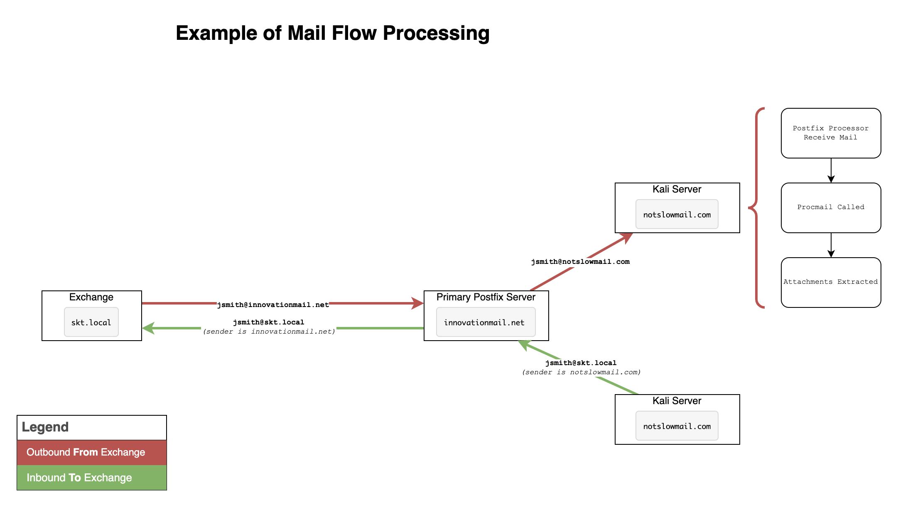

# Mail Flow

- [Mail Flow](#mail-flow)
  - [Overview](#overview)
  - [Email Flow](#email-flow)
    - [Email - Inbound To Scenario Exchange Servers](#email---inbound-to-scenario-exchange-servers)
    - [Email - Outbound From Scenario Exchange Servers](#email---outbound-from-scenario-exchange-servers)
    - [Mail Flow Diagram](#mail-flow-diagram)

## Overview

Mail Exchange DNS records (MX) are used to determine email routing for both inbound and outbound email. When the terms Inbound and Outbound are used in this document, Inbound and Outbound are always relative the the Exchange Servers perspective.

Postfix was used as the mail server external to the vendor range.

## Email Flow

### Email - Inbound To Scenario Exchange Servers

Postfix was used to provide email services external to the scenario domains. From the attacker platform, email was masked to rewrite emails originating from the attacker platform to a different domain name, to further obscure the attacking platform.

### Email - Outbound From Scenario Exchange Servers

When sending email from Exchange, Exchange used DNS lookups to identify mail servers to send email. For the evaluation, all email sent to `*@innovationmail.net` (for all users) was always forwarded to `cradwell@notslowmail.com`. The `cradwell@notslowmail.com` inbox was processed using Procmail scripts, to extract all attachments from emails to a separate directory.

### Mail Flow Diagram

