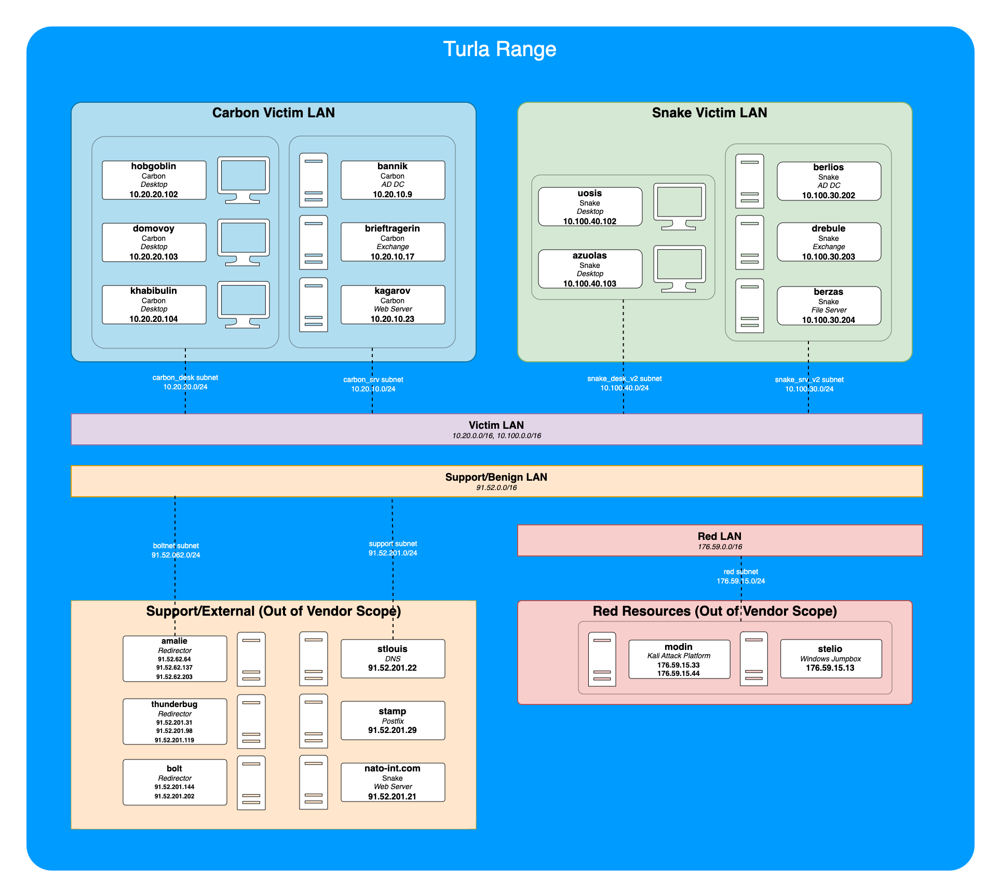

# Infrastructure for Turla Evaluation

The Turla infrastructure is split over two scenarios, Scenario 1 (Carbon) and Scenario 2 (Snake). For convenience, both scenarios share supporting infrastructure, including attacker platform, DNS, mail server, and traffic forwarding hosts.

Initial infrastructure was setup using Terraform, with configuration applied via scripts and configuration files.

-------

- [Infrastructure for Turla Evaluation](#infrastructure-for-turla-evaluation)
  - [Infrastructure Overview](#infrastructure-overview)
    - [Scenario VMs](#scenario-vms)
      - [Carbon](#carbon)
      - [Snake](#snake)
      - [Support Hosts](#support-hosts)
    - [Network Services](#network-services)
    - [Network Diagram](#network-diagram)
    - [TLS Certificates](#tls-certificates)
    - [Domains Used](#domains-used)
    - [Email Flow](#email-flow)
    - [Windows Service (Carbon Scenario Only)](#windows-service-carbon-scenario-only)

## Infrastructure Overview

This document provides an overview of the infrastructure support used for the evaluation. In addition to setup and configuration of virtual machines, this document covers infrastructure support services, such as DNS, mail, and traffic redirection, used to support the evaluation. The Carbon and Snake scenarios both shared the same set of support services for efficiency.

Any references to scenario or range hosts is referencing all Carbon and Snake hosts, unless otherwise specified.

### Scenario VMs

#### Carbon

The Carbon scenario consists of six virtual machines, all joined to the `skt.local` Windows domain.

| Hostname      | OS                                                | Role                               | IP           |
| ------------- | ------------------------------------------------- | ---------------------------------- | ------------ |
| bannik        | Windows Server 2019 Datacenter -  10.0.17763.2867 | Active Directory Domain Controller | 10.20.10.9   |
| brieftragerin | Windows Server 2019 Datacenter - 10.0.17763.404   | Microsoft Exchange Server          | 10.20.10.17  |
| domovoy       | Windows 10 Pro - 10.0.19041.1806                  | Windows Workstation                | 10.20.20.103 |
| hobgoblin     | Windows 10 Pro - 10.0.19041.1806                  | Windows Workstation                | 10.20.20.102 |
| kagarov       | Ubuntu 20.04.4 LTS - Kernel: 5.15.0-1031-azure    | Ubuntu Linux Workstation           | 10.20.10.23  |
| khabibulin    | Windows 10 Pro - 10.0.19041.1806                  | Windows Workstation                | 10.20.20.104 |

#### Snake

The Snake scenario consists of five virtual machines, all joined to the `nk.local` Windows domain.

| Hostname | OS                                               | Role                               | IP            |
| -------- | ------------------------------------------------ | ---------------------------------- | ------------- |
| azuolas  | Windows 10 Pro - 10.0.18362.1171                 | Windows Workstation                | 10.100.40.103 |
| berlios  | Windows Server 2019 Datacenter - 10.0.17763.2867 | Active Directory Domain Controller | 10.100.30.202 |
| berzas   | Windows Server 2019 Datacenter - 10.0.17763.2867 | File Server                        | 10.100.30.204 |
| drebule  | Windows Server 2019 Datacenter - 10.0.17763.2867 | Exchange Server                    | 10.100.30.203 |
| uosis    | Windows 10 Pro - 10.0.18362.1171                 | Windows Workstation                | 10.100.40.102 |
|          |                                                  |                                    |               |

#### Support Hosts

| Hostname                 | OS           | Role                | IP(s)                                                        |
| ------------------------ | ------------ | ------------------- | ------------------------------------------------------------ |
| stamp.innovationmail.net | Ubuntu 20.04 | Postfix Mail Server | 91.52.201.29                                                 |
| stlouis.notfastdns.com   | Ubuntu 20.04 | DNS Server          | 91.52.201.22                                                 |
| nato-int.com             | Ubuntu 20.04 | Web Server          | 91.52.201.21                                                 |
| amalie                   | Ubuntu 20.04 | Traffic Redirector  | *eth0:* 91.52.62.64, *eth1:* 91.52.62.137, *eth2:* 91.52.62.203 |
| thunderbug               | Ubuntu 20.04 | Traffic Redirector  | *eth0:* 91.52.201.31, *eth1:* 91.52.201.98, *eth2:* 91.52.201.119 |
| bolt                     | Ubuntu 20.04 | Traffic Redirector  | *eth0:* 91.52.201.144, *eth1:* 91.52.201.202                 |

#### Red Team Hosts

| Hostname | OS                  | Role             | IP(s)                                      |
| -------- | ------------------- | ---------------- | ------------------------------------------ |
| modin    | Kali Linux          | Attack Platform  | *eth0:* 176.59.15.33, *eth1:* 176.59.15.44 |
| stelio   | Windows Server 2019 | Attacker Jumpbox | 176.59.15.13                               |

### Network Services

In addition to the VMs in scope for vendor security software during the evaluation, additional hosts were required to provide the full complement of services to fully emulate the scenario.

### Network Diagram

The diagram below shows the layout of both scenario networks, attack platform, and support hosts.

### TLS Certificates

A self-signed certificate authority was generated to emulate a legitimately assigned TLS certificate for the domain `svobodaukrayin[.]ua`. See the [Certificate Authority](CertificateAuthority.md) page for further details on how the certificates were created and configured.

### Domains Used

| URL                                          | Usage           | Notes                                                 |
| -------------------------------------------- | --------------- | ----------------------------------------------------- |
| svobodaukrayin[.]ua, www.svobodaukrayin[.]ua | Web Certificate | Emulated registered domain with valid TLS certificate |

### Email Flow

Email services used Microsoft Exchange 2019 for email processing for each scenario domain, with Postfix used as the external email server. More details are provided in the [Email Flow page](EmailFlow.md).

### Windows Service (Carbon Scenario Only)

The Carbon Windows VMs had a [custom Windows Service installed, *Viper VPN Service*](WindowsService.md). Details of the service code and configuration are provided in the linked document.
