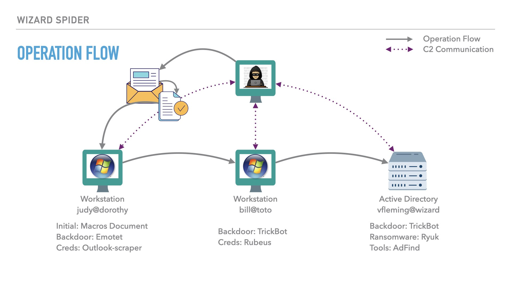

# Wizard Spider
[](https://opensource.org/licenses/Apache-2.0)

Based on open-source intelligence, the ATT&CK &reg; Evaluations team created the below scenario leveraging techniques seen from Wizard Spider in the wild. We have adapted the scenario based on tools and resources available at the time. 

## Adversary Overview 🪄 🕸️

Wizard Spider is a Russia-based e-crime group originally known for the Trickbot banking malware.<sup>[1]</sup> In August 2018, Wizard Spider added capabilities to their Trickbot software enabling the deployment of the Ryuk ransomware.<sup>[2] [3] </sup> This resulted in "big game hunting" campaigns, focused on targeting large organizations for high-ransom return rates.<sup> [4] </sup> Notable Ryuk attacks include the Universal Healthcare System Hospitals, US Georgia and Florida state government administrative offices, and Chinese companies.<sup> [5] [6]</sup>

According to the FBI, in less than one year (2019-2020) Wizard Spider extorted $61 million USD from ransomware attacks.<sup> [7] [8]</sup> Throughout the operations, the group used a multi-staged approach to manage ransomware campaigns.<sup>[9]</sup> Prior to encrypting a victim's network, the group exfiltrates sensitive data and threatens to publicly disclose it if the victim refuses to pay the ransom.

Associated Names: UNC1878, TEMP.MixMaster, Grim Spider, Team9 

[1]:https://attack.mitre.org/groups/G0102/
[2]:https://www.trendmicro.com/en_us/research/19/b/trickbot-adds-remote-application-credential-grabbing-capabilities-to-its-repertoire.html
[3]:(./Resources/images/Trickbot_analysis_and_mitigation_Jisc%20community.pdf)
[4]:https://www.crowdstrike.com/blog/big-game-hunting-with-ryuk-another-lucrative-targeted-ransomware/
[5]:https://www.bleepingcomputer.com/news/security/uhs-hospitals-hit-by-reported-country-wide-ryuk-ransomware-attack/campaign/#:~:text=SandWorm%20is%20an%20APT%20group,aggressive%20and%20sometimes%20destructive%20cyberattacks.
[6]:https://www.upi.com/Top_News/US/2019/07/08/Ransom-hackers-hit-Georgia-courts-after-cities-pay-1M/4111562116580/
[7]:https://www.youtube.com/watch?v=LUxOcpIRxmg
[8]:https://www.cybersecuritydive.com/news/Ryuk-FBI-DHS-ransomware-healthcare/587961/
[9]:https://intel471.com/blog/ransomware-as-a-service-2020-ryuk-maze-revil-egregor-doppelpaymer/

## Emulation Overview


# Quick Links
### For Engineers 🧑‍💻

### Resources

The [Resources Folder](./Resources/) contains the emulated software source code. Executables are provided in password protected zip files located in the specified software folder.  The password is `malware`.

The [Binaries.zip](./Resources/Binaries) contains all executables in one zip file for easy download. The password is `malware`.

We provide a [script](./Resources/utilities/crypt_executables.py) to automatically decrypt these files:

```
$ cd wizard_spider

$ python3 Resources/utilities/crypt_executables.py -i ./ -p malware --decrypt
```

### YARA Rules

[YARA rules](./yara-rules) are provided to assist the community in researching, preventing, and detecting malware specimens used in this emulation plan.

### Emulation Key Software 💻

- [Emotet](./Resources/Emotet/)

- [TrickBot](./Resources/TrickBot)

- [Ryuk](./Resources/Ryuk/)

### Scenario Walkthrough
- [Detection Scenario](./Emulation_Plan/Scenario_1/) - Step by Step walkthrough of Scenario's procedures (10 steps). 
- [Protection Scenario](./Emulation_Plan/Scenario_2/) - Step by Step walkthrough of Scenario's procedures (6 tests)

## For Analysts 🔎
- [Operation Flow](./Operations_Flow/Operations_Flow.md/) - High-level summary of the scenario & infrastructure with diagrams. 
- [Intelligence Summary](./Intelligence_Summary/Intelligence_Summary.md) - General overview of the Adversary with links to reporting used throughout the scenario. 

## Acknowledgements

We would like to formally thank the people that contributed to the content, review, and format of this document. This includes the MITRE ATT&CK and MITRE ATT&CK Evaluations teams, the organizations and people that provided public intelligence and resources, as well as the following organizations that participated in the community cyber threat intelligence contribution process:

- Microsoft
-	SentinelOne
-	Trellix/McAfee
- Wojciech Lesicki, @WLesicki

## Connect with us 🗨️

We 💖 feedback! Let us know how using ATT&CK Evaluation results has helped you and what we can do better. 

Email: <evals@mitre-engenuity.org><br>
Twitter: https://twitter.com/MITREengenuity<br>
LinkedIn: https://www.linkedin.com/company/mitre-engenuity/<br>

## Liability / Responsible Usage

This content is only to be used with appropriate prior, explicit authorization for the purposes of assessing security posture and/or research.

## Notice

© 2022 MITRE Engenuity. Approved for Public Release. Document number AT0016.

Licensed under the Apache License, Version 2.0 (the "License"); you may not use this file except in compliance with the License. You may obtain a copy of the License at

[http://www.apache.org/licenses/LICENSE-2.0](http://www.apache.org/licenses/LICENSE-2.0)

Unless required by applicable law or agreed to in writing, software distributed under the License is distributed on an "AS IS" BASIS, WITHOUT WARRANTIES OR CONDITIONS OF ANY KIND, either express or implied. See the License for the specific language governing permissions and limitations under the License.

This project makes use of ATT&CK®

[ATT&CK Terms of Use](https://attack.mitre.org/resources/terms-of-use/)
